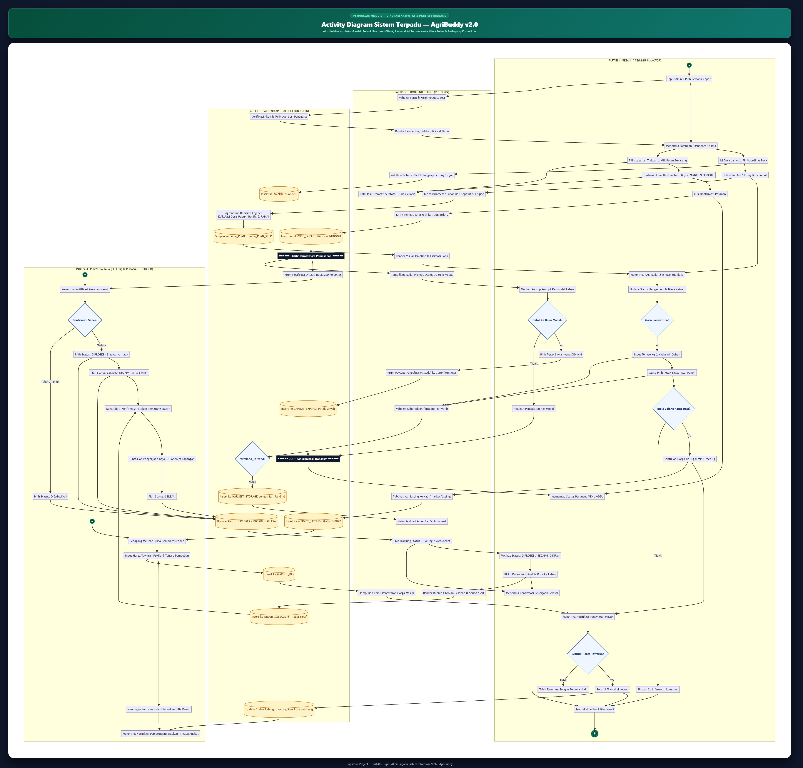
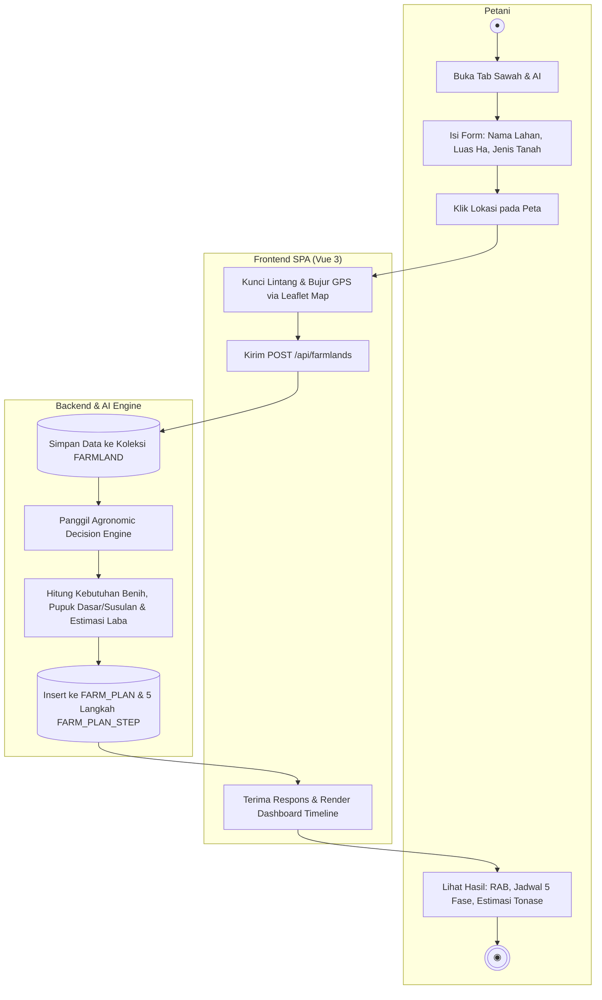
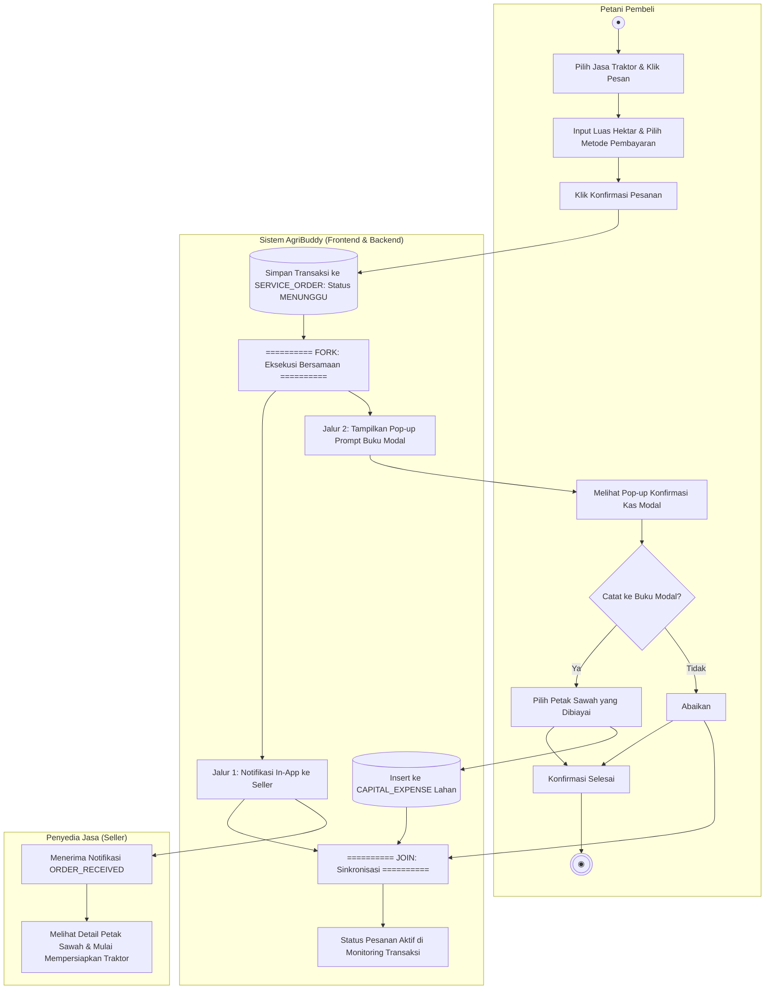
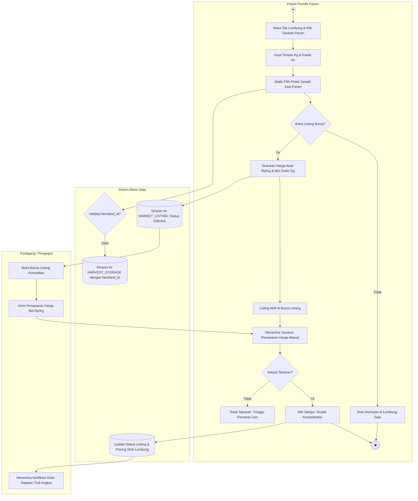
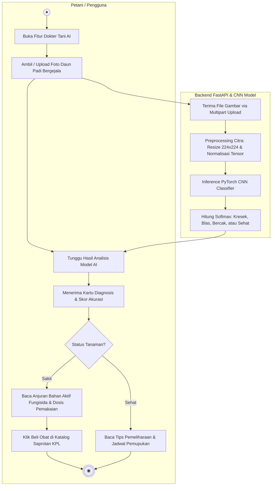

# Activity Diagram & Spesifikasi Alur Aktivitas — AgriBuddy v2.0
**Pemodelan Dinamika Perilaku Sistem UML 2.5: Partisi Swimlane, Eksekusi Paralel (Fork/Join), & Kolaborasi Ekosistem Tani**  
*Capstone Project STSI4440 • Tugas Akhir Sarjana Sistem Informasi 2026*

---

## 1. Pendahuluan & Standar Notasi UML 2.5

Activity Diagram (*Diagram Aktivitas*) memodelkan aspek dinamis dari sistem **AgriBuddy v2.0**, yang menggambarkan aliran kontrol (*control flow*) dan aliran data antaraksi pengguna, antarmuka klien (*frontend*), server backend (*FastAPI & AI Engine*), serta mitra ekosistem (*penyedia jasa traktor & pedagang lelang*).

Berbeda dengan Flowchart prosedural, Activity Diagram pada standar **UML 2.5 (OMG)** membagi tanggung jawab eksekusi menggunakan **Partisi Swimlane (*Swimlanes*)**, serta mengakomodasi eksekusi tugas secara bersamaan melalui batang sinkronisasi **Fork** dan **Join**.

### Standar Notasi Elemen Diagram
| Notasi Simbol | Bentuk Geometris | Nama Elemen UML | Definisi & Makna Operasional |
| :---: | :---: | :--- | :--- |
| **Initial Node** | Lingkaran Hitam Solid (`●`) | *Initial Node* | Titik awal dimulainya suatu alur aktivitas. |
| **Activity Final** | Lingkaran Konsentris Titik Tengah (`◉`) | *Activity Final Node* | Titik akhir dari keseluruhan aliran aktivitas sistem. |
| **Action State** | Persegi Panjang Sudut Membulat | *Action / Activity* | Langkah eksekusi atomik yang dikerjakan oleh entitas partisi bersangkutan. |
| **Decision / Merge** | Belah Ketupat (*Diamond*) | *Decision & Merge Node* | Percabangan logika kondisi bersyarat (*Guard Condition `[kondisi]`*). |
| **Fork Node** | Batang Garis Tebal Hitam | *Fork (Split)* | Memecah satu aliran kontrol menjadi dua atau lebih aliran yang berjalan **secara paralel / konkuren**. |
| **Join Node** | Batang Garis Tebal Hitam | *Join (Synchronize)* | Menggabungkan beberapa aliran paralel dan menunggu semuanya tuntas sebelum melanjutkan alur. |
| **Swimlane / Partisi** | Kolom Persegi Panjang Besar | *Activity Partition* | Mengelompokkan aksi berdasarkan aktor atau modul sistem yang bertanggung jawab menjalankannya. |
| **Control Flow** | Garis Berpanah Padat | *Control Flow* | Menunjukkan perpindahan urutan eksekusi antar-aksi. |

---

## 2. Visual Activity Diagram Terpadu (*Unified Cross-Lane Diagram*)

Berikut adalah hasil render visual diagram aktivitas terpadu beresolusi tinggi yang memetakan interaksi lintas 4 partisi (Petani, Frontend SPA, Backend AI, dan Mitra Seller/Bidder):

*(File grafis vektor murni SVG tersedia di: [`ACTIVITY_DIAGRAM_AgriBuddy.svg`](ACTIVITY_DIAGRAM_AgriBuddy.svg))*

---

## 3. Pemodelan Diagram Aktivitas Terpadu (Mermaid UML 2.5)

```mermaid
flowchart TD
    %% SWIMLANE 1: PETANI / PENGGUNA
    subgraph LanePetani["PARTISI 1: PETANI / PENGGUNA (ACTOR)"]
        InitPetani((●)) --> ActLogin[Input Akun / Pilih Persona Cepat]
        ActLogin --> WaitAuth[Menerima Tampilan Dashboard Utama]

        %% Skenario 1: Lahan & AI
        WaitAuth --> ActAddFarm[Isi Data Lahan & Pin Koordinat Peta]
        ActAddFarm --> ActClickAI[Tekan Tombol 'Hitung Rencana AI']
        ActClickAI --> ViewPlan[Menerima RAB Modal & 5 Fase Budidaya]
        ViewPlan --> ActDoFarm[Update Status Pengerjaan & Biaya Aktual]

        %% Skenario 2: Marketplace Checkout
        WaitAuth --> ActBrowse[Pilih Layanan Traktor & Klik Pesan Sekarang]
        ActBrowse --> ActFillCheckout[Tentukan Luas Ha & Metode Bayar YARNEN/COD/QRIS]
        ActFillCheckout --> ActConfirmOrder[Klik 'Konfirmasi Pesanan']
        ActConfirmOrder --> ViewOrderWait[Memantau Status Pesanan: MENUNGGU]
        ViewPromptModal[Melihat Pop-up Prompt Kas Modal Lahan] --> DecideRecordModal{Catat ke Buku Modal?}
        DecideRecordModal -- Ya --> ActChoosePlot[Pilih Petak Sawah yang Dibiayai]
        DecideRecordModal -- Tidak --> SkipRecord[Abaikan Pencatatan Kas Modal]

        %% Skenario 3: Live Tracking & Chat
        ViewOrderProc[Melihat Status: DIPROSES / SEDANG_DIKIRIM] --> ActSendChat[Kirim Pesan Koordinat & Rute ke Lahan]
        ActSendChat --> ViewOrderDone[Menerima Konfirmasi Pekerjaan Selesai]

        %% Skenario 4: Lumbung Traceability & Bursa Lelang
        ActDoFarm --> CheckHarvest{Masa Panen Tiba?}
        CheckHarvest -- Ya --> ActInputHarvest[Input Tonase Kg & Kadar Air Gabah]
        ActInputHarvest --> ActPickOrigin[Wajib Pilih Petak Sawah Asal Panen]
        ActPickOrigin --> DecideAuction{Buka Lelang Komoditas?}
        DecideAuction -- Ya --> ActSetAuction[Tentukan Harga Rp/Kg & Min Order Kg]
        DecideAuction -- Tidak --> ActKeepStore[Simpan Stok Aman di Lumbung]
        ActSetAuction --> ReviewBids[Menerima Notifikasi Penawaran Masuk]
        ReviewBids --> DecideAcceptBid{Setujui Harga Tawaran?}
        DecideAcceptBid -- Ya --> ActApproveBid[Setujui Transaksi Lelang]
        DecideAcceptBid -- Tidak --> ActRejectBid[Tolak Tawaran: Tunggu Penawar Lain]

        %% Selesai
        ActApproveBid --> DoneAll[Transaksi Berhasil Disepakati]
        ViewOrderDone --> DoneAll
        ActKeepStore --> DoneAll
        DoneAll --> FinalPetani(((◉)))
    end

    %% SWIMLANE 2: FRONTEND CLIENT (VUE 3)
    subgraph LaneFrontend["PARTISI 2: FRONTEND CLIENT (VUE 3 SPA)"]
        FE_SubmitAuth[Validasi Form & Kirim Request Sesi]
        FE_RenderDash[Render HeaderBar, Sidebar, & Grid Menu]
        
        FE_LeafletMap[Aktifkan Peta Leaflet & Tangkap Lintang/Bujur]
        FE_ReqPlan[Kirim Parameter Lahan ke Endpoint AI Engine]
        FE_RenderPlan[Render Visual Timeline & Estimasi Laba]

        FE_CalcSubtotal[Kalkulasi Otomatis Subtotal = Luas x Tarif]
        FE_SubmitOrder[Kirim Payload Checkout ke /api/orders]
        FE_ShowModal[Tampilkan Modal Prompt Otomatis Buku Modal]
        FE_SendExpense[Kirim Payload Pengeluaran Modal ke /api/farmlands]

        FE_LiveTrack[Live Tracking Status & Polling / WebSocket]
        FE_RenderChat[Render Bubble Obrolan Pesanan & Sound Alert]

        FE_EnforceTrace[Validasi Keberadaan farmland_id Wajib]
        FE_SubmitHarvest[Kirim Payload Panen ke /api/harvest]
        FE_SubmitListing[Publikasikan Listing ke /api/market/listings]
        FE_RenderBids[Tampilkan Kartu Penawaran Harga Masuk]
    end

    %% SWIMLANE 3: BACKEND API & DECISION ENGINE
    subgraph LaneBackend["PARTISI 3: BACKEND API & AI DECISION ENGINE"]
        BE_Auth[Verifikasi Akun & Terbitkan Sesi Pengguna]
        BE_SaveFarm[(Insert ke Koleksi FARMLAND)]
        
        BE_AIEngine[Agronomic Decision Engine:<br/>Kalkulasi Dosis Pupuk, Benih, & RAB AI]
        BE_SavePlan[(Simpan ke FARM_PLAN & FARM_PLAN_STEP)]
        
        BE_CreateOrder[(Insert ke SERVICE_ORDER: Status MENUNGGU)]
        BE_Fork1[====== FORK: Paralelisasi Pemesanan ======]
        BE_NotifOrder[Kirim Notifikasi ORDER_RECEIVED ke Seller]
        BE_SaveExpense[(Insert ke CAPITAL_EXPENSE Petak Sawah)]
        BE_Join1[====== JOIN: Sinkronisasi Transaksi ======]

        BE_UpdateOrderStatus[(Update Status: DIPROSES / DIKIRIM / SELESAI)]
        BE_SaveMessage[(Insert ke ORDER_MESSAGE & Trigger Notif)]

        BE_CheckTrace{farmland_id Valid?}
        BE_SaveHarvest[(Insert ke HARVEST_STORAGE dengan farmland_id)]
        BE_SaveListing[(Insert ke MARKET_LISTING: Status DIBUKA)]
        BE_SaveBid[(Insert ke MARKET_BID)]
        BE_ExecDeal[(Update Status Lelang & Potong Stok Fisik Lumbung)]
    end

    %% SWIMLANE 4: PENYEDIA JASA (SELLER) & PEDAGANG (BIDDER)
    subgraph LaneMitra["PARTISI 4: PENYEDIA JASA (SELLER) & PEDAGANG (BIDDER)"]
        InitMitra((●)) --> WaitNotifOrder[Menerima Notifikasi Pesanan Masuk]
        WaitNotifOrder --> SellerDecision{Konfirmasi Seller?}
        SellerDecision -- Terima --> SellerProc[Pilih Status: DIPROSES - Siapkan Armada]
        SellerDecision -- Tolak / Penuh --> SellerReject[Pilih Status: DIBATALKAN]
        
        SellerProc --> SellerDepart[Pilih Status: SEDANG_DIKIRIM - OTW Sawah]
        SellerDepart --> SellerChat[Buka Chat: Konfirmasi Patokan Pematang Sawah]
        SellerChat --> SellerWork[Tuntaskan Pengerjaan Bajak / Panen di Lapangan]
        SellerWork --> SellerFinish[Pilih Status: SELESAI]
        
        InitBidder((●)) --> BrowseBursa[Pedagang Melihat Bursa Komoditas Panen]
        BrowseBursa --> SendBid[Input Harga Tawaran Rp/Kg & Tonase Pembelian]
        SendBid --> WaitDeal[Menunggu Konfirmasi dari Petani Pemilik Panen]
        WaitDeal --> ReceiveDeal[Menerima Notifikasi Persetujuan: Siapkan Armada Angkut]
    end

    %% ALIRAN LINTAS PARTISI (CROSS-LANE CONTROL FLOW)
    ActLogin --> FE_SubmitAuth
    FE_SubmitAuth --> BE_Auth
    BE_Auth --> FE_RenderDash
    FE_RenderDash --> WaitAuth

    ActAddFarm --> FE_LeafletMap
    FE_LeafletMap --> BE_SaveFarm
    ActClickAI --> FE_ReqPlan
    FE_ReqPlan --> BE_AIEngine
    BE_AIEngine --> BE_SavePlan
    BE_SavePlan --> FE_RenderPlan
    FE_RenderPlan --> ViewPlan

    ActBrowse --> FE_CalcSubtotal
    ActFillCheckout --> FE_CalcSubtotal
    ActConfirmOrder --> FE_SubmitOrder
    FE_SubmitOrder --> BE_CreateOrder
    BE_CreateOrder --> BE_Fork1

    BE_Fork1 --> BE_NotifOrder
    BE_Fork1 --> FE_ShowModal
    FE_ShowModal --> ViewPromptModal
    ActChoosePlot --> FE_SendExpense
    FE_SendExpense --> BE_SaveExpense
    BE_SaveExpense --> BE_Join1
    SkipRecord --> BE_Join1
    BE_Join1 --> ViewOrderWait

    BE_NotifOrder --> WaitNotifOrder
    SellerProc --> BE_UpdateOrderStatus
    SellerDepart --> BE_UpdateOrderStatus
    SellerFinish --> BE_UpdateOrderStatus
    SellerReject --> BE_UpdateOrderStatus
    BE_UpdateOrderStatus --> FE_LiveTrack
    FE_LiveTrack --> ViewOrderProc
    FE_LiveTrack --> ViewOrderDone

    ActSendChat --> FE_RenderChat
    FE_RenderChat --> BE_SaveMessage
    BE_SaveMessage --> SellerChat

    ActInputHarvest --> FE_EnforceTrace
    ActPickOrigin --> FE_EnforceTrace
    FE_EnforceTrace --> BE_CheckTrace
    BE_CheckTrace -- Valid --> BE_SaveHarvest
    BE_SaveHarvest --> FE_SubmitHarvest
    ActSetAuction --> FE_SubmitListing
    FE_SubmitListing --> BE_SaveListing
    BE_SaveListing --> BrowseBursa

    SendBid --> BE_SaveBid
    BE_SaveBid --> FE_RenderBids
    FE_RenderBids --> ReviewBids
    ActApproveBid --> BE_ExecDeal
    BE_ExecDeal --> ReceiveDeal

    %% Styling
    classDef initFinal fill:#064e3b,stroke:#059669,stroke-width:2.5px,color:#ffffff;
    classDef actionStyle fill:#f8fafc,stroke:#334155,stroke-width:1.5px,color:#0f172a;
    classDef decisionStyle fill:#eff6ff,stroke:#2563eb,stroke-width:1.5px,color:#1e3a8a,font-weight:600;
    classDef storageStyle fill:#fef3c7,stroke:#d97706,stroke-width:1.5px,color:#78350f;
    classDef syncBar fill:#0f172a,stroke:#475569,stroke-width:3px,color:#ffffff,font-weight:bold;

    class InitPetani,FinalPetani,InitMitra,InitBidder initFinal;
    class DecideRecordModal,CheckHarvest,DecideAuction,DecideAcceptBid,SellerDecision,BE_CheckTrace decisionStyle;
    class BE_SaveFarm,BE_SavePlan,BE_CreateOrder,BE_SaveExpense,BE_UpdateOrderStatus,BE_SaveMessage,BE_SaveHarvest,BE_SaveListing,BE_SaveBid,BE_ExecDeal storageStyle;
    class BE_Fork1,BE_Join1 syncBar;
```

---

## 4. Diagram Aktivitas Rinci per Modul Fungsional (Bab 4 Skripsi)

### 4.1. AD-01: Alur Pendaftaran Petak Lahan & Kalkulasi Rencana Tani AI
Menggambarkan interaksi antara Petani, Komponen Peta Leaflet, Backend FastAPI, dan Agronomic Decision Engine.

---

### 4.2. AD-02: Alur Pemesanan Jasa Alsintan, Fork/Join, & Integrasi Buku Modal
Menggambarkan proses paralel (*Fork/Join*): saat pesanan divalidasi, sistem secara bersamaan mengirimkan notifikasi ke penjual dan memunculkan konfirmasi pencatatan kas modal sawah kepada pembeli.

---

### 4.3. AD-03: Alur Konfirmasi Armada Penjual & Live Tracking Pembeli
Menggambarkan siklus pengerjaan pesanan traktor dari status `DIPROSES` $\rightarrow$ `SEDANG_DIKIRIM` $\rightarrow$ `SELESAI`, beserta obrolan koordinasi lapangan.

```mermaid
flowchart TD
    subgraph P_Seller["Penyedia Jasa (Seller)"]
        A3((●)) --> B3[Buka Tab Pesanan Masuk]
        B3 --> C3{Konfirmasi Jadwal?}
        C3 -- Tolak --> D3[Ubah Status: DIBATALKAN & Tulis Alasan]
        C3 -- Terima --> E3[Ubah Status: DIPROSES - Siapkan Traktor]
        E3 --> F3[Ubah Status: SEDANG_DIKIRIM - Menuju Sawah]
        F3 --> G3[Buka Chat: 'Armada Tiba di Pematang Krajan']
        G3 --> H3[Kerjakan Pembajakan Sawah di Lokasi]
        H3 --> I3[Ubah Status: SELESAI]
        I3 --> J3(((◉)))
        D3 --> J3
    end

    subgraph P_Buyer["Petani Pemesan"]
        K3[Pantau Status di Menu Monitoring -> Transaksi] --> L3{Status Berubah?}
        L3 -- SEDANG_DIKIRIM --> M3[Terima Notifikasi: Armada Sedang Berangkat]
        M3 --> N3[Balas Chat: 'Patokannya dekat Pohon Randu']
        N3 --> O3[Cek Hasil Pembajakan di Sawah]
        O3 --> P3[Menerima Status SELESAI]
        P3 --> Q3(((◉)))
    end
```

---

### 4.4. AD-04: Alur Keterlacakan Lumbung (*Food Traceability*) & Bursa Lelang
Menggambarkan integrasi ketertelusuran komoditas panen dari petak sawah asal menuju bursa lelang dan transaksi pembelian pedagang.

---

### 4.5. AD-05: Alur Dokter Tani AI (Diagnosis Penyakit Daun Padi)
Menggambarkan alur klasifikasi citra berbasis *Convolutional Neural Network (CNN)* untuk deteksi dini penyakit tanaman padi.

---

## 5. Analisis Sinkronisasi Paralel (*Fork & Join*)

Salah satu keunggulan perancangan Activity Diagram AgriBuddy v2.0 adalah pemodelan **Fork** dan **Join** pada transaksi pemesanan jasa (`AD-02`):

1. **Titik Fork (*Split Parallelism*)**:
   Ketika pembeli menekan tombol *"Konfirmasi Pesanan"*, proses sistem terbelah menjadi dua cabang independen yang tidak saling mengunci (*non-blocking*):
   * **Cabang A (Notifikasi Mitra)**: Sistem menerbitkan transaksi ke `SERVICE_ORDER` dan mengirimkan sinyal notifikasi `ORDER_RECEIVED` ke akun penyedia jasa (seller).
   * **Cabang B (Pencatatan Finansial Pembeli)**: Antarmuka pembeli memunculkan pop-up modal interaktif untuk mencatatkan biaya transaksi ke dalam buku kas pengeluaran sawah (`CAPITAL_EXPENSE`).
2. **Titik Join (*Synchronization Barrier*)**:
   Sistem menunggu kedua cabang tersebut menyelesaikan tugasnya (baik pembeli memilih mencatat modal maupun mengabaikannya, serta notifikasi penjual berhasil terkirim) sebelum memposisikan pesanan dalam status pemantauan aktif (*Ready for Live Tracking*). Hal ini memastikan integritas data keuangan petani tetap sinkron dengan status pesanan di marketplace.

---

## 6. Kesimpulan & Relevansi Pengujian Sidang Tugas Akhir

Rancangan Activity Diagram AgriBuddy v2.0 ini:
1. **Mematuhi Standar Baku UML 2.5:** Menggunakan notasi partisi swimlane yang jelas untuk memisahkan tanggung jawab antarentitas (*Separation of Concerns*), serta mengimplementasikan batang sinkronisasi *Fork/Join* secara tepat.
2. **Menggambarkan Kolaborasi Ekosistem Nyata:** Menunjukkan bagaimana interaksi antara petani, penyedia alsintan, dan pengepul komoditas berlangsung secara harmonis dalam satu arsitektur platform digital.
3. **Kesiapan Naskah Skripsi:** Menyediakan diagram terpadu (*overview*) untuk pemaparan arsitektur sistem di Bab 3, serta 5 diagram modular untuk analisis perancangan rinci per use-case di Bab 4.
