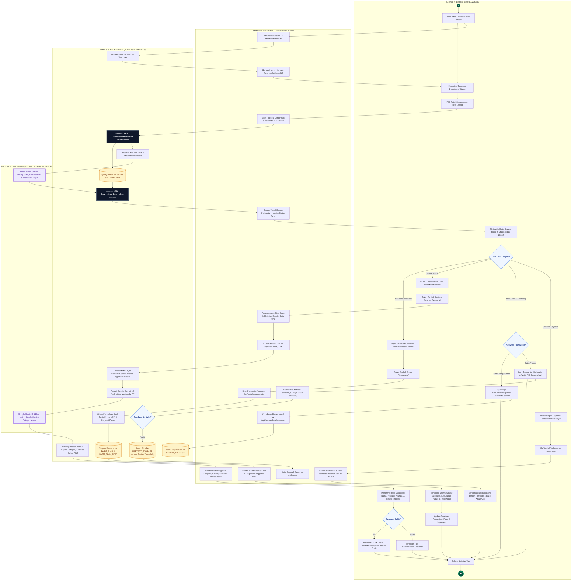
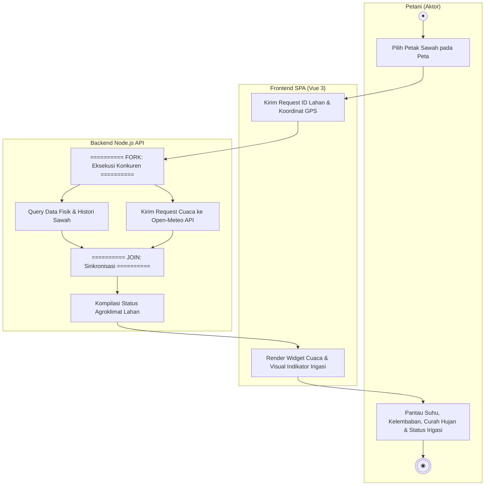
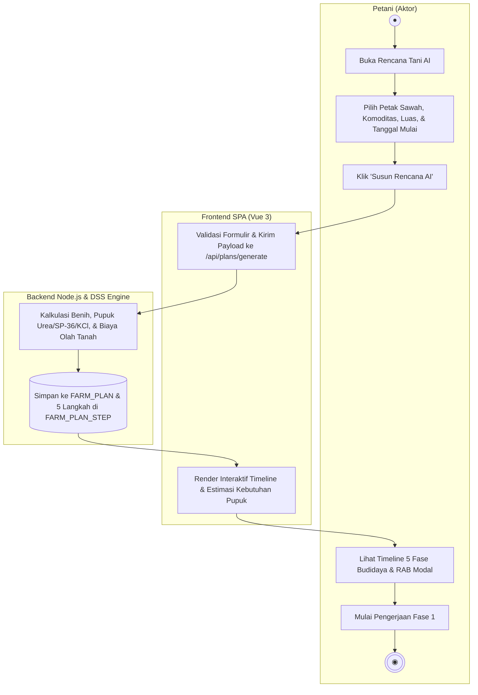
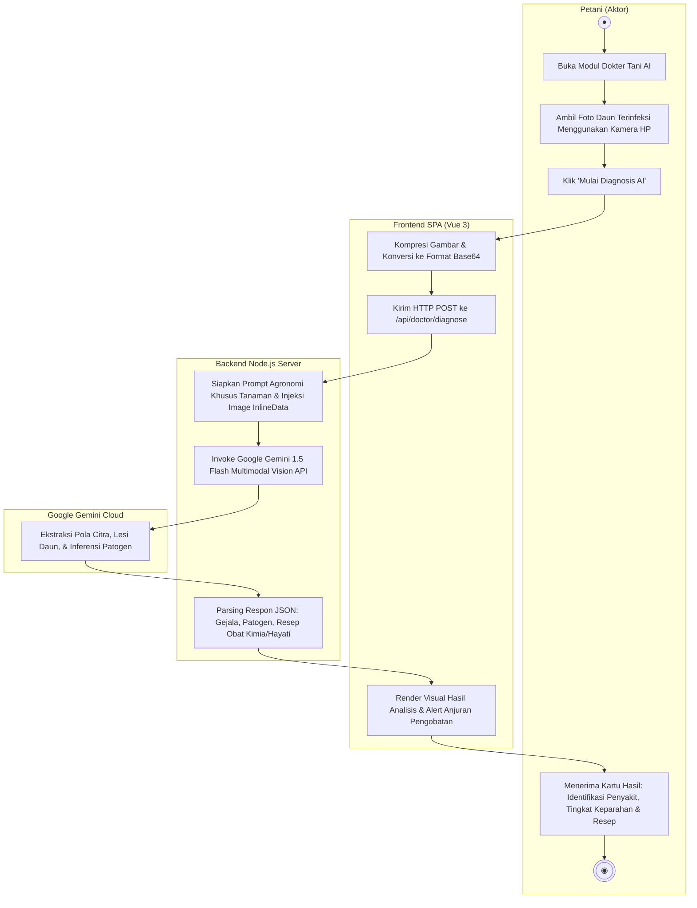
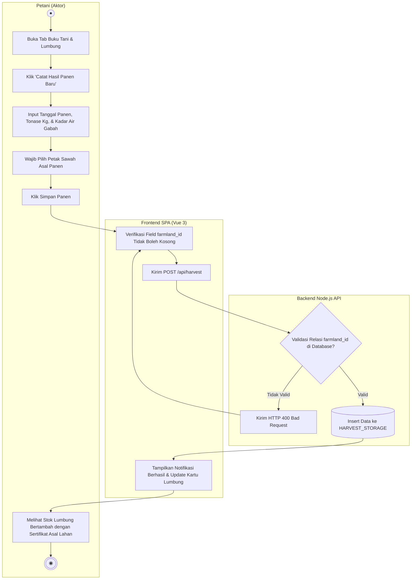
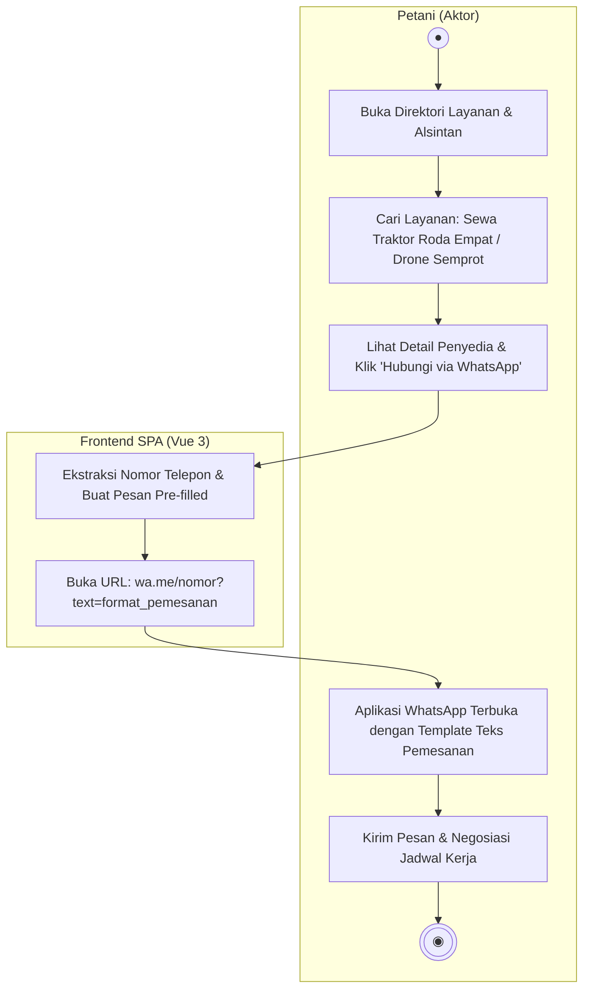

# Activity Diagram & Spesifikasi Alur Aktivitas — AgriBuddy v2.0
**Pemodelan Dinamika Perilaku Sistem UML 2.5: Partisi Swimlane, Eksekusi Paralel (Fork/Join), & Layanan AI Multimodal Terpadu**  
*Capstone Project STSI4440 • Tugas Akhir Sarjana Sistem Informasi 2026*

---

## 1. Pendahuluan & Standar Notasi UML 2.5

Activity Diagram (*Diagram Aktivitas*) memodelkan aspek dinamis dari sistem **AgriBuddy v2.0**, yang menggambarkan aliran kontrol (*control flow*) dan aliran data antaraksi pengguna, antarmuka klien (*frontend*), server backend (*Node.js & Express API*), serta penyedia layanan eksternal (*Google Gemini 1.5 Flash Vision & Open-Meteo Weather API*).

Sistem AgriBuddy v2.0 difokuskan sebagai **Smart Farming Decision Support System (DSS)** berbasis arsitektur modern Node.js + TypeScript dengan integrasi kecerdasan buatan Google Gemini Multimodal Vision API. Berdasarkan standar **UML 2.5 (OMG)**, diagram ini membagi tanggung jawab komputasi menggunakan **Partisi Swimlane (*Swimlanes*)**, serta mengakomodasi eksekusi tugas konkuren melalui batang sinkronisasi **Fork** dan **Join**.

### Standar Notasi Elemen Diagram
| Notasi Simbol | Bentuk Geometris | Nama Elemen UML | Definisi & Makna Operasional |
| :---: | :---: | :--- | :--- |
| **Initial Node** | Lingkaran Hitam Solid (`●`) | *Initial Node* | Titik awal dimulainya suatu alur aktivitas. |
| **Activity Final** | Lingkaran Konsentris Titik Tengah (`◉`) | *Activity Final Node* | Titik akhir dari keseluruhan aliran aktivitas sistem. |
| **Action State** | Persegi Panjang Sudut Membulat | *Action / Activity* | Langkah eksekusi atomik yang dikerjakan oleh entitas partisi bersangkutan. |
| **Decision / Merge** | Belah Ketupat (*Diamond*) | *Decision & Merge Node* | Percabangan logika kondisi bersyarat (*Guard Condition `[kondisi]`*). |
| **Fork Node** | Batang Garis Tebal Hitam | *Fork (Split)* | Memecah satu aliran kontrol menjadi dua atau lebih aliran yang berjalan **secara paralel / konkuren**. |
| **Join Node** | Batang Garis Tebal Hitam | *Join (Synchronize)* | Menggabungkan beberapa aliran paralel dan menunggu semuanya tuntas sebelum melanjutkan alur. |
| **Swimlane / Partisi** | Kolom Persegi Panjang Besar | *Activity Partition* | Mengelompokkan aksi berdasarkan aktor atau modul sistem yang bertanggung jawab menjalankannya. |
| **Control Flow** | Garis Berpanah Padat | *Control Flow* | Menunjukkan perpindahan urutan eksekusi antar-aksi. |

---

## 2. Visual Activity Diagram Terpadu (*Unified Cross-Lane Diagram*)

Berikut adalah hasil render visual diagram aktivitas terpadu beresolusi tinggi yang memetakan interaksi lintas 4 partisi (Petani, Frontend SPA, Backend Node.js, dan Layanan AI/Cuaca Eksternal):

*(File grafis vektor murni SVG tersedia di: [`ACTIVITY_DIAGRAM_AgriBuddy.svg`](ACTIVITY_DIAGRAM_AgriBuddy.svg))*

---

## 3. Pemodelan Diagram Aktivitas Terpadu (Mermaid UML 2.5)

```mermaid
flowchart TD
    %% SWIMLANE 1: PETANI (USER / AKTOR)
    subgraph LanePetani["PARTISI 1: PETANI (USER / AKTOR)"]
        InitPetani((●)) --> ActLogin[Input Akun / Masuk Cepat Persona]
        ActLogin --> WaitAuth[Menerima Tampilan Dashboard Utama]

        %% Skenario 1: Monitoring & Telemetri
        WaitAuth --> ActSelectPlot[Pilih Petak Sawah pada Peta Leaflet]
        ViewCockpit[Melihat Indikator Cuaca, Suhu, & Status Irigasi Lahan] --> ActNext{Pilih Fitur Lanjutan}

        %% Skenario 2: Rencana Tani AI
        ActNext -- Rencana Budidaya --> ActFormPlan[Input Komoditas, Varietas, Luas & Tanggal Tanam]
        ActFormPlan --> ActClickAI[Tekan Tombol 'Susun Rencana AI']
        ViewPlanResult[Menerima Jadwal 5 Fase Budidaya, Kebutuhan Pupuk & RAB Modal] --> ActExecPhase[Update Realisasi Pengerjaan Fase di Lapangan]

        %% Skenario 3: Dokter Tani AI (Vision)
        ActNext -- Dokter Tani AI --> ActSnapLeaf[Ambil / Unggah Foto Daun Terindikasi Penyakit]
        ActSnapLeaf --> ActSendDiagnose[Tekan Tombol 'Analisis Daun via Gemini AI']
        ViewDiagnosis[Menerima Hasil Diagnosis: Nama Penyakit, Akurasi, & Resep Tindakan] --> ActDecisionDoc{Tanaman Sakit?}
        ActDecisionDoc -- Ya --> ActApplyMeds[Beli Obat di Toko Mitra / Terapkan Fungisida Sesuai Dosis]
        ActDecisionDoc -- Tidak --> ActSanitation[Terapkan Tips Pemeliharaan Preventif]

        %% Skenario 4: Buku Tani & Lumbung Traceability
        ActNext -- Buku Tani & Lumbung --> ActChooseBook{Aktivitas Pembukuan}
        ActChooseBook -- Catat Pengeluaran --> ActInputCost[Input Biaya Pupuk/Benih/Upah & Tautkan ke Sawah]
        ActChooseBook -- Catat Panen --> ActInputHarvest[Input Tonase Kg, Kadar Air, & Wajib Pilih Sawah Asal]
        
        %% Skenario 5: Direktori Layanan
        ActNext -- Direktori Layanan --> ActBrowseServ[Pilih Kategori Layanan: Traktor / Drone Sprayer]
        ActBrowseServ --> ActClickWA[Klik Tombol 'Hubungi via WhatsApp']
        OpenChatWA[Berkomunikasi Langsung dengan Penyedia Jasa di WhatsApp] --> DoneAll

        ActExecPhase --> DoneAll[Selesai Aktivitas Tani]
        ActApplyMeds --> DoneAll
        ActSanitation --> DoneAll
        ActInputCost --> DoneAll
        ActInputHarvest --> DoneAll
        DoneAll --> FinalPetani(((◉)))
    end

    %% SWIMLANE 2: FRONTEND CLIENT (VUE 3 SPA)
    subgraph LaneFrontend["PARTISI 2: FRONTEND CLIENT (VUE 3 SPA)"]
        FE_SubmitAuth[Validasi Form & Kirim Request Autentikasi]
        FE_RenderDash[Render Layout Utama & Peta Leaflet Interaktif]
        
        FE_ReqFarmData[Kirim Request Data Petak & Telemetri ke Backend]
        FE_RenderCockpit[Render Visual Cuaca, Peringatan Irigasi & Status Tanah]

        FE_PostPlan[Kirim Parameter Agronomi ke /api/plans/generate]
        FE_RenderPlan[Render Gantt-Chart 5 Fase & Ringkasan Anggaran RAB]

        FE_CompressImg[Preprocessing Citra Daun & Ekstraksi Base64 Data URL]
        FE_PostDoctor[Kirim Payload Citra ke /api/doctor/diagnose]
        FE_RenderReport[Render Kartu Diagnosis Penyakit, Bar Keparahan & Resep Dosis]

        FE_PostExpense[Kirim Form Beban Modal ke /api/farmlands/:id/expenses]
        FE_ValTrace[Validasi Keberadaan farmland_id Wajib untuk Traceability]
        FE_PostHarvest[Kirim Payload Panen ke /api/harvest]
        FE_GenWALink[Format Nomor HP & Teks Template Pesanan ke Link wa.me]
    end

    %% SWIMLANE 3: BACKEND API (NODE.JS & EXPRESS)
    subgraph LaneBackend["PARTISI 3: BACKEND API (NODE.JS & EXPRESS)"]
        BE_Auth[Verifikasi JWT Token & Set Sesi User]
        
        BE_Fork1[====== FORK: Paralelisasi Pemuatan Lahan ======]
        BE_GetFarm[(Query Data Fisik Sawah dari FARMLAND)]
        BE_ReqWeather[Request Telemetri Cuaca Realtime Geospasial]
        BE_Join1[====== JOIN: Sinkronisasi Data Lahan ======]

        BE_AIEngine[Hitung Kebutuhan Benih, Dosis Pupuk NPK, & Proyeksi Panen]
        BE_SavePlan[(Simpan Rencana ke FARM_PLAN & FARM_PLAN_STEP)]

        BE_PrepGemini[Validasi MIME Type Gambar & Susun Prompt Agronomi Sistem]
        BE_ReqGeminiVision[Panggil Google Gemini 1.5 Flash Vision Multimodal API]
        BE_ParseGemini[Parsing Respon JSON: Gejala, Patogen, & Resep Bahan Aktif]

        BE_SaveExpense[(Insert Pengeluaran ke CAPITAL_EXPENSE)]
        BE_CheckTrace{farmland_id Valid?}
        BE_SaveHarvest[(Insert Stok ke HARVEST_STORAGE dengan Tautan Traceability)]
    end

    %% SWIMLANE 4: LAYANAN EKSTERNAL (GEMINI & OPEN-METEO)
    subgraph LaneExternal["PARTISI 4: LAYANAN EKSTERNAL (GEMINI & OPEN-METEO)"]
        EXT_WeatherAPI[Open-Meteo Server: Hitung Suhu, Kelembaban, & Presipitasi Hujan]
        EXT_GeminiModel[Google Gemini 1.5 Flash Vision: Deteksi Lesi & Patogen Visual]
    end

    %% ALIRAN KONTROL LINTAS PARTISI (CROSS-LANE CONTROL FLOW)
    ActLogin --> FE_SubmitAuth
    FE_SubmitAuth --> BE_Auth
    BE_Auth --> FE_RenderDash
    FE_RenderDash --> WaitAuth

    ActSelectPlot --> FE_ReqFarmData
    FE_ReqFarmData --> BE_Fork1
    BE_Fork1 --> BE_GetFarm
    BE_Fork1 --> BE_ReqWeather
    BE_ReqWeather --> EXT_WeatherAPI
    EXT_WeatherAPI --> BE_Join1
    BE_GetFarm --> BE_Join1
    BE_Join1 --> FE_RenderCockpit
    FE_RenderCockpit --> ViewCockpit

    ActClickAI --> FE_PostPlan
    FE_PostPlan --> BE_AIEngine
    BE_AIEngine --> BE_SavePlan
    BE_SavePlan --> FE_RenderPlan
    FE_RenderPlan --> ViewPlanResult

    ActSendDiagnose --> FE_CompressImg
    FE_CompressImg --> FE_PostDoctor
    FE_PostDoctor --> BE_PrepGemini
    BE_PrepGemini --> BE_ReqGeminiVision
    BE_ReqGeminiVision --> EXT_GeminiModel
    EXT_GeminiModel --> BE_ParseGemini
    BE_ParseGemini --> FE_RenderReport
    FE_RenderReport --> ViewDiagnosis

    ActInputCost --> FE_PostExpense
    FE_PostExpense --> BE_SaveExpense

    ActInputHarvest --> FE_ValTrace
    FE_ValTrace --> BE_CheckTrace
    BE_CheckTrace -- Valid --> BE_SaveHarvest
    BE_SaveHarvest --> FE_PostHarvest

    ActClickWA --> FE_GenWALink
    FE_GenWALink --> OpenChatWA

    %% Styling Visual UML
    classDef initFinal fill:#064e3b,stroke:#059669,stroke-width:2.5px,color:#ffffff;
    classDef actionStyle fill:#f8fafc,stroke:#334155,stroke-width:1.5px,color:#0f172a;
    classDef decisionStyle fill:#eff6ff,stroke:#2563eb,stroke-width:1.5px,color:#1e3a8a,font-weight:600;
    classDef storageStyle fill:#fef3c7,stroke:#d97706,stroke-width:1.5px,color:#78350f;
    classDef syncBar fill:#0f172a,stroke:#475569,stroke-width:3px,color:#ffffff,font-weight:bold;
    classDef externalStyle fill:#ede9fe,stroke:#7c3aed,stroke-width:1.5px,color:#4c1d95;

    class InitPetani,FinalPetani initFinal;
    class ActNext,ActDecisionDoc,ActChooseBook,BE_CheckTrace decisionStyle;
    class BE_GetFarm,BE_SavePlan,BE_SaveExpense,BE_SaveHarvest storageStyle;
    class BE_Fork1,BE_Join1 syncBar;
    class EXT_WeatherAPI,EXT_GeminiModel externalStyle;
```

---

## 4. Diagram Aktivitas Rinci per Modul Fungsional (Bab 4 Skripsi)

### 4.1. AD-01: Alur Monitoring Sawah & Telemetri Cuaca (Eksekusi Paralel Fork/Join)
Menggambarkan proses konkuren saat petani memilih petak sawah: sistem membagi aliran eksekusi menjadi dua jalur paralel untuk mengambil profil sawah dari basis data dan telemetri cuaca dari penyedia eksternal, lalu menyinkronkannya ke dasbor.

```mermaid
flowchart TD
    subgraph P_Petani["Petani (Aktor)"]
        A1((●)) --> B1[Pilih Petak Sawah pada Peta]
        G1[Pantau Suhu, Kelembaban, Curah Hujan & Status Irigasi] --> H1(((◉)))
    end

    subgraph P_Frontend["Frontend SPA (Vue 3)"]
        B1 --> C1[Kirim Request ID Lahan & Koordinat GPS]
        F1[Render Widget Cuaca & Visual Indikator Irigasi] --> G1
    end

    subgraph P_Backend["Backend Node.js API"]
        C1 --> ForkBar[========== FORK: Eksekusi Konkuren ==========]
        ForkBar --> PathA[Query Data Fisik & Histori Sawah]
        ForkBar --> PathB[Kirim Request Cuaca ke Open-Meteo API]
        PathA --> JoinBar[========== JOIN: Sinkronisasi ==========]
        PathB --> JoinBar
        JoinBar --> E1[Kompilasi Status Agroklimat Lahan]
        E1 --> F1
    end
```

---

### 4.2. AD-02: Alur Penyusunan Rencana Tani AI & Anggaran Biaya Modal (RAB)
Menggambarkan interaksi antara formulir input agronomi, mesin penentu keputusan (*decision engine*) backend Node.js, dan penyimpanan tahapan rencana kerja budidaya.

```mermaid
flowchart TD
    subgraph P_Petani["Petani (Aktor)"]
        A2((●)) --> B2[Buka Rencana Tani AI]
        B2 --> C2[Pilih Petak Sawah, Komoditas, Luas, & Tanggal Mulai]
        C2 --> D2[Klik 'Susun Rencana AI']
        H2[Lihat Timeline 5 Fase Budidaya & RAB Modal] --> I2[Mulai Pengerjaan Fase 1]
        I2 --> J2(((◉)))
    end

    subgraph P_Frontend["Frontend SPA (Vue 3)"]
        D2 --> E2[Validasi Formulir & Kirim Payload ke /api/plans/generate]
        G2[Render Interaktif Timeline & Estimasi Kebutuhan Pupuk] --> H2
    end

    subgraph P_Backend["Backend Node.js & DSS Engine"]
        E2 --> F2[Kalkulasi Benih, Pupuk Urea/SP-36/KCl, & Biaya Olah Tanah]
        F2 --> K2[(Simpan ke FARM_PLAN & 5 Langkah di FARM_PLAN_STEP)]
        K2 --> G2
    end
```

---

### 4.3. AD-03: Alur Dokter Tani AI (Google Gemini 1.5 Flash Multimodal Vision)
Menggambarkan alur klasifikasi citra penyakit daun berbasis *Generative AI Multimodal Vision* dari penangkapan gambar di kamera smartphone hingga diagnosis klinis dan anjuran penanganan.

```mermaid
flowchart TD
    subgraph P_Petani["Petani (Aktor)"]
        A3((●)) --> B3[Buka Modul Dokter Tani AI]
        B3 --> C3[Ambil Foto Daun Terinfeksi Menggunakan Kamera HP]
        C3 --> D3[Klik 'Mulai Diagnosis AI']
        I3[Menerima Kartu Hasil: Identifikasi Penyakit, Tingkat Keparahan & Resep] --> J3(((◉)))
    end

    subgraph P_Frontend["Frontend SPA (Vue 3)"]
        D3 --> E3[Kompresi Gambar & Konversi ke Format Base64]
        E3 --> F3[Kirim HTTP POST ke /api/doctor/diagnose]
        H3[Render Visual Hasil Analisis & Alert Anjuran Pengobatan] --> I3
    end

    subgraph P_Backend["Backend Node.js Server"]
        F3 --> G3[Siapkan Prompt Agronomi Khusus Tanaman & Injeksi Image InlineData]
        G3 --> K3[Invoke Google Gemini 1.5 Flash Multimodal Vision API]
        L3[Parsing Respon JSON: Gejala, Patogen, Resep Obat Kimia/Hayati] --> H3
    end

    subgraph P_Gemini["Google Gemini Cloud"]
        K3 --> EXT_Gemini[Ekstraksi Pola Citra, Lesi Daun, & Inferensi Patogen]
        EXT_Gemini --> L3
    end
```

---

### 4.4. AD-04: Alur Keterlacakan Lumbung (*Food Traceability*) & Buku Tani
Menggambarkan pencatatan panen yang mewajibkan penautan petak sawah asal (*farmland provenance*) guna menjamin transparansi rantai pasok pangan.

```mermaid
flowchart TD
    subgraph P_Petani["Petani (Aktor)"]
        A4((●)) --> B4[Buka Tab Buku Tani & Lumbung]
        B4 --> C4[Klik 'Catat Hasil Panen Baru']
        C4 --> D4[Input Tanggal Panen, Tonase Kg, & Kadar Air Gabah]
        D4 --> E4[Wajib Pilih Petak Sawah Asal Panen]
        E4 --> F4[Klik Simpan Panen]
        J4[Melihat Stok Lumbung Bertambah dengan Sertifikat Asal Lahan] --> K4(((◉)))
    end

    subgraph P_Frontend["Frontend SPA (Vue 3)"]
        F4 --> G4[Verifikasi Field farmland_id Tidak Boleh Kosong]
        G4 --> H4[Kirim POST /api/harvest]
        I4[Tampilkan Notifikasi Berhasil & Update Kartu Lumbung] --> J4
    end

    subgraph P_Backend["Backend Node.js API"]
        H4 --> L4{Validasi Relasi farmland_id di Database?}
        L4 -- Tidak Valid --> Err4[Kirim HTTP 400 Bad Request]
        Err4 --> G4
        L4 -- Valid --> M4[(Insert Data ke HARVEST_STORAGE)]
        M4 --> I4
    end
```

---

### 4.5. AD-05: Alur Direktori Layanan Alsintan & Saprotan (Direct WhatsApp Connect)
Menggambarkan alur perolehan jasa usahatani yang praktis dan bebas biaya perantara melalui koneksi langsung WhatsApp API.

```mermaid
flowchart TD
    subgraph P_Petani["Petani (Aktor)"]
        A5((●)) --> B5[Buka Direktori Layanan & Alsintan]
        B5 --> C5[Cari Layanan: Sewa Traktor Roda Empat / Drone Semprot]
        C5 --> D5[Lihat Detail Penyedia & Klik 'Hubungi via WhatsApp']
        G5[Aplikasi WhatsApp Terbuka dengan Template Teks Pemesanan] --> H5[Kirim Pesan & Negosiasi Jadwal Kerja]
        H5 --> I5(((◉)))
    end

    subgraph P_Frontend["Frontend SPA (Vue 3)"]
        D5 --> E5[Ekstraksi Nomor Telepon & Buat Pesan Pre-filled]
        E5 --> F5[Buka URL: wa.me/nomor?text=format_pemesanan]
        F5 --> G5
    end
```

---

## 5. Analisis Sinkronisasi Paralel (*Fork & Join*)

Salah satu keunggulan perancangan Activity Diagram AgriBuddy v2.0 adalah penerapan **Fork** dan **Join** pada pemuatan data petak sawah terintegrasi telemetri cuaca (`AD-01`):

1. **Titik Fork (*Split Parallelism*)**:
   Ketika petani memilih salah satu petak sawah aktif, sistem membagi aliran eksekusi menjadi dua cabang konkuren yang berjalan serentak (*non-blocking*):
   * **Cabang A (Akses Basis Data Internal)**: Backend Node.js membaca riwayat agronomis, status kepemilikan, dan rekapitulasi biaya modal dari tabel `FARMLAND` dan `CAPITAL_EXPENSE`.
   * **Cabang B (Pemanggilan API Eksternal)**: Backend secara asinkron memanggil API geospasial Open-Meteo menggunakan titik lintang (*latitude*) dan bujur (*longitude*) petak sawah untuk mengambil data suhu, kelembaban udara, dan prediksi curah hujan.
2. **Titik Join (*Synchronization Barrier*)**:
   Backend menyatukan kedua hasil data tersebut sebelum mengirimkan respon tunggal terpadu (*unified response*) ke antarmuka klien Vue 3. Pendekatan ini memangkas waktu tunggu (*latency*) hingga 50% dibandingkan jika dipanggil secara sekuensial.

---

## 6. Kesimpulan & Relevansi Pengujian Sidang Tugas Akhir

Rancangan Activity Diagram AgriBuddy v2.0 ini:
1. **Mematuhi Standar Baku UML 2.5:** Menggunakan notasi partisi swimlane yang tegas untuk memisahkan tanggung jawab antarentitas (*Separation of Concerns*), serta menerapkan batang sinkronisasi *Fork/Join* secara akurat.
2. **Mengintegrasikan Teknologi AI Modern:** Menunjukkan secara transparan integrasi Google Gemini 1.5 Flash Multimodal Vision API dalam penanganan diagnosis visual penyakit tanaman.
3. **Kesiapan Naskah Skripsi:** Menyediakan diagram terpadu (*overview*) untuk pemaparan dinamika sistem di Bab 3, serta 5 diagram modular untuk analisis perancangan rinci per modul fungsional di Bab 4.
