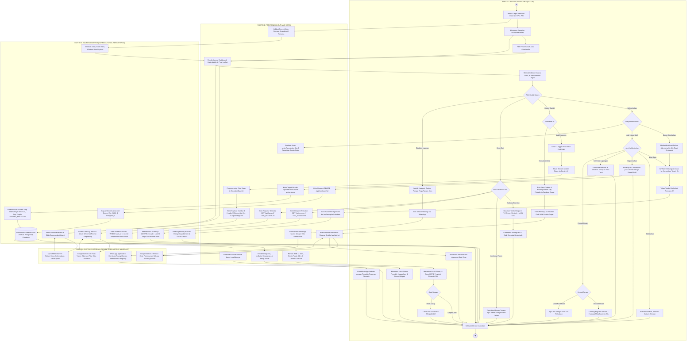

# Activity Diagram & Spesifikasi Alur Aktivitas — AgriBuddy v2.5
**Pemodelan Dinamika Perilaku Sistem UML 2.5: Partisi Swimlane, Eksekusi Paralel (Fork/Join), Kelola Lahan, & Layanan AI Multimodal Terpadu**  
*Capstone Project STSI4440 • Tugas Akhir Sarjana Sistem Informasi 2026*

---

## 1. Pendahuluan & Standar Notasi UML 2.5

Activity Diagram (*Diagram Aktivitas*) memodelkan aspek dinamis dari sistem **AgriBuddy v2.5 (Final Capstone Release)**, yang menggambarkan aliran kontrol (*control flow*) dan aliran data antaraksi pengguna, antarmuka klien (*frontend Vue 3 + SweetAlert2*), server backend (*Node.js Express TypeScript dengan Dual Persistence Engine*), serta sistem eksternal (*Google Gemini 2.5 Flash Vision & Chat, Open-Meteo Weather API, dan WhatsApp Web/App Protocol*).

Berdasarkan standar **UML 2.5 (OMG)**, diagram ini membagi alur kerja ke dalam **4 Partisi Swimlane (*Swimlanes*)**:
1. **Partisi 1: Petani / Pengguna (Aktor)**
2. **Partisi 2: Frontend Client (Vue 3 SPA + SweetAlert2)**
3. **Partisi 3: Backend Server (Node.js Express + Dual Persistence)**
4. **Partisi 4: Sistem Eksternal (Google Gemini API, Open-Meteo, WhatsApp)**

---

## 2. Visual Activity Diagram Terpadu (*Unified Cross-Lane Diagram*)

Berikut adalah hasil pemodelan diagram aktivitas terpadu beresolusi tinggi lintas 4 partisi:

*(File grafis vektor murni SVG tersedia di: [`ACTIVITY_DIAGRAM_AgriBuddy.svg`](ACTIVITY_DIAGRAM_AgriBuddy.svg))*

---

## 3. Pemodelan Diagram Aktivitas Terpadu (Mermaid UML 2.5)

```mermaid
flowchart TD
    %% SWIMLANE 1: PETANI (USER / AKTOR)
    subgraph LanePetani["PARTISI 1: PETANI / PENGGUNA (AKTOR)"]
        InitPetani((●)) --> ActLogin[Masuk Cepat Persona / Input No. HP & PIN]
        ActLogin --> WaitAuth[Menerima Tampilan Dashboard Utama]

        %% Skenario 1: Monitoring & Telemetri
        WaitAuth --> ActSelectPlot[Pilih Petak Sawah pada Peta Leaflet]
        ViewCockpit[Melihat Indikator Cuaca, Suhu, & Rekomendasi Irigasi] --> ActNext{Pilih Modul Sistem}

        %% Skenario 2: Kelola Lahan (Rencana & Kontrol)
        ActNext -- Kelola Lahan --> CheckFarmExist{Punya Lahan Aktif?}
        CheckFarmExist -- Belum Ada Lahan --> ViewEmptyState["Melihat Notifikasi 'Belum Ada Lahan' & Klik 'Buat Sekarang'"]
        ViewEmptyState --> ActWizardPlan[Isi Wizard 4 Langkah: Luas Ha, Komoditas, Tanah, Air]
        CheckFarmExist -- Ada Lahan Aktif --> ManageFarmAction{Aksi Kelola Lahan}

        ManageFarmAction -- Buat Baru --> ActWizardPlan
        ActWizardPlan --> ActClickAI[Tekan Tombol 'Kalkulasi Rencana AI']
        ViewPlanResult[Menerima RAB 12 Item, 5 Fase HST & Proyeksi Finansial ROI] --> ActChoosePlanSave{Opsi Simpan}
        ActChoosePlanSave -- Simpan Draf --> DoneAll
        ActChoosePlanSave -- Mulai Garap --> ActActiveFarmCreated[Lahan Berubah Status Menjadi Aktif]

        ManageFarmAction -- Edit Lahan --> ActEditFarm[Buka Modal Edit, Perbarui Data, & Simpan]
        ManageFarmAction -- Hapus Lahan --> ActDeleteFarm[Klik Hapus & Konfirmasi pada Modal Bahaya SweetAlert2]
        ManageFarmAction -- Set Fase Lapangan --> ActSetPhase[Pilih Fase Berjalan di Sawah & Terapkan Fast-Track]

        ManageFarmAction -- Kontrol Harian --> ActDualControl{Kontrol Tanam}
        ActDualControl -- Checklist Fase --> ActCheckTask[Centang Kegiatan Selesai / Hubungi Mitra Fase via WA]
        ActDualControl -- Catat Kas Modal --> ActInputCost[Input Pos Pengeluaran Kas Riil Lahan]

        %% Skenario 3: Dokter Tani AI (Vision & Chat)
        ActNext -- Dokter Tani AI --> ActDoctorMode{Pilih Mode AI}
        ActDoctorMode -- Lab Diagnosa --> ActSnapLeaf[Ambil / Unggah Foto Daun Padi Sakit]
        ActSnapLeaf --> ActSendDiagnose[Tekan Tombol 'Analisis Daun via Gemini AI']
        ViewDiagnosis[Menerima Hasil: Nama Penyakit, Keparahan, & Resep Mitigasi] --> DoneAll

        ActDoctorMode -- Konsultasi Chat --> ActOpenChat[Buka Sesi Chatbot & Pasang Gemini Key Pribadi via Panduan Cepat]
        ActOpenChat --> ActAskChat[Kirim Pertanyaan Masalah Padi / Klik Contoh Cepat]
        ViewChatReply[Menerima Rekomendasi Agronomi Real-Time] --> DoneAll

        %% Skenario 4: Buku Tani (Gudang & Lumbung Terisolasi)
        ActNext -- Buku Tani --> ActChooseBook{Pilih Tab Buku Tani}
        ActChooseBook -- Gudang Saprotan --> ActAdjustStock["Gunakan Tombol Cepat (+ / -) / Pesan Restock via WA Kios"]
        ActAdjustStock --> ActConfirmArrival[Konfirmasi Barang Tiba -> Stok Otomatis Bertambah]
        ActChooseBook -- Lumbung Panen --> ActInputHarvest[Catat Hasil Panen Tonase Kg & Pantau Harga Pasar Harian]

        %% Skenario 5: Direktori Layanan Ekosistem
        ActNext -- Direktori Layanan --> ActBrowseServ[Jelajah Kategori: Traktor, Pompa, Regu Tanam, Kios]
        ActBrowseServ --> ActClickWA[Klik Tombol 'Hubungi via WhatsApp']
        OpenChatWA[Chat WhatsApp Terbuka dengan Template Pesanan Otomatis] --> DoneAll

        ActActiveFarmCreated --> DoneAll
        ActEditFarm --> DoneAll
        ActDeleteFarm --> DoneAll
        ActSetPhase --> DoneAll
        ActCheckTask --> DoneAll
        ActInputCost --> DoneAll
        ActConfirmArrival --> DoneAll
        ActInputHarvest --> DoneAll

        DoneAll[Selesai Aktivitas Usahatani] --> FinalPetani(((◉)))
    end

    %% SWIMLANE 2: FRONTEND CLIENT (VUE 3 SPA + SWEETALERT2)
    subgraph LaneFrontend["PARTISI 2: FRONTEND CLIENT (VUE 3 SPA)"]
        FE_SubmitAuth[Validasi Form & Kirim Request Autentikasi / Persona]
        FE_RenderDash[Render Layout Dashboard, Kartu Metrik, & Peta Leaflet]
        
        FE_CheckFarms[Evaluasi Array activeFarmlands: Jika 0 Tampilkan Empty State]
        FE_PostPlan[Kirim Parameter Agronomi ke /api/farm-plan/calculate]
        FE_RenderPlan[Render RAB 12 Item, Dosis Pupuk Iklim, & Linimasa 5 Fase]

        FE_SendDeleteFarm[Kirim Request DELETE /api/farmlands/:id]
        FE_ClearFarmCache[Bersihkan activeFarmId & Kunci LocalStorage]
        FE_PostSetPhase[Kirim Target Step ke /api/farmlands/:id/set-active-phase]

        FE_CompressImg[Preprocessing Citra Daun & Ekstraksi Base64]
        FE_PostDoctor[Kirim Payload Gambar & Header X-Gemini-Api-Key ke /api/ai/diagnose]
        FE_RenderDoctor[Render Diagnosis, Indikator Keparahan, & Resep Solusi]

        FE_PostChat[Kirim Pesan Konsultasi & Riwayat Sesi ke /api/ai/chat]
        FE_ReqInv[Kirim Request Terisolasi GET /api/inventory?user_id=activeUid]
        FE_ReqHrv[Kirim Request Terisolasi GET /api/harvest?user_id=activeUid]
        FE_GenWALink[Format Link WhatsApp wa.me dengan Teks Pemesanan]
    end

    %% SWIMLANE 3: BACKEND SERVER (EXPRESS + DUAL PERSISTENCE)
    subgraph LaneBackend["PARTISI 3: BACKEND SERVER (EXPRESS + DUAL PERSISTENCE)"]
        BE_Auth[Verifikasi Akun, Token Sesi, & Return User Payload]
        BE_FetchWeather[Ambil Data Mikroklimat & Olah Rekomendasi Irigasi]
        BE_CalcPlan[Smart Agronomy Planner: Hitung Biaya 12 Item & Skala Luas Ha]

        BE_DeleteFarm[Hapus Record Lahan dari Cache, File JSON, & PostgreSQL]
        BE_UpdatePhase[Perbarui Status Fase: Step Sebelumnya SELESAI, Step Terpilih SEDANG_BERJALAN]

        BE_ProxyAI[Validasi API Key Pribadi / Server & Format Prompt Fitopatologi]
        BE_FilterInv[Filter Koleksi inventory: WHERE user_id = :userId Tanpa Bocor Antar-Akun]
        BE_FilterHrv[Filter Koleksi harvests: WHERE user_id = :userId Tanpa Bocor Antar-Akun]
        BE_SaveData[(Sinkronisasi Data ke Local JSON & PostgreSQL Database)]
    end

    %% SWIMLANE 4: SISTEM EKSTERNAL (GEMINI, OPEN-METEO, WHATSAPP)
    subgraph LaneExternal["PARTISI 4: SISTEM EKSTERNAL (GEMINI, OPEN-METEO, WHATSAPP)"]
        Ext_WeatherAPI[Open-Meteo Server: Return Suhu, Kelembaban, & Presipitasi]
        Ext_GeminiVision[Google Gemini 2.5 Flash Vision: Ekstraksi Fitur Citra Daun Padi]
        Ext_GeminiChat[Google Gemini 2.5 Flash Chat: Pemrosesan Bahasa Alami Agronomi]
        Ext_WhatsAppApp[WhatsApp Application: Membuka Ruang Obrolan Pemesanan Langsung]
    end

    %% Aliran Kontrol Lintas Swimlane
    ActLogin --> FE_SubmitAuth
    FE_SubmitAuth --> BE_Auth
    BE_Auth --> FE_RenderDash
    FE_RenderDash --> WaitAuth

    ActSelectPlot --> FE_RenderDash
    FE_RenderDash --> BE_FetchWeather
    BE_FetchWeather --> Ext_WeatherAPI
    Ext_WeatherAPI --> BE_FetchWeather
    BE_FetchWeather --> FE_RenderDash
    FE_RenderDash --> ViewCockpit

    CheckFarmExist --> FE_CheckFarms
    ActClickAI --> FE_PostPlan
    FE_PostPlan --> BE_CalcPlan
    BE_CalcPlan --> FE_RenderPlan
    FE_RenderPlan --> ViewPlanResult

    ActDeleteFarm --> FE_SendDeleteFarm
    FE_SendDeleteFarm --> BE_DeleteFarm
    BE_DeleteFarm --> BE_SaveData
    BE_SaveData --> FE_ClearFarmCache
    FE_ClearFarmCache --> DoneAll

    ActSetPhase --> FE_PostSetPhase
    FE_PostSetPhase --> BE_UpdatePhase
    BE_UpdatePhase --> BE_SaveData
    BE_SaveData --> DoneAll

    ActSendDiagnose --> FE_CompressImg
    FE_CompressImg --> FE_PostDoctor
    FE_PostDoctor --> BE_ProxyAI
    BE_ProxyAI --> Ext_GeminiVision
    Ext_GeminiVision --> BE_ProxyAI
    BE_ProxyAI --> FE_RenderDoctor
    FE_RenderDoctor --> ViewDiagnosis

    ActAskChat --> FE_PostChat
    FE_PostChat --> Ext_GeminiChat
    Ext_GeminiChat --> FE_PostChat
    FE_PostChat --> ViewChatReply

    ActChooseBook --> FE_ReqInv
    ActChooseBook --> FE_ReqHrv
    FE_ReqInv --> BE_FilterInv
    FE_ReqHrv --> BE_FilterHrv
    BE_FilterInv --> DoneAll
    BE_FilterHrv --> DoneAll

    ActClickWA --> FE_GenWALink
    FE_GenWALink --> Ext_WhatsAppApp
    Ext_WhatsAppApp --> OpenChatWA
```

---

## 4. Keunggulan Dinamika Sistem Terkini
1. **Pencegahan Kebocoran Data Multi-Akun:**
   Alur pembukuan saprotan dan hasil panen diatur secara asinkron dengan menyertakan token/identitas `user_id` pada setiap panggilan API, menjamin isolasi data 100% antar-pengguna.
2. **Fleksibilitas Petani Konvensional (*Fast-Track Set Fase*):**
   Petani tidak diharuskan mengulang dari Fase 1 jika sawah mereka di dunia nyata sudah masuk fase bunting atau pemupukan susulan.
3. **Ergonomi Layar & Zero-Overflow:**
   Alur konsultasi AI dan panduan kunci API dirancang agar seluruh instrumen penting langsung terlihat di viewport perangkat tanpa memerlukan interaksi scroll tambahan.
