# Entity Relationship Diagram (ERD) — AgriBuddy 🌾
**Platform Ekosistem Pendamping Petani Cerdas Terpadu**
*Dokumen Spesifikasi Arsitektur Basis Data Relasional & Ketertelusuran Usahatani (Capstone Project STSI4440)*

---

## 1. Diagram ERD Lengkap (Mermaid Relational Schema)

```mermaid
erDiagram
    USER ||--o{ FARMLAND : "mengelola / memiliki"
    USER ||--o{ ECOSYSTEM_SERVICE : "memasang layanan"
    USER ||--o{ SERVICE_ORDER : "membuat pesanan (pembeli)"
    USER ||--o{ SERVICE_ORDER : "menerima pesanan (penjual)"
    USER ||--o{ COMMUNITY_POST : "membuat postingan feed"
    USER ||--o{ COMMUNITY_COMMENT : "menulis komentar diskusi"
    USER ||--o{ IN_APP_NOTIFICATION : "menerima notifikasi"
    USER ||--o{ INVENTORY_ITEM : "mencatat stok saprotan"
    USER ||--o{ HARVEST_STORAGE : "menyimpan hasil panen"
    USER ||--o{ MARKET_LISTING : "mendaftarkan lelang panen"
    USER ||--o{ MARKET_BID : "mengajukan tawaran harga"
    USER ||--o{ PRODUCT_DISCUSSION : "mengajukan pertanyaan produk"

    FARMLAND ||--o{ COLLABORATOR : "memiliki tim bagi hasil"
    FARMLAND ||--o{ CAPITAL_EXPENSE : "mencatat pengeluaran modal"
    FARMLAND ||--o| FARM_PLAN : "dihitungkan rencana AI"
    FARMLAND ||--o{ HARVEST_STORAGE : "menghasilkan panen tersimpan"

    FARM_PLAN ||--o{ FARM_PLAN_STEP : "memiliki tahapan kerja agronomis"

    ECOSYSTEM_SERVICE ||--o{ SERVICE_ORDER : "dipesan dalam transaksi"
    ECOSYSTEM_SERVICE ||--o{ PRODUCT_DISCUSSION : "memiliki tanya-jawab publik"

    SERVICE_ORDER ||--o{ ORDER_MESSAGE : "memiliki obrolan koordinasi"
    SERVICE_ORDER ||--o| CAPITAL_EXPENSE : "dicatat otomatis ke buku modal"

    COMMUNITY_POST ||--o{ COMMUNITY_COMMENT : "memiliki tanggapan komentar"
    MARKET_LISTING ||--o{ MARKET_BID : "menerima penawaran lelang"

    USER {
        string id PK "usr_xxx"
        string username "Username unik akun"
        string full_name "Nama lengkap warga tani"
        string specialization "Keahlian usahatani / profesi"
        string village "Lokasi desa / kecamatan"
        string phone_number "Nomor telepon / WhatsApp"
        string avatar "Emoji / URI foto avatar"
        int followers_count "Jumlah pengikut"
        timestamp created_at "Waktu registrasi akun"
    }

    FARMLAND {
        string id PK "farm_xxx"
        string user_id FK "Pemilik / pengelola utama (USER.id)"
        string name "Nama petak sawah"
        float land_size_ha "Luas lahan dalam hektar"
        string commodity "Komoditas tanam (e.g. Padi Inpari 32)"
        string soil_type "Karakteristik tanah"
        string water_source "Sumber pasokan air"
        string location "Alamat / nama dusun"
        float latitude "Koordinat lintang GPS"
        float longitude "Koordinat bujur GPS"
        timestamp created_at "Waktu pendaftaran petak sawah"
    }

    COLLABORATOR {
        string id PK "col_xxx"
        string farm_id FK "Petak lahan sasaran (FARMLAND.id)"
        string name "Nama anggota pengelola"
        string role "Peran (Pemilik / Penggarap / Pemodal)"
        float share_percentage "Porsi bagi hasil panen (%)"
        string phone "Kontak WhatsApp anggota"
    }

    CAPITAL_EXPENSE {
        string id PK "exp_xxx"
        string farm_id FK "Lahan sawah yang dibiayai (FARMLAND.id)"
        string item_name "Nama pos pengeluaran modal"
        float amount "Nominal pengeluaran (Rp)"
        string category "Kategori modal (Olah Tanah, Pupuk, dll)"
        string source "Sumber (MARKETPLACE / MANUAL)"
        string order_ref_id FK "ID referensi order katalog (SERVICE_ORDER.id, nullable)"
        timestamp date "Waktu pencatatan biaya"
    }

    FARM_PLAN {
        string id PK "plan_xxx"
        string farmland_id FK "Petak sawah sasaran (FARMLAND.id)"
        float land_size_ha "Luas lahan kalkulasi"
        string commodity "Komoditas target tanam"
        string soil_type "Karakteristik tanah"
        string water_source "Sumber pasokan air"
        float estimated_yield_tons "Estimasi tonase panen (Ton)"
        float estimated_revenue "Proyeksi pendapatan kotor (Rp)"
        float estimated_cost "Proyeksi modal RAB AI (Rp)"
        float estimated_profit "Proyeksi laba bersih (Rp)"
        timestamp created_at "Waktu kalkulasi rencana AI"
    }

    FARM_PLAN_STEP {
        string id PK "step_xxx"
        string farm_plan_id FK "Rencana tani induk (FARM_PLAN.id)"
        int step_no "Urutan fase budidaya (1-5)"
        string phase_name "Nama fase (Olah Tanah, Semai, dll)"
        string activity_name "Deskripsi aktivitas agronomis"
        float estimated_cost "Estimasi biaya langkah (Rp)"
        float actual_cost "Biaya aktual lapangan (Rp)"
        string status "Status (BELUM, SEDANG_BERJALAN, SELESAI)"
    }

    ECOSYSTEM_SERVICE {
        string id PK "srv_xxx"
        string provider_id FK "Penyedia jasa / seller (USER.id)"
        string provider_name "Nama penyedia (Snapshot)"
        string provider_badge "Lencana keahlian / reputasi"
        string provider_avatar "Avatar penyedia"
        string title "Judul layanan / produk jasa"
        string category "Kategori layanan"
        string category_label "Label tampilan kategori"
        float price "Tarif harga satuan (Rp)"
        string price_unit "Satuan tarif (/ Hektar, / Hari, dll)"
        string location "Cakupan wilayah layanan"
        string phone "Kontak WhatsApp pemesanan"
        string description "Deskripsi spesifikasi layanan"
        string tags "Tag keahlian"
        boolean is_available "Ketersediaan armada / pekerja"
        timestamp created_at "Waktu penayangan layanan"
    }

    SERVICE_ORDER {
        string id PK "ord_xxx"
        string service_id FK "Layanan yang dipesan (ECOSYSTEM_SERVICE.id)"
        string service_title "Nama layanan (Snapshot faktur)"
        string seller_id FK "Penyedia jasa / penjual (USER.id)"
        string seller_name "Nama penjual (Snapshot faktur)"
        string buyer_id FK "Pemesan usahatani / pembeli (USER.id)"
        string buyer_name "Nama pembeli (Snapshot faktur)"
        float quantity "Kuantitas pesanan / luas lahan"
        string unit "Satuan unit pesanan"
        float unit_price "Tarif harga satuan saat transaksi"
        float total_price "Total tagihan transaksi (Rp)"
        string payment_method "Metode (COD / YARNEN / Transfer)"
        string delivery_notes "Catatan petak sawah & petunjuk pembeli"
        string status "Status pengerjaan (MENUNGGU, PROSES, KIRIM, SELESAI, BATAL)"
        string seller_notes "Catatan konfirmasi armada dari penjual"
        timestamp created_at "Waktu pembuatan pesanan"
        timestamp status_updated_at "Waktu pembaruan status pengerjaan"
    }

    ORDER_MESSAGE {
        string id PK "msg_xxx"
        string order_id FK "Pesanan transaksi terkait (SERVICE_ORDER.id)"
        string sender_id FK "ID pengguna pengirim (USER.id)"
        string sender_name "Nama pengirim pesan"
        string sender_role "Peran pengirim (PEMBELI / PENJUAL)"
        string message "Isi pesan obrolan koordinasi"
        timestamp created_at "Waktu pengiriman pesan"
    }

    PRODUCT_DISCUSSION {
        string id PK "disc_xxx"
        string service_id FK "Layanan katalog terkait (ECOSYSTEM_SERVICE.id)"
        string user_id FK "Pengguna penanya (USER.id)"
        string user_name "Nama penanya (calon pembeli)"
        string user_avatar "Avatar penanya"
        string question "Pertanyaan publik seputar produk/layanan"
        string reply "Tanggapan resmi dari penyedia"
        string replied_by "Nama perwakilan penyedia yang menjawab"
        timestamp replied_at "Waktu pemberian jawaban"
        timestamp created_at "Waktu pengajuan pertanyaan"
    }

    COMMUNITY_POST {
        string id PK "post_xxx"
        string author_id FK "Pengguna pembuat postingan (USER.id)"
        string author_name "Nama pembuat postingan"
        string author_role "Peran pembuat (Petani, Poktan, Penyuluh)"
        string title "Judul kabar / topik diskusi tani"
        string content "Isi postingan feed komunitas"
        string category "Kategori topik"
        int likes_count "Jumlah respon apresiasi (suka)"
        timestamp created_at "Waktu penayangan postingan"
    }

    COMMUNITY_COMMENT {
        string id PK "comm_xxx"
        string post_id FK "Postingan sasaran (COMMUNITY_POST.id)"
        string author_id FK "Pengguna pemberi komentar (USER.id)"
        string author_name "Nama warga pengomentar"
        string author_role "Peran pengomentar"
        string comment "Isi teks komentar diskusi"
        timestamp created_at "Waktu pengiriman komentar"
    }

    IN_APP_NOTIFICATION {
        string id PK "notif_xxx"
        string user_id FK "Pengguna penerima notifikasi (USER.id)"
        string title "Judul pemberitahuan"
        string message "Ringkasan isi notifikasi"
        string type "Jenis notifikasi (ORDER, STATUS, CHAT, dll)"
        string reference_id "ID referensi entitas terkait"
        boolean is_read "Status telah dibaca pengguna"
        timestamp created_at "Waktu terbit notifikasi"
    }

    INVENTORY_ITEM {
        string id PK "inv_xxx"
        string user_id FK "Pemilik stok saprotan (USER.id)"
        string item_name "Nama pupuk / benih / obat tani"
        string item_type "Jenis komoditas (PUPUK / BIBIT / OBAT)"
        float quantity "Jumlah stok fisik tersimpan"
        string unit "Satuan kemasan (Karung, Kg, Botol)"
        float min_threshold "Ambang batas peringatan stok menipis"
        timestamp updated_at "Waktu pembaruan kuantitas stok"
    }

    HARVEST_STORAGE {
        string id PK "hrv_xxx"
        string user_id FK "Petani pemilik hasil panen (USER.id)"
        string farmland_id FK "Petak sawah asal panen (FARMLAND.id - Traceability)"
        string commodity "Jenis komoditas (GKP, GKG, Beras Medium)"
        float total_weight_kg "Total tonase berat tersimpan (Kg)"
        date harvest_date "Tanggal pelaksanaan panen"
        string status "Status stok (TERSIMPAN / TERJUAL_SEBAGIAN / HABIS)"
        string notes "Catatan mutu kadar air & petak sawah"
    }

    MARKET_LISTING {
        string id PK "list_xxx"
        string seller_id FK "Petani pemilik lelang gabah (USER.id)"
        string seller_name "Nama petani penjual gabah"
        string harvest_ref_id FK "Referensi stok lumbung (HARVEST_STORAGE.id, nullable)"
        string commodity "Komoditas hasil panen yang dilelang"
        float total_weight_kg "Volume berat yang ditawarkan (Kg)"
        float starting_price_per_kg "Harga penawaran awal (Rp/Kg)"
        float min_order_kg "Volume pembelian minimal (Kg)"
        string location "Lokasi lumbung penyimpanan gabah"
        string status "Status bursa (DIBUKA / TERJUAL / DITUTUP)"
        string notes "Catatan spesifikasi & varietas gabah"
        timestamp created_at "Waktu pembukaan lelang"
    }

    MARKET_BID {
        string id PK "bid_xxx"
        string listing_id FK "Lelang panen yang ditawar (MARKET_LISTING.id)"
        string bidder_id FK "Pengepul / mitra pembeli (USER.id)"
        string bidder_name "Nama pengepul / mitra penebas"
        string bidder_role "Peran mitra (PENGGILINGAN / AGEN / KOPERASI)"
        float bid_price_per_kg "Nominal harga penawaran (Rp/Kg)"
        float bid_weight_kg "Volume tonase yang ditawar (Kg)"
        string status "Status penawaran (MENUNGGU / DISETUJUI / DITOLAK)"
        string notes "Catatan kesiapan armada jemput & pembayaran"
        timestamp created_at "Waktu pengajuan penawaran"
    }
```



---

## 2. Kamus Data Entitas (*Data Dictionary*)

| Entitas | Kunci Utama (PK) | Kunci Asing (FK) | Keterangan Relasional & Integritas Data |
| :--- | :--- | :--- | :--- |
| **`USER`** | `id` | - | Entitas sentral seluruh warga ekosistem (petani, penyedia traktor, pengairan, kios, penggilingan). |
| **`FARMLAND`** | `id` | `user_id` -> `USER.id` | Petak sawah yang dikelola pengguna, memuat koordinat GPS presisi dan riwayat agronomis. |
| **`COLLABORATOR`** | `id` | `farm_id` -> `FARMLAND.id` | Struktur aliansi bagi hasil panen per petak sawah (*profit-sharing agreement*). |
| **`CAPITAL_EXPENSE`** | `id` | `farm_id` -> `FARMLAND.id`<br>`order_ref_id` -> `SERVICE_ORDER.id` (opt) | Buku modal pengeluaran riil sawah; tersinkronisasi otomatis saat checkout katalog. |
| **`FARM_PLAN`** | `id` | `farmland_id` -> `FARMLAND.id` | Kalkulator rencana usahatani berbasis AI (estimasi tonase, RAB modal, proyeksi laba). |
| **`FARM_PLAN_STEP`** | `id` | `farm_plan_id` -> `FARM_PLAN.id` | Jadwal tahapan kerja agronomis (Olah Tanah s.d. Pasca-Panen) beserta biaya aktual. |
| **`ECOSYSTEM_SERVICE`** | `id` | `provider_id` -> `USER.id` | Katalog jasa usahatani (sewa traktor, pompa air, regu buruh tanam, saprotan resmi). |
| **`SERVICE_ORDER`** | `id` | `service_id` -> `ECOSYSTEM_SERVICE.id`<br>`seller_id` -> `USER.id`<br>`buyer_id` -> `USER.id` | Transaksi pemesanan jasa antar warga dengan dukungan sistem Bayar Panen (Yarnen). |
| **`ORDER_MESSAGE`** | `id` | `order_id` -> `SERVICE_ORDER.id`<br>`sender_id` -> `USER.id` | Jalur percakapan privat dua arah antara pembeli dan penjual untuk koordinasi armada. |
| **`PRODUCT_DISCUSSION`**| `id` | `service_id` -> `ECOSYSTEM_SERVICE.id`<br>`user_id` -> `USER.id` | Forum tanya-jawab publik pada halaman rincian produk/layanan katalog. |
| **`COMMUNITY_POST`** | `id` | `author_id` -> `USER.id` | Feed linimasa sosial untuk berbagi kabar cuaca, hama, info poktan, dan harga pasar. |
| **`COMMUNITY_COMMENT`** | `id` | `post_id` -> `COMMUNITY_POST.id`<br>`author_id` -> `USER.id` | Interaksi tanggapan diskusi warga tani pada postingan komunitas. |
| **`IN_APP_NOTIFICATION`**| `id` | `user_id` -> `USER.id` | Sistem notifikasi terpusat untuk pesanan, jadwal armada, chat, dan interaksi sosial. |
| **`INVENTORY_ITEM`** | `id` | `user_id` -> `USER.id` | Buku stok saprotan fisik milik petani; otomatis bertambah saat pesanan kios selesai. |
| **`HARVEST_STORAGE`** | `id` | `user_id` -> `USER.id`<br>`farmland_id` -> `FARMLAND.id` | Lumbung hasil panen petani dengan ketertelusuran penuh (*traceability*) ke petak sawah. |
| **`MARKET_LISTING`** | `id` | `seller_id` -> `USER.id`<br>`harvest_ref_id` -> `HARVEST_STORAGE.id` (opt) | Bursa pasar terbuka lelang gabah/hasil panen langsung ke mitra penggilingan dan pengepul. |
| **`MARKET_BID`** | `id` | `listing_id` -> `MARKET_LISTING.id`<br>`bidder_id` -> `USER.id` | Penawaran harga dan volume tonase pembelian gabah yang diajukan oleh mitra pembeli. |

---

## 3. Analisis Integritas Relasional & Ketertelusuran (*Agricultural Traceability*)

### A. Rantai Ketertelusuran Padi ke Petak Lahan (*End-to-End Traceability*)
Dengan menambahkan `farmland_id FK` pada entitas `HARVEST_STORAGE`, platform AgriBuddy kini memiliki rantai data agronomis yang tidak terputus (*closed-loop agricultural data chain*):
1. **Lahan (`FARMLAND`)**: Karakteristik tanah, pasokan air, luas lahan, dan koordinat GPS.
2. **Kalkulasi & Biaya (`FARM_PLAN` + `CAPITAL_EXPENSE`)**: Rencana kebutuhan pupuk, pestisida, dan pengeluaran modal riil selama siklus tanam.
3. **Penyimpanan Lumbung (`HARVEST_STORAGE`)**: Menghubungkan langsung tonase panen aktual ke petak sawah asalnya. Hal ini memungkinkan komputasi **Produktivitas Aktual (Ton/Ha)** dan evaluasi galat prediksi AI.
4. **Bursa Komoditas (`MARKET_LISTING`)**: Pembeli (penggilingan padi) dapat menelusuri asal-usul petak sawah dan riwayat budidaya gabah yang mereka beli.

### B. Integritas Relasional Seluruh Interaksi Pengguna
Seluruh entitas transaksional dan sosial kini terikat secara ketat pada entitas induk `USER`:
* **Bursa Lelang**: `MARKET_LISTING` terhubung ke `seller_id FK`, dan setiap tawaran `MARKET_BID` terhubung ke `bidder_id FK`.
* **Interaksi Sosial**: `COMMUNITY_POST` dan `COMMUNITY_COMMENT` masing-masing memiliki `author_id FK`, menjamin integritas data postingan apabila ada pembaruan nama pengguna, serta memungkinkan kueri analitik kontribusi per pengguna.

---

## 4. Kajian Ilmiah: Normalisasi Basis Data (3NF) vs. *Snapshot Transaksional* (Denormalisasi Terkontrol)

Penguji menyoroti adanya redundansi data pada tabel `SERVICE_ORDER` (seperti `seller_name`, `buyer_name`, `service_title`) dan `ECOSYSTEM_SERVICE` (`provider_name`). Berikut adalah justifikasi rekayasa perangkat lunak dan arsitektur data untuk skenario ini:

```
+-------------------------------------------------------------------------------+
|                       KOMPARASI PENDEKATAN DESAIN                             |
+------------------------------------+------------------------------------------+
|  Normalisasi Penuh (Murni 3NF)     |  Denormalisasi Terkontrol (Snapshot)     |
+------------------------------------+------------------------------------------+
| - Hanya menyimpan seller_id,       | - Menyimpan seller_id, buyer_id (FK),    |
|   buyer_id, dan service_id.        |   ditambah snapshot nama saat transaksi. |
| - Nama diambil via JOIN ke USER.   | - Tetap memiliki integritas relasional   |
| - Jika user mengubah namanya di    |   penuh melalui Foreign Key.             |
|   kemudian hari, nama pada riwayat | - Menjamin sifat Immutability Faktur:    |
|   kwitansi lama ikut berubah.      |   nama pada invoice 2 tahun lalu tidak   |
|                                    |   berubah secara retroaktif jika pihak   |
|                                    |   terkait berganti display name.         |
| - Standar pada sistem CRUD master. | - Standar industri E-Commerce & FinTech  |
|                                    |   (Slowly Changing Dimensions Type 3).   |
+------------------------------------+------------------------------------------+
```

> **Keputusan Desain Arsitektur AgriBuddy**:
> 1. **Integritas Relasional Mutlak**: Kunci relasi (`seller_id`, `buyer_id`, `author_id`, `bidder_id`, `farmland_id`) berstatus **Foreign Key wajib**. Kueri relasional, hak akses (*authorization*), dan integritas data merujuk sepenuhnya ke Primary Key `USER.id`.
> 2. **Snapshot Faktur Transaksi (*Point-in-Time Invoice Snapshot*)**: Atribut nama teks pada pesanan (`SERVICE_ORDER.service_title`, `seller_name`, `buyer_name`) dideklarasikan secara eksplisit sebagai *field audit snapshot* untuk melindungi keabsahan rekonsiliasi buku modal bagi petani.

---

## 5. Standardisasi Tipe Data Tanggal & Waktu

Sesuai kaidah perancangan basis data relasional (SQL-92 / ANSI SQL) dan efisiensi pengindeksan:
* **`timestamp` / `datetime`**: Digunakan untuk atribut yang membutuhkan presisi waktu hingga detik (audit trail logistik, waktu pembuatan transaksi, penerbitan notifikasi, dan pertukaran pesan chat). Mendukung *B-Tree Indexing* untuk pengurutan linimasa descending (`ORDER BY created_at DESC`).
* **`date`**: Digunakan untuk pencatatan kalender harian murni tanpa jam (seperti `harvest_date` pada lumbung hasil panen).
