# Entity Relationship Diagram (ERD) — AgriBuddy 🌾
**Platform Ekosistem Pendamping Petani Cerdas**

Dokumen ini memvisualisasikan arsitektur basis data relasional/dokumen pada platform **AgriBuddy**, mencakup entitas profil pengguna, manajemen multi-lahan sawah, kolaborator bagi hasil panen, perencanaan usahatani AI, katalog marketplace & pesanan in-app, diskusi transaksi/produk, jejaring sosial, dan sistem notifikasi.

---

## 1. Diagram ERD (Mermaid)

```mermaid
erDiagram
    USER ||--o{ FARMLAND : "mengelola / memiliki"
    USER ||--o{ ECOSYSTEM_SERVICE : "memasang layanan"
    USER ||--o{ SERVICE_ORDER : "membuat pesanan (pembeli)"
    USER ||--o{ SERVICE_ORDER : "menerima pesanan (penjual)"
    USER ||--o{ COMMUNITY_POST : "membuat postingan"
    USER ||--o{ COMMUNITY_COMMENT : "menulis komentar"
    USER ||--o{ IN_APP_NOTIFICATION : "menerima notifikasi"
    USER ||--o{ INVENTORY_ITEM : "mencatat stok saprotan"
    USER ||--o{ HARVEST_STORAGE : "menyimpan hasil panen"
    USER ||--o{ MARKET_LISTING : "mendaftarkan lelang panen"

    FARMLAND ||--o{ COLLABORATOR : "memiliki tim bagi hasil"
    FARMLAND ||--o{ CAPITAL_EXPENSE : "mencatat pengeluaran modal"
    FARMLAND ||--o| FARM_PLAN : "dihitungkan rencana AI"
    FARM_PLAN ||--o{ FARM_PLAN_STEP : "memiliki tahapan kerja"

    ECOSYSTEM_SERVICE ||--o{ SERVICE_ORDER : "dipesan dalam transaksi"
    ECOSYSTEM_SERVICE ||--o{ PRODUCT_DISCUSSION : "memiliki tanya-jawab publik"
    USER ||--o{ PRODUCT_DISCUSSION : "mengajukan pertanyaan"

    SERVICE_ORDER ||--o{ ORDER_MESSAGE : "memiliki obrolan chat"
    SERVICE_ORDER ||--o| CAPITAL_EXPENSE : "dicatat ke buku modal (opsional)"

    COMMUNITY_POST ||--o{ COMMUNITY_COMMENT : "memiliki komentar"
    MARKET_LISTING ||--o{ MARKET_BID : "menerima tawaran pengepul"

    USER {
        string id PK "usr_xxx"
        string username "Username unik"
        string full_name "Nama lengkap warga tani"
        string specialization "Keahlian usahatani / profesi"
        string village "Lokasi desa / kecamatan"
        string phone_number "Nomor telepon / WhatsApp"
        string avatar "Emoji / foto avatar"
        int followers_count "Jumlah pengikut"
        string created_at "Waktu pendaftaran"
    }

    FARMLAND {
        string id PK "farm_xxx"
        string user_id FK "Pemilik / pengelola utama"
        string name "Nama petak (e.g. Sawah Blok Krajan)"
        float land_size_ha "Luas lahan dalam hektar"
        string commodity "Komoditas tanam (e.g. Padi Inpari 32)"
        string soil_type "Karakteristik tanah"
        string water_source "Sumber pasokan air"
        string location "Alamat / nama dusun"
        float latitude "Koordinat lintang"
        float longitude "Koordinat bujur"
        string created_at "Waktu pembuatan"
    }

    COLLABORATOR {
        string id PK "col_xxx"
        string farm_id FK "Lahan yang dikelola"
        string name "Nama anggota pengelola"
        string role "Peran (Pemilik / Penggarap / Buruh)"
        float share_percentage "Porsi bagi hasil (%)"
        string phone "Kontak WhatsApp"
    }

    CAPITAL_EXPENSE {
        string id PK "exp_xxx"
        string farm_id FK "Lahan sawah yang dibiayai"
        string item_name "Nama pos biaya / pengeluaran"
        float amount "Nominal biaya rupiah"
        string category "Kategori pos modal (Olah Tanah, Pupuk, dll)"
        string source "Sumber (MARKETPLACE / MANUAL)"
        string order_ref_id FK "ID referensi order katalog jika ada"
        string date "Tanggal & jam pencatatan"
    }

    FARM_PLAN {
        string id PK "plan_xxx"
        string farmland_id FK "Petak lahan sasaran"
        float land_size_ha "Luas lahan"
        string commodity "Komoditas target"
        string soil_type "Kondisi tanah"
        string water_source "Pasokan air"
        float estimated_yield_tons "Estimasi tonase panen"
        float estimated_revenue "Estimasi pendapatan (Rp)"
        float estimated_cost "Estimasi modal RAB (Rp)"
        float estimated_profit "Estimasi laba bersih (Rp)"
        string created_at "Waktu kalkulasi AI"
    }

    FARM_PLAN_STEP {
        string id PK "step_xxx"
        string farm_plan_id FK "Rencana tani induk"
        int step_no "Urutan tahapan (1-5)"
        string phase_name "Nama fase (Olah Tanah, Semai, dll)"
        string activity_name "Deskripsi aktivitas agronomis"
        float estimated_cost "Estimasi biaya AI"
        float actual_cost "Biaya aktual lapangan"
        string status "Status (BELUM, SEDANG_BERJALAN, SELESAI)"
    }

    ECOSYSTEM_SERVICE {
        string id PK "srv_xxx"
        string provider_id FK "Penyedia jasa / seller"
        string provider_name "Nama penyedia"
        string provider_badge "Gelar / reputasi keahlian"
        string provider_avatar "Avatar penyedia"
        string title "Judul layanan / produk"
        string category "Kategori layanan"
        string category_label "Label kategori"
        float price "Tarif harga satuan"
        string price_unit "Satuan tarif (/ Hektar, / Hari, dll)"
        string location "Jangkauan wilayah pengerjaan"
        string phone "Kontak WhatsApp"
        string description "Deskripsi layanan / spesifikasi"
        string tags "Tag keahlian (array)"
        boolean is_available "Kesiapan armada / ketersediaan"
        string created_at "Waktu penayangan"
    }

    SERVICE_ORDER {
        string id PK "ord_xxx"
        string service_id FK "Layanan yang dipesan"
        string service_title "Nama layanan / produk"
        string seller_id FK "Penyedia jasa (penjual)"
        string seller_name "Nama penjual"
        string buyer_id FK "Pemesan usahatani (pembeli)"
        string buyer_name "Nama pembeli"
        float quantity "Jumlah kuantitas / luas lahan"
        string unit "Satuan unit"
        float unit_price "Tarif satuan"
        float total_price "Total tagihan transaksi (Rp)"
        string payment_method "Metode (COD / YARNEN / Transfer)"
        string delivery_notes "Catatan lokasi & waktu pembeli"
        string status "Status (MENUNGGU, PROSES, KIRIM, SELESAI, BATAL)"
        string seller_notes "Catatan konfirmasi dari penjual"
        string created_at "Waktu pemesanan"
        string status_updated_at "Waktu pembaruan status terakhir"
    }

    ORDER_MESSAGE {
        string id PK "msg_xxx"
        string order_id FK "Pesanan transaksi terkait"
        string sender_id FK "ID pengirim pesan"
        string sender_name "Nama pengirim"
        string sender_role "Peran (PEMBELI / PENJUAL)"
        string message "Isi pesan obrolan koordinasi"
        string created_at "Waktu kirim pesan"
    }

    PRODUCT_DISCUSSION {
        string id PK "disc_xxx"
        string service_id FK "Layanan / produk katalog"
        string user_id FK "Penanya (calon pembeli)"
        string user_name "Nama penanya"
        string user_avatar "Avatar penanya"
        string question "Pertanyaan publik spesifikasi produk"
        string reply "Jawaban resmi dari penyedia"
        string replied_by "Nama penyedia yang menjawab"
        string replied_at "Waktu pemberian jawaban"
        string created_at "Waktu pengajuan pertanyaan"
    }

    COMMUNITY_POST {
        string id PK "post_xxx"
        string author_name "Nama pembuat postingan"
        string author_role "Peran pembuat"
        string title "Judul kabar / topik diskusi"
        string content "Isi postingan feed komunitas"
        string category "Kategori topik"
        int likes_count "Jumlah respon suka"
        string created_at "Waktu posting"
    }

    COMMUNITY_COMMENT {
        string id PK "comm_xxx"
        string post_id FK "Postingan yang dikomentari"
        string author_name "Nama pengomentar"
        string author_role "Peran pengomentar"
        string comment "Isi teks komentar"
        string created_at "Waktu komentar"
    }

    IN_APP_NOTIFICATION {
        string id PK "notif_xxx"
        string user_id FK "Penerima notifikasi"
        string title "Judul notifikasi"
        string message "Ringkasan pesan notifikasi"
        string type "Jenis notifikasi (ORDER, STATUS, CHAT, dll)"
        string reference_id "ID referensi (order_id / srv_id / post_id)"
        boolean is_read "Status telah dibaca"
        string created_at "Waktu terbit notifikasi"
    }

    INVENTORY_ITEM {
        string id PK "inv_xxx"
        string user_id FK "Pemilik stok"
        string item_name "Nama pupuk / bibit / obat"
        string item_type "Jenis (PUPUK / BIBIT / OBAT)"
        float quantity "Jumlah stok fisik tersimpan"
        string unit "Satuan kemasan (Karung, Kg, Botol)"
        float min_threshold "Batas peringatan stok menipis"
        string updated_at "Waktu pembaruan stok"
    }

    HARVEST_STORAGE {
        string id PK "hrv_xxx"
        string user_id FK "Pemilik panen"
        string commodity "Komoditas (Gabah Kering, Beras, dll)"
        float total_weight_kg "Total tonase berat (Kg)"
        string harvest_date "Tanggal pelaksanaan panen"
        string status "Status (TERSIMPAN / TERJUAL)"
        string notes "Catatan asal petak sawah"
    }

    MARKET_LISTING {
        string id PK "list_xxx"
        string seller_name "Nama petani penjual gabah"
        string commodity "Komoditas hasil panen"
        float total_weight_kg "Total berat yang dilelang"
        float starting_price_per_kg "Harga buka awal lelang (Rp/Kg)"
        string status "Status lelang (DIBUKA / TERJUAL)"
        string location "Lokasi lumbung penyimpanan"
        string notes "Catatan kualitas gabah"
    }

    MARKET_BID {
        string id PK "bid_xxx"
        string listing_id FK "Lelang panen yang ditawar"
        string bidder_name "Nama pengepul / penebas"
        string bidder_role "Peran penawar"
        float bid_price_per_kg "Harga penawaran (Rp/Kg)"
        float bid_weight_kg "Volume yang ingin dibeli"
        string status "Status tawaran (MENUNGGU / DISETUJUI)"
        string notes "Catatan penawaran"
    }
```

---

## 2. Rincian Hubungan Antar-Entitas (*Cardinality & Business Rules*)

### A. Pengguna & Lahan Sawah (`USER` - `FARMLAND`)
* **Kardinalitas:** `1 : N` (Satu pengguna dapat memiliki atau mengelola banyak petak lahan sawah).
* **Aturan Bisnis:** Setiap sawah memiliki identitas koordinat lokasi (lintang dan bujur) yang dapat dideteksi via GPS otomatis atau dipilih melalui pemilih pin Leaflet Maps.

### B. Lahan Sawah & Kolaborator (`FARMLAND` - `COLLABORATOR`)
* **Kardinalitas:** `1 : N` (Satu petak sawah dapat dikelola oleh beberapa kolaborator bagi hasil).
* **Aturan Bisnis:** Total persentase `share_percentage` dari seluruh kolaborator pada satu petak sawah berjumlah 100% (misal: Pemilik Lahan 60% dan Penggarap 40%). Sistem mengalkulasi proyeksi nominal rupiah berdasarkan estimasi hasil panen AI.

### C. Lahan Sawah & Buku Modal (`FARMLAND` - `CAPITAL_EXPENSE`)
* **Kardinalitas:** `1 : N` (Satu petak sawah menampung riwayat pengeluaran modal).
* **Aturan Bisnis:** Pengeluaran modal dapat bersumber secara otomatis dari transaksi belanja marketplace (`source: 'MARKETPLACE'`) dengan mencantumkan `order_ref_id`, atau diinput secara manual oleh petani di lapangan (`source: 'MANUAL'`).

### D. Lahan Sawah & Rencana Tani AI (`FARMLAND` - `FARM_PLAN` - `FARM_PLAN_STEP`)
* **Kardinalitas:** `1 : 1` (Setiap petak sawah memiliki rencana tani aktif) dan `1 : N` ke tahapan kerja agronomis (`FARM_PLAN_STEP`).
* **Aturan Bisnis:** AI mengalkulasi Rencana Anggaran Biaya (RAB) berdasarkan luas lahan, jenis tanah, sumber air, dan cuaca. Petani dapat memantau status pengerjaan tahapan per fase tanam.

### E. Katalog & Transaksi Pesanan (`ECOSYSTEM_SERVICE` - `SERVICE_ORDER`)
* **Kardinalitas:** `1 : N` (Satu item layanan katalog dapat dipesan berkali-kali oleh berbagai pembeli).
* **Aturan Bisnis:** 
  * `SERVICE_ORDER` menghubungkan `buyer_id` dan `seller_id`.
  * Penjual mengonfirmasi status pengerjaan (*DIPROSES, SEDANG_DIKIRIM, SELESAI, STOK_HABIS, DIBATALKAN*) disertai catatan langsung untuk pembeli.
  * Pasca-checkout, pembeli dapat memilih petak sawah tujuan untuk otomatis mendebitkan total biaya ke `CAPITAL_EXPENSE`.

### F. Diskusi Transaksi & Diskusi Produk (`ORDER_MESSAGE` & `PRODUCT_DISCUSSION`)
* **Kardinalitas Pesanan:** `1 : N` (`SERVICE_ORDER` - `ORDER_MESSAGE`). Obrolan dua arah privat antara pembeli dan penjual terkait transaksi tertentu.
* **Kardinalitas Produk:** `1 : N` (`ECOSYSTEM_SERVICE` - `PRODUCT_DISCUSSION`). Utas tanya-jawab publik antara calon pembeli dan penyedia layanan pada kartu katalog.

### G. Notifikasi Terpadu (`USER` - `IN_APP_NOTIFICATION`)
* **Kardinalitas:** `1 : N`. Seluruh aksi penting (*pesanan baru, update status pengerjaan armada, pesan chat transaksi, pertanyaan produk, komentar postingan, dan pengikut baru*) memicu pembuatan satu notifikasi yang ditujukan ke `user_id` penerima.
