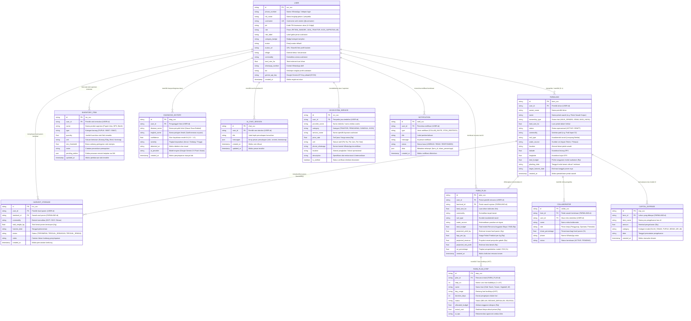

# Entity Relationship Diagram (ERD) — AgriBuddy 🌾
**Platform Smart Farming Decision Support System (DSS) — Versi 2.5 Terkini**
*Dokumen Spesifikasi Arsitektur Basis Data Relasional, Isolasi Akun, & Ketertelusuran Usahatani (Capstone Project STSI4440)*

---

## 1. Diagram ERD Lengkap (Mermaid Relational Schema)

```mermaid
erDiagram
    USER ||--o{ FARMLAND : "mengelola / memiliki (0..n)"
    USER ||--o{ INVENTORY_ITEM : "mencatat stok saprotan terisolasi"
    USER ||--o{ HARVEST_STORAGE : "menyimpan hasil panen terisolasi"
    USER ||--o{ DIAGNOSIS_HISTORY : "memiliki riwayat diagnosa daun"
    USER ||--o{ AI_CHAT_SESSION : "memiliki sesi konsultasi AI"
    USER ||--o{ FARM_PLAN : "membuat rencana tani AI"
    USER ||--o{ ECOSYSTEM_SERVICE : "mendaftarkan jasa / saprotan"
    USER ||--o{ NOTIFICATION : "menerima notifikasi kemitraan"

    FARMLAND ||--o{ COLLABORATOR : "memiliki mitra pengelola"
    FARMLAND ||--o{ CAPITAL_EXPENSE : "mencatat pos kas modal riil"
    FARMLAND ||--o{ FARM_PLAN : "dihitungkan rekomendasi AI"
    FARMLAND ||--o{ HARVEST_STORAGE : "menghasilkan panen (traceability)"

    FARM_PLAN ||--o{ FARM_PLAN_STEP : "memiliki 5 fase budidaya (HST)"

    USER {
        string id PK "usr_xxx"
        string phone_number "Nomor WhatsApp / telepon login"
        string full_name "Nama lengkap petani / penyedia"
        string username UK "Username unik sistem (@username)"
        string pin "Kode PIN keamanan akun (4-6 digit)"
        string role "Peran (PETANI_MANDIRI, JASA_TRAKTOR, KIOS_SAPROTAN, dll)"
        string role_label "Label gelar peran usahatani"
        string category_badge "Badge kategori tampilan"
        string avatar "Emoji avatar default"
        string avatar_url "URL / Base64 foto profil kustom"
        string village "Domisili desa / kecamatan"
        string commodity "Komoditas utama usahatani"
        float land_size_ha "Total estimasi luas lahan"
        string whatsapp_number "Kontak WhatsApp aktif"
        string bio "Deskripsi singkat profil usahatani"
        string gemini_api_key "Google Gemini API Key pribadi (BYOK)"
        timestamp created_at "Waktu registrasi akun"
    }

    FARMLAND {
        string id PK "farm_xxx"
        string user_id FK "Pemilik lahan (USER.id)"
        string owner_name "Nama pemilik lahan"
        string name "Nama petak sawah (e.g. Petak Sawah Krajan)"
        string ownership_type "Status hak (MILIK_SENDIRI, SEWA, BAGI_HASIL)"
        float land_size_ha "Luas petak dalam hektar"
        string status "Status operasional (ACTIVE / DRAFT)"
        string commodity "Varietas padi (e.g. Padi Inpari 32)"
        string soil_type "Karakteristik tanah (Lempung Berliat)"
        string water_source "Sumber air (Irigasi Teknis / Pompa)"
        string location "Alamat lokasi petak sawah"
        float latitude "Koordinat lintang GPS"
        float longitude "Koordinat bujur GPS"
        float total_budget "Plafon anggaran modal usahatani (Rp)"
        string planting_date "Tanggal mulai tanam aktual / estimasi"
        string target_harvest_date "Estimasi tanggal panen raya"
        timestamp created_at "Waktu pendaftaran petak sawah"
    }

    COLLABORATOR {
        string id PK "collab_xxx"
        string farm_id FK "Petak sawah kemitraan (FARMLAND.id)"
        string user_id FK "Akun mitra terdaftar (USER.id)"
        string name "Nama mitra kolaborator"
        string role "Peran kerja (Penggarap, Operator, Pemodal)"
        float share_percentage "Persentase bagi hasil panen (%)"
        string phone "Nomor WhatsApp mitra"
        string status "Status kemitraan (ACTIVE / PENDING)"
    }

    CAPITAL_EXPENSE {
        string id PK "exp_xxx"
        string farm_id FK "Lahan yang dibiayai (FARMLAND.id)"
        string item_name "Nama pos pengeluaran kas riil"
        float amount "Nominal pengeluaran (Rp)"
        string category "Kategori modal (OLAH_TANAH, PUPUK, BENIH, AIR, dll)"
        string date "Tanggal pencatatan pengeluaran"
        timestamp created_at "Waktu transaksi dicatat"
    }

    FARM_PLAN {
        string id PK "plan_xxx"
        string user_id FK "Petani pemilik rencana (USER.id)"
        string farmland_id FK "Petak sawah rujukan (FARMLAND.id)"
        float land_size_ha "Luas lahan kalkulasi (Ha)"
        string commodity "Komoditas target tanam"
        string soil_type "Kondisi karakteristik tanah"
        string water_source "Ketersediaan pasokan air irigasi"
        float total_budget "Total modal Rencana Anggaran Biaya / RAB (Rp)"
        float projected_yield_kg "Estimasi tonase hasil panen (Kg)"
        float hpp_per_kg "Harga Pokok Produksi per kg (Rp)"
        float projected_revenue "Proyeksi omzet penjualan gabah (Rp)"
        float projected_net_profit "Estimasi laba bersih (Rp)"
        float roi_percentage "Tingkat pengembalian modal / ROI (%)"
        timestamp created_at "Waktu kalkulasi rencana tanam"
    }

    FARM_PLAN_STEP {
        string id PK "step_xxx"
        string plan_id FK "Rencana induk (FARM_PLAN.id)"
        int step_no "Nomor urut fase budidaya (1 s.d 5)"
        string name "Nama fase (Olah Tanah, Tanam, Vegetatif, dll)"
        string day_range "Rentang hari budidaya (HST)"
        int duration_days "Durasi pengerjaan dalam hari"
        string status "Status (BELUM, SEDANG_BERJALAN, SELESAI)"
        float allocated_budget "Alokasi anggaran tahapan (Rp)"
        float actual_cost "Realisasi biaya aktual petani (Rp)"
        string ai_tips "Rekomendasi agronomi cerdas iklim"
    }

    INVENTORY_ITEM {
        string id PK "inv_xxx"
        string user_id FK "Pemilik stok terisolasi (USER.id)"
        string name "Nama produk saprotan (Pupuk Urea, NPK, Benih)"
        string type "Kategori barang (PUPUK / BIBIT / OBAT)"
        float quantity "Jumlah kuantitas stok fisik tersedia"
        string unit "Satuan kemasan (Karung 50kg, Botol, Kantong)"
        float min_threshold "Batas ambang peringatan stok menipis"
        string notes "Catatan peruntukan pemupukan"
        json pending_orders "Daftar pesanan restock berjalan via WA"
        timestamp updated_at "Waktu pembaruan stok terakhir"
    }

    HARVEST_STORAGE {
        string id PK "hrv_xxx"
        string user_id FK "Pemilik hasil panen (USER.id)"
        string farmland_id FK "Sawah asal panen (FARMLAND.id)"
        string commodity "Bentuk komoditas (GKP / GKG / Beras)"
        float total_weight_kg "Total berat panen tersimpan (Kg)"
        string harvest_date "Tanggal pemanenan"
        string status "Status (TERSIMPAN, TERJUAL_SEBAGIAN, TERJUAL_SEMUA)"
        string notes "Catatan lokasi lumbung penyimpanan"
        timestamp created_at "Waktu pencatatan lumbung"
    }

    DIAGNOSIS_HISTORY {
        string id PK "diag_xxx"
        string user_id FK "Pengunggah foto (USER.id)"
        string disease_name "Nama penyakit lokal (Hawar Daun Bakteri)"
        string english_name "Nama patogen ilmiah (Xanthomonas oryzae)"
        float confidence "Skor keyakinan model AI (0.0 - 1.0)"
        string severity "Tingkat keparahan (Aman / Sedang / Tinggi)"
        string detected_at "Waktu deteksi citra visual"
        string ai_provider "Model engine (Google Gemini 2.5 Flash Vision)"
        timestamp created_at "Waktu penyimpanan riwayat lab"
    }

    AI_CHAT_SESSION {
        string id PK "chat_xxx"
        string user_id FK "Pemilik sesi obrolan (USER.id)"
        string title "Judul topik percakapan konsultasi"
        json messages "Array pesan percakapan (role, content, timestamp)"
        timestamp created_at "Waktu sesi dibuat"
        timestamp updated_at "Waktu pesan terakhir"
    }

    ECOSYSTEM_SERVICE {
        string id PK "srv_xxx"
        string user_id FK "Penyedia jasa terdaftar (USER.id)"
        string provider_name "Nama individu / nama entitas usaha"
        string category "Kategori (TRAKTOR, PENGAIRAN, CANGKUL, KIOS)"
        string service_name "Nama spesifik layanan usahatani"
        float price_rate "Tarif jasa / harga sewa (Rp)"
        string unit "Satuan tarif (Per Ha, Per Jam, Per Hari)"
        string phone_whatsapp "Nomor kontak WhatsApp terverifikasi"
        string location "Alamat pangkalan / lokasi operasional"
        string description "Spesifikasi alat mekanisasi & ketersediaan"
        boolean is_verified "Status verifikasi direktori ekosistem"
    }

    NOTIFICATION {
        string id PK "notif_xxx"
        string user_id FK "Penerima notifikasi (USER.id)"
        string type "Jenis notifikasi (COLLAB_INVITE, STOK_RESTOCK)"
        string title "Judul pemberitahuan"
        string message "Isi pesan notifikasi"
        string status "Status baca (UNREAD / READ / RESPONDED)"
        json data "Metadata terlampir (farm_id, share_percentage)"
        timestamp created_at "Waktu notifikasi dikirimkan"
    }
```

---

## 2. Kamus Data & Integritas Relasional 3NF

### A. Kebijakan Kardinalitas Relasi & Isolasi Data Terkini
1. **Aturan Kepemilikan Lahan `USER (1) -> FARMLAND (0..n)`:**
   - Kardinalitas bersifat opsional di sisi *Farmland* (`0..n`).
   - Setiap akun yang baru didaftarkan atau akun yang menghapus seluruh lahannya diizinkan memiliki **0 lahan**.
   - Sistem **tidak menerapkan auto-provisioning lahan paksaan**.
2. **Isolasi Ketat Inventaris & Lumbung `USER (1) -> INVENTORY_ITEM (0..n)` & `USER (1) -> HARVEST_STORAGE (0..n)`:**
   - Semua operasi kueri `GET /inventory` dan `GET /harvest` wajib menyertakan filter `WHERE user_id = :authenticated_user_id`.
   - Data stok pupuk milik Pak Joko (`usr_petani`) tidak dapat diakses atau dilihat oleh Mas Bambang (`usr_traktor`) maupun akun terdaftar lainnya.
3. **Keterlacakan Usahatani (*Traceability*) `FARMLAND (1) -> HARVEST_STORAGE (0..n)`:**
   - Setiap catatan gabah yang masuk ke lumbung memiliki foreign key opsional `farmland_id` yang melacak petak sawah tempat padi tersebut dibudidayakan.
4. **Keamanan API Key Pribadi (*BYOK Architecture*):**
   - Kolom `gemini_api_key` pada tabel `USER` menyimpan kunci API pribadi pengguna yang disinkronkan aman antara klien dan backend.
