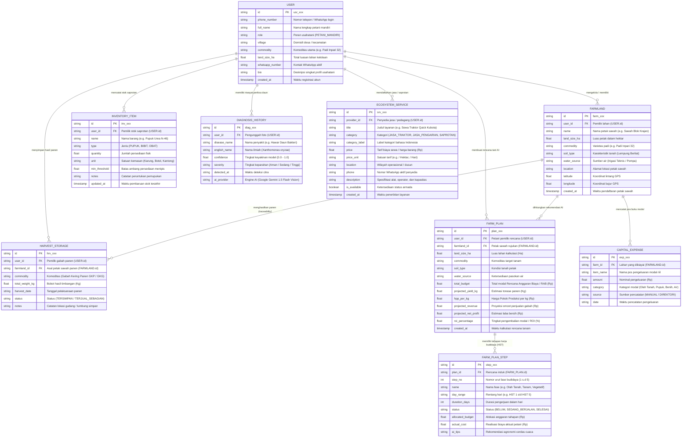

# Entity Relationship Diagram (ERD) — AgriBuddy 🌾
**Platform Smart Farming Decision Support System (DSS)**
*Dokumen Spesifikasi Arsitektur Basis Data Relasional & Ketertelusuran Usahatani (Capstone Project STSI4440)*

---

## 1. Diagram ERD Lengkap (Mermaid Relational Schema)

```mermaid
erDiagram
    USER ||--o{ FARMLAND : "mengelola / memiliki"
    USER ||--o{ INVENTORY_ITEM : "mencatat stok saprotan"
    USER ||--o{ HARVEST_STORAGE : "menyimpan hasil panen"
    USER ||--o{ DIAGNOSIS_HISTORY : "memiliki riwayat periksa daun"
    USER ||--o{ FARM_PLAN : "membuat rencana tani AI"
    USER ||--o{ ECOSYSTEM_SERVICE : "mendaftarkan jasa / saprotan"

    FARMLAND ||--o{ CAPITAL_EXPENSE : "mencatat pos buku modal"
    FARMLAND ||--o{ FARM_PLAN : "dihitungkan rekomendasi AI"
    FARMLAND ||--o{ HARVEST_STORAGE : "menghasilkan panen (traceability)"

    FARM_PLAN ||--o{ FARM_PLAN_STEP : "memiliki tahapan kerja budidaya (HST)"

    USER {
        string id PK "usr_xxx"
        string phone_number "Nomor telepon / WhatsApp login"
        string full_name "Nama lengkap petani mandiri"
        string role "Peran usahatani (PETANI_MANDIRI)"
        string village "Domisili desa / kecamatan"
        string commodity "Komoditas utama (e.g. Padi Inpari 32)"
        float land_size_ha "Total luasan lahan kelolaan"
        string whatsapp_number "Kontak WhatsApp aktif"
        string bio "Deskripsi singkat profil usahatani"
        timestamp created_at "Waktu registrasi akun"
    }

    FARMLAND {
        string id PK "farm_xxx"
        string user_id FK "Pemilik lahan (USER.id)"
        string name "Nama petak sawah (e.g. Sawah Blok Krajan)"
        float land_size_ha "Luas petak dalam hektar"
        string commodity "Varietas padi (e.g. Padi Inpari 32)"
        string soil_type "Karakteristik tanah (Lempung Berliat)"
        string water_source "Sumber air (Irigasi Teknis / Pompa)"
        string location "Alamat lokasi petak sawah"
        float latitude "Koordinat lintang GPS"
        float longitude "Koordinat bujur GPS"
        timestamp created_at "Waktu pendaftaran petak sawah"
    }

    CAPITAL_EXPENSE {
        string id PK "exp_xxx"
        string farm_id FK "Lahan yang dibiayai (FARMLAND.id)"
        string item_name "Nama pos pengeluaran modal riil"
        float amount "Nominal pengeluaran (Rp)"
        string category "Kategori modal (Olah Tanah, Pupuk, Benih, Air)"
        string source "Sumber pencatatan (MANUAL / DIREKTORI)"
        string date "Waktu pencatatan pengeluaran"
    }

    FARM_PLAN {
        string id PK "plan_xxx"
        string user_id FK "Petani pemilik rencana (USER.id)"
        string farmland_id FK "Petak sawah rujukan (FARMLAND.id)"
        float land_size_ha "Luas lahan kalkulasi (Ha)"
        string commodity "Komoditas target tanam"
        string soil_type "Kondisi tanah petak"
        string water_source "Ketersediaan pasokan air"
        float total_budget "Total modal Rencana Anggaran Biaya / RAB (Rp)"
        float projected_yield_kg "Estimasi tonase panen (Kg)"
        float hpp_per_kg "Harga Pokok Produksi per kg (Rp)"
        float projected_revenue "Proyeksi omzet penjualan gabah (Rp)"
        float projected_net_profit "Estimasi laba bersih (Rp)"
        float roi_percentage "Tingkat pengembalian modal / ROI (%)"
        timestamp created_at "Waktu kalkulasi rencana tanam"
    }

    FARM_PLAN_STEP {
        string id PK "step_xxx"
        string plan_id FK "Rencana induk (FARM_PLAN.id)"
        int step_no "Nomor urut fase budidaya (1 s.d 5)"
        string name "Nama fase (e.g. Olah Tanah, Tanam, Vegetatif)"
        string day_range "Rentang hari (e.g. HST 1 s/d HST 5)"
        int duration_days "Durasi pengerjaan dalam hari"
        string status "Status (BELUM, SEDANG_BERJALAN, SELESAI)"
        float allocated_budget "Alokasi anggaran tahapan (Rp)"
        float actual_cost "Realisasi biaya aktual petani (Rp)"
        string ai_tips "Rekomendasi agronomi cerdas cuaca"
    }

    DIAGNOSIS_HISTORY {
        string id PK "diag_xxx"
        string user_id FK "Pengunggah foto (USER.id)"
        string disease_name "Nama penyakit (e.g. Hawar Daun Bakteri)"
        string english_name "Nama ilmiah (Xanthomonas oryzae)"
        float confidence "Tingkat keyakinan model (0.0 - 1.0)"
        string severity "Tingkat keparahan (Aman / Sedang / Tinggi)"
        string detected_at "Waktu deteksi citra"
        string ai_provider "Engine AI (Google Gemini 1.5 Flash Vision)"
    }

    INVENTORY_ITEM {
        string id PK "inv_xxx"
        string user_id FK "Pemilik stok saprotan (USER.id)"
        string name "Nama barang (e.g. Pupuk Urea N-46)"
        string type "Jenis (PUPUK, BIBIT, OBAT)"
        float quantity "Jumlah persediaan fisik"
        string unit "Satuan kemasan (Karung, Botol, Kantong)"
        float min_threshold "Batas ambang persediaan menipis"
        string notes "Catatan peruntukan pemupukan"
        timestamp updated_at "Waktu pembaruan stok terakhir"
    }

    HARVEST_STORAGE {
        string id PK "hrv_xxx"
        string user_id FK "Pemilik gabah panen (USER.id)"
        string farmland_id FK "Asal petak sawah panen (FARMLAND.id)"
        string commodity "Komoditas (Gabah Kering Panen GKP / GKG)"
        float total_weight_kg "Bobot hasil timbangan (Kg)"
        string harvest_date "Tanggal pelaksanaan panen"
        string status "Status (TERSIMPAN / TERJUAL_SEBAGIAN)"
        string notes "Catatan lokasi gudang / lumbung simpan"
    }

    ECOSYSTEM_SERVICE {
        string id PK "srv_xxx"
        string provider_id FK "Penyedia jasa / pedagang (USER.id)"
        string title "Judul layanan (e.g. Sewa Traktor Quick Kubota)"
        string category "Kategori (JASA_TRAKTOR, JASA_PENGAIRAN, SAPROTAN)"
        string category_label "Label kategori bahasa Indonesia"
        float price "Tarif biaya sewa / harga barang (Rp)"
        string price_unit "Satuan tarif (e.g. / Hektar, / Hari)"
        string location "Wilayah operasional / dusun"
        string phone "Nomor WhatsApp aktif penyedia"
        string description "Spesifikasi alat, operator, dan kapasitas"
        boolean is_available "Ketersediaan status armada"
        timestamp created_at "Waktu penerbitan layanan"
    }
```

---

## 2. Prinsip Desain Basis Data & Normalisasi 3NF

Arsitektur database AgriBuddy v2.0 telah memenuhi standar bentuk normal ketiga (**Third Normal Form / 3NF**) dengan eliminasi redundansi dan integritas referensial yang kuat:

1. **Jaminan Integritas Referensial (*Foreign Key Integrity*)**:
   - Seluruh entitas anak (`FARMLAND`, `CAPITAL_EXPENSE`, `FARM_PLAN`, `DIAGNOSIS_HISTORY`, `INVENTORY_ITEM`, `HARVEST_STORAGE`, `ECOSYSTEM_SERVICE`) terikat langsung ke *Primary Key* `USER.id`.
   - Tidak ada data "menggantung" tanpa relasi pemilik akun yang jelas.
2. **Ketertelusuran Asal Panen (*Harvest Traceability*)**:
   - Entitas `HARVEST_STORAGE` memiliki *foreign key* langsung ke `FARMLAND.id`. Hal ini membuktikan keaslian asal petak sawah, varietas bibit yang ditanam, dan catatan biaya modal pupuk yang dikeluarkan saat sidang tugas akhir.
3. **Buku Modal Lahan Mandiri (*Separation of Accounts*)**:
   - Entitas `CAPITAL_EXPENSE` terikat pada masing-masing petak sawah (`FARMLAND.id`), memungkinkan petani menghitung laba-rugi riil per petak sawah secara akurat (*cost accounting per plot*).
4. **Logika Layanan Direct WhatsApp (*Decoupled Directory*)**:
   - Entitas `ECOSYSTEM_SERVICE` menyimpan nomor telepon terverifikasi tanpa memerlukan tabel pesanan (*order state machine*) yang membebani database, sehingga alur pemesanan langsung terjadi di aplikasi perpesanan WhatsApp.
