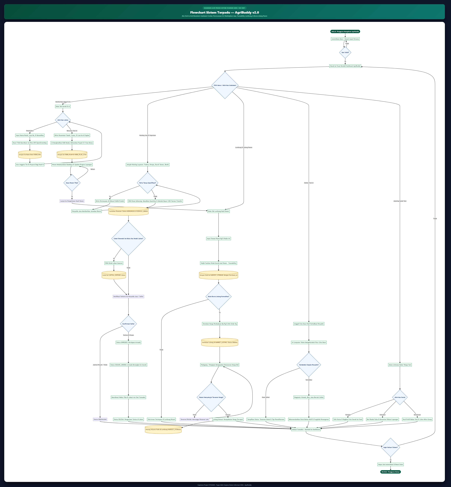
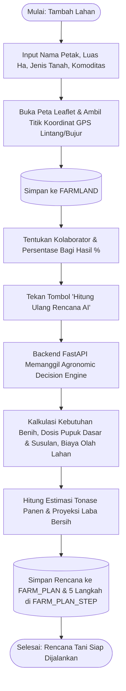
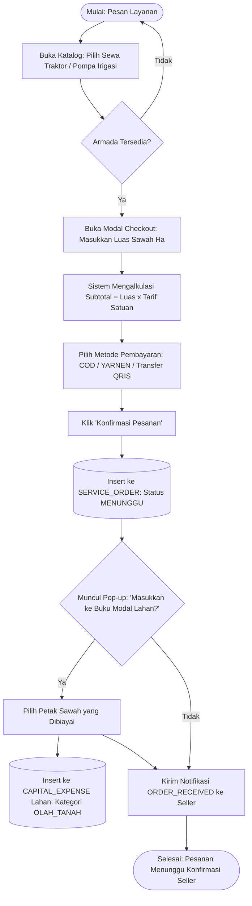
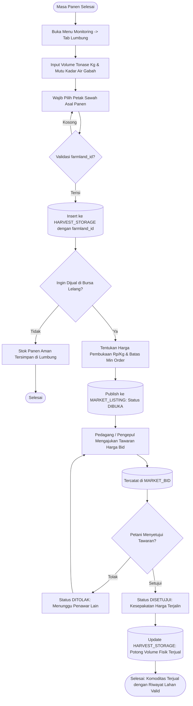

# Flowchart Sistem & Spesifikasi Alur Proses — AgriBuddy v2.0
**Pemodelan Logika Alur Bisnis Usahatani Cerdas: Perencanaan AI, Marketplace Jasa, Traceability Lumbung, & Bursa Lelang**  
*Capstone Project STSI4440 • Tugas Akhir Sarjana Sistem Informasi 2026*

---

## 1. Pendahuluan & Standar Notasi Diagram

Dokumen ini memodelkan seluruh logika alur operasional dan algoritma alur kerja (*business process workflow*) dari sistem **AgriBuddy v2.0**. Pemodelan disusun mengacu pada standar internasional **ANSI/ISO 5807-1985** (*Information processing — Documentation symbols and conventions for data, program and system flowcharts*).

### Standar Simbol yang Digunakan
| Simbol Notasi | Bentuk Geometris | Nama Standar | Fungsi & Makna Operasional |
| :---: | :---: | :--- | :--- |
| **Terminator** | Persegi Panjang Sudut Membulat | *Terminal / Terminator* | Menandakan titik awal (*Start / Mulai*) dan titik akhir (*Finish / Selesai*) dari alur sistem. |
| **Proses** | Persegi Panjang Biasa | *Process* | Mewakili aktivitas operasional, eksekusi kode, manipulasi data, atau prosedur komputasi. |
| **Keputusan** | Belah Ketupat (*Diamond*) | *Decision* | Mewakili titik percabangan logika kondisi yang menghasilkan keluaran boolean (*Ya / Tidak*). |
| **Basis Data** | Silinder / Tabung Data | *Direct Data / Database* | Menandakan operasi baca (*read*), tulis (*insert*), atau perbarui (*update*) ke tabel/koleksi database. |
| **Masukan / I/O** | Jajaran Genjang | *Input / Output* | Menandakan interaksi pengguna memasukkan data formulir atau sistem menampilkan hasil. |
| **Garis Alir** | Garis Berpanah | *Flowline* | Menunjukkan arah aliran eksekusi urutan proses dari hulu ke hilir. |

---

## 2. Visual Flowchart Terpadu (Unified End-to-End System)

Berikut adalah diagram alir proses sistem terpadu beresolusi tinggi yang menggambarkan integrasi dari saat pengguna masuk sistem, mengelola lahan dan rencana AI, bertransaksi di marketplace, mencatat panen lumbung berketertelusuran, hingga bertransaksi di bursa lelang komoditas:



*(File vektor lossless SVG juga tersedia di: [`FLOWCHART_AgriBuddy.svg`](FLOWCHART_AgriBuddy.svg))*

---

## 3. Pemodelan Mermaid Flowchart Sistem Terpadu

```mermaid
flowchart TD
    %% Titik Awal
    Start([MULAI: Pengguna Mengakses AgriBuddy]) --> Login[Autentikasi Akun / Masuk Cepat Persona]
    Login --> AuthCheck{Sesi Valid?}
    AuthCheck -- Tidak --> Login
    AuthCheck -- Ya --> Dashboard[Masuk ke Pusat Kendali Dashboard AgriBuddy]

    %% Percabangan Menu Utama
    Dashboard --> MenuChoice{Pilih Menu / Aktivitas Usahatani}

    %% JALUR 1: MANAJEMEN SAWAH & RENCANA AI
    MenuChoice -->|Monitoring Lahan & AI| FarmMenu[Buka Tab Sawah & AI]
    FarmMenu --> FarmAction{Aktivitas Lahan}
    
    FarmAction -->|Petak Baru| InputLand[Input Nama Petak, Luas Ha, & Komoditas]
    InputLand --> PickGPS[Kunci Titik Koordinat via Peta GPS OpenStreetMap]
    PickGPS --> SaveLand[(Simpan ke Basis Data FARMLAND)]
    SaveLand --> CollabSet[Atur Anggota Tim & Proporsi Bagi Hasil %]
    CollabSet --> FarmAction

    FarmAction -->|Rencana Tani AI| CallAI[Kirim Parameter Tanah, Cuaca, & Luas ke AI Engine]
    CallAI --> GenPlan[AI Menghasilkan RAB Modal, Kebutuhan Pupuk & 5 Fase Kerja]
    GenPlan --> SavePlan[(Simpan ke FARM_PLAN & FARM_PLAN_STEP)]
    SavePlan --> ExecPhase[Petani Melaksanakan Budidaya & Update Progres Lapangan]
    ExecPhase --> CheckHarvest{Masa Panen Tiba?}
    CheckHarvest -- Belum --> ExecPhase
    CheckHarvest -- Ya --> ToHarvest[Lanjut ke Pengelolaan Hasil Panen]

    %% JALUR 2: MARKETPLACE JASA & CHECKOUT
    MenuChoice -->|Katalog Jasa & Saprotan| BrowseMarket[Jelajah Katalog Layanan: Traktor, Pompa, Buruh Tanam, Benih]
    BrowseMarket --> AskProd{Perlu Tanya Spesifikasi?}
    AskProd -- Ya --> DiscProd[Kirim Pertanyaan di Diskusi Publik Produk]
    DiscProd --> WaitReply[Penyedia Jasa Memberikan Jawaban Resmi]
    WaitReply --> AskProd
    AskProd -- Tidak --> Checkout[Klik Pesan Sekarang: Masukkan Kuantitas & Metode Bayar COD/Yarnen/Transfer]
    Checkout --> CreateOrder[(Terbitkan Pesanan: Status MENUNGGU di SERVICE_ORDER)]
    CreateOrder --> PromptModal{Catat Otomatis ke Buku Kas Modal Lahan?}
    PromptModal -- Ya --> SelectPlot[Pilih Petak Lahan Sasaran]
    SelectPlot --> RecordExpense[(Catat ke CAPITAL_EXPENSE Lahan)]
    RecordExpense --> SellerTrack[Notifikasi Terkirim ke Penyedia Jasa / Seller]
    PromptModal -- Tidak --> SellerTrack

    SellerTrack --> SellerAction{Konfirmasi Seller}
    SellerAction -- Jadwal Penuh / Tolak --> RejectOrder[Status DIBATALKAN]
    SellerAction -- Terima & Proses --> ProcessOrder[Status DIPROSES: Persiapan Armada]
    ProcessOrder --> DispatchOrder[Status SEDANG_DIKIRIM: Armada Berangkat ke Sawah]
    DispatchOrder --> LiveChat[Koordinasi Waktu Tiba & Lokasi via Chat Transaksi]
    LiveChat --> CompleteOrder[Status SELESAI: Pengerjaan Tuntas di Lahan]

    %% JALUR 3: LUMBUNG TRACEABILITY & BURSA LELANG
    ToHarvest --> HarvestMenu[Buka Tab Lumbung Hasil Panen]
    MenuChoice -->|Lumbung & Lelang Panen| HarvestMenu
    HarvestMenu --> StoreHarvest[Input Tonase Panen Kg & Kadar Air]
    StoreHarvest --> BindTraceability[Wajib Tautkan Petak Sawah Asal Panen - Traceability]
    BindTraceability --> SaveLumbung[(Simpan Stok ke HARVEST_STORAGE dengan farmland_id)]
    SaveLumbung --> AuctionChoice{Buka Bursa Lelang Komoditas?}
    AuctionChoice -- Tidak --> KeepStore[Stok Aman Tersimpan di Lumbung Petani]
    AuctionChoice -- Ya --> OpenListing[Tentukan Harga Pembukaan Rp/Kg & Min Order Kg]
    OpenListing --> SaveListing[(Terbitkan Lelang di MARKET_LISTING: Status DIBUKA)]
    SaveListing --> WaitBids[Pedagang / Pengepul Mengajukan Penawaran Harga Bid]
    WaitBids --> ReviewBid{Petani Menyetujui Tawaran Harga?}
    ReviewBid -- Tolak --> RejectBid[Tawaran Ditolak: Menunggu Penawar Lain]
    RejectBid --> WaitBids
    ReviewBid -- Setujui --> DealAuction[Lelang Selesai: Kesepakatan Harga Tercapai]
    DealAuction --> DeductStock[(Potong Volume Fisik di Lumbung HARVEST_STORAGE)]

    %% JALUR 4: DOKTER TANI AI (COMPUTER VISION)
    MenuChoice -->|Dokter Tani AI| UploadLeaf[Unggah Foto Daun Padi Terindikasi Penyakit]
    UploadLeaf --> CVProcess[AI Computer Vision Mengekstraksi Fitur Citra Daun]
    CVProcess --> DiseaseCheck{Terdeteksi Gejala Penyakit?}
    DiseaseCheck -- Daun Sehat --> HealthyReport[Tampilkan Status: Tanaman Sehat & Tips Pemeliharaan]
    DiseaseCheck -- Terinfeksi --> InfectionReport[Diagnosis: Kresek, Blas, atau Bercak Coklat]
    InfectionReport --> ShowDosage[Rekomendasikan Dosis Bahan Aktif & Fungisida Penanganan]

    %% JALUR 5: JEJARING KOMUNITAS TANI
    MenuChoice -->|Jejaring Sosial Tani| FeedCommunity[Akses Linimasa Kabar Warga Tani]
    FeedCommunity --> SocialAction{Aktivitas Sosial}
    SocialAction -->|Posting| CreatePost[Tulis Status & Bagikan Foto Sawah ke Feed]
    SocialAction -->|Interaksi| LikeComment[Beri Reaksi Suka & Komentar Diskusi Lapangan]
    SocialAction -->|Kemitraan| FollowFarmer[Ikuti Profil Rekan Tani & Calon Mitra Garap]

    %% Terminasi Selesai / Logout
    CompleteOrder --> LoopBack[Selesai Transaksi / Kembali ke Dashboard]
    DealAuction --> LoopBack
    KeepStore --> LoopBack
    ShowDosage --> LoopBack
    HealthyReport --> LoopBack
    CreatePost --> LoopBack
    LikeComment --> LoopBack
    FollowFarmer --> LoopBack
    RejectOrder --> LoopBack

    LoopBack --> LogoutChoice{Ingin Keluar Sistem?}
    LogoutChoice -- Tidak --> Dashboard
    LogoutChoice -- Ya --> EndSession[Hapus Sesi Autentikasi & Reset State]
    EndSession --> Finish([SELESAI: Pengguna Keluar])

    %% Styling
    classDef startEnd fill:#064e3b,stroke:#059669,stroke-width:2px,color:#ffffff,font-weight:bold;
    classDef process fill:#f0fdf4,stroke:#16a34a,stroke-width:1.5px,color:#14532d;
    classDef decision fill:#eff6ff,stroke:#2563eb,stroke-width:1.5px,color:#1e3a8a,font-weight:600;
    classDef storage fill:#fef3c7,stroke:#d97706,stroke-width:1.5px,color:#78350f;

    class Start,Finish startEnd;
    class Login,Dashboard,FarmMenu,InputLand,PickGPS,CollabSet,CallAI,GenPlan,ExecPhase,BrowseMarket,DiscProd,WaitReply,Checkout,SelectPlot,ProcessOrder,DispatchOrder,LiveChat,CompleteOrder,HarvestMenu,StoreHarvest,BindTraceability,KeepStore,OpenListing,WaitBids,DealAuction,UploadLeaf,CVProcess,HealthyReport,InfectionReport,ShowDosage,FeedCommunity,CreatePost,LikeComment,FollowFarmer,LoopBack,EndSession process;
    class AuthCheck,MenuChoice,FarmAction,CheckHarvest,AskProd,PromptModal,SellerAction,AuctionChoice,ReviewBid,DiseaseCheck,SocialAction,LogoutChoice decision;
    class SaveLand,SavePlan,CreateOrder,RecordExpense,SaveLumbung,SaveListing,DeductStock storage;
```



---

## 4. Flowchart Rinci 5 Alur Proses Utama (Modular Breakdown)

Untuk kemudahan penulisan narasi teknis pada **Bab 3 (Metodologi/Perancangan)** dan **Bab 4 (Implementasi & Pengujian)** skripsi, berikut adalah pemecahan flowchart per modul:

### 4.1. Alur 1: Pendaftaran Lahan Sawah & Perhitungan Rencana AI (RAB)


### 4.2. Alur 2: Pemesanan Layanan Alsintan (In-App Checkout) & Integrasi Buku Modal


### 4.3. Alur 3: Manajemen Pesanan Seller & Live Tracking Pembeli
```mermaid
flowchart TD
    S3([Pesanan Masuk di Akun Seller]) --> ViewOrder[Seller Melihat Detail Pesanan & Catatan Petak Sawah]
    ViewOrder --> DecSeller{Konfirmasi Penjual?}
    DecSeller -- Tolak / Jadwal Penuh --> CancelStat[Update Status: DIBATALKAN]
    CancelStat --> End3([Pesanan Batal])
    DecSeller -- Terima Pesanan --> ProcStat[Update Status: DIPROSES]
    ProcStat --> PrepMach[Persiapan Bahan Bakar & Armada Traktor]
    PrepMach --> DispStat[Update Status: SEDANG_DIKIRIM (Berangkat ke Lahan)]
    DispStat --> LiveMap[Pembeli Memantau Status & Kotak Catatan Jam Tiba Armada]
    LiveMap --> ChatBtn{Butuh Koordinasi Rute?}
    ChatBtn -- Ya --> SendChat[Kirim Pesan Obrolan Transaksi: 'Lewat Pematang Timur']
    SendChat --> D5[(Simpan ke ORDER_MESSAGE & Trigger Notifikasi)]
    D5 --> LiveMap
    ChatBtn -- Tidak --> WorkDone[Pekerjaan Olah Tanah Selesai di Lokasi]
    WorkDone --> DoneStat[Update Status: SELESAI]
    DoneStat --> End3b([Selesai: Transaksi Berhasil Tuntas])
```

### 4.4. Alur 4: Keterlacakan Lumbung (*Food Traceability*) & Bursa Lelang Komoditas


### 4.5. Alur 5: Dokter Tani AI (Computer Vision Diagnosis Penyakit Daun)
```mermaid
flowchart TD
    S5([Petani Menemukan Gejala Penyakit]) --> OpenDoc[Buka Fitur Dokter Tani AI]
    OpenDoc --> SnapPhoto[Ambil Foto Daun Padi Menggunakan Kamera / Galeri HP]
    SnapPhoto --> Preprocess[Resize Citra 224x224 & Normalisasi Tensor RGB]
    Preprocess --> CNNInference[Eksekusi Model CNN Deep Learning Classifier]
    CNNInference --> CheckDisease{Hasil Diagnosis?}
    CheckDisease -- Sehat --> ResHealthy[Label: DAUN SEHAT (Confidence Score %)]
    ResHealthy --> Tips1[Tampilkan Tips Pemeliharaan Preventif & Jadwal Pemupukan]
    CheckDisease -- Sakit --> ResInfect[Label: KRESEK / BLAS / BERCAK COKLAT (Score %)]
    ResInfect --> ShowMeds[Tampilkan Deskripsi Gejala, Patogen Penyebab, & Dosis Fungisida]
    ShowMeds --> RecKatalog[Rekomendasikan Pembelian Obat di Katalog Saprotan KPL]
    Tips1 --> End5([Selesai])
    RecKatalog --> End5
```

---

## 5. Matriks Pengambilan Keputusan (*Decision Points*) & Penanganan Eksepsi

| Titik Keputusan (*Decision Node*) | Kondisi Evaluasi | Alur Jika Kondisi Terpenuhi (*True*) | Alur Jika Kondisi Gagal (*False*) |
| :--- | :--- | :--- | :--- |
| **`AuthCheck`** | Memeriksa token/sesi login di `localStorage`. | Masuk ke dashboard utama. | Kembali ke layar `/login`. |
| **`FarmAction`** | Apakah petani mendaftarkan sawah baru atau menghitung rencana AI? | Masuk ke alur formulir peta GPS. | Masuk ke alur pemanggilan Agronomic Decision Engine. |
| **`PromptModal`** | Apakah petani menyetujui biaya pesanan dicatat ke buku modal sawah? | Menyimpan record baru ke `CAPITAL_EXPENSE` petak sawah. | Melewati pencatatan kas modal (hanya menyimpan `SERVICE_ORDER`). |
| **`SellerAction`** | Penjual mengonfirmasi ketersediaan armada traktor/pekerja. | Mengubah status pesanan menjadi `DIPROSES` lalu `SEDANG_DIKIRIM`. | Mengubah status menjadi `DIBATALKAN` beserta catatan alasan penolakan. |
| **`TraceCheck`** | Memeriksa apakah data hasil panen memiliki tautan `farmland_id`. | Menyimpan panen dengan sertifikat asal lahan (*food traceability*). | Sistem memblokir penyimpanan hingga petani memilih petak sawah asal. |
| **`ReviewBid`** | Petani mengevaluasi harga penawaran pedagang di bursa lelang. | Status tawaran `DISETUJUI` dan stok lumbung otomatis dipotong. | Status tawaran `DITOLAK`, listing tetap dibuka untuk pedagang lain. |
| **`DiseaseCheck`** | Model CNN mendeteksi tanda infeksi patogen pada daun padi. | Menampilkan nama penyakit, tingkat keparahan, dan anjuran dosis obat. | Menampilkan keterangan tanaman sehat dan anjuran sanitasi rutin. |

---

## 6. Kesimpulan & Relevansi Pengujian Akademis

Pemodelan Flowchart Sistem AgriBuddy v2.0 ini:
1. **Memenuhi Kaidah ANSI/ISO 5807:** Setiap percabangan logika didefinisikan secara deterministik dengan masukan, proses, titik keputusan, dan koneksi basis data yang transparan.
2. **Keterpaduan Antarmodul:** Menjelaskan secara runut bagaimana keluaran dari satu proses (misal: pesanan katalog) langsung menjadi masukan bagi proses lainnya (buku kas modal lahan sawah), serta bagaimana siklus panen sawah berlanjut ke rantai pasok bursa lelang (*traceability supply chain*).
3. **Kesiapan Naskah Skripsi:** Menyediakan flowchart global untuk pemaparan arsitektur sistem di Bab 3, serta 5 flowchart modular untuk melengkapi analisis perancangan rinci di Bab 4.
