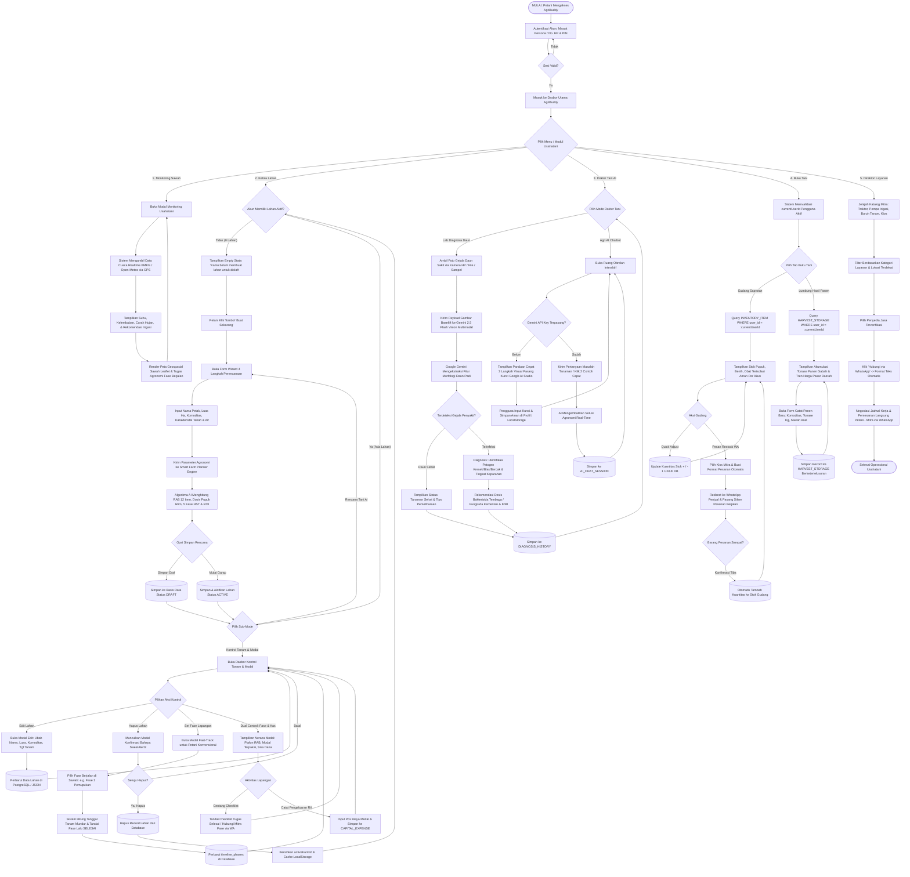

# Flowchart Sistem & Spesifikasi Alur Proses — AgriBuddy v2.5
**Pemodelan Logika Alur Bisnis Usahatani Cerdas: Monitoring Telemetri, Kelola Lahan AI, Dokter Tani Multimodal Vision, Buku Kas, & Keterlacakan Lumbung Terisolasi**  
*Capstone Project STSI4440 • Tugas Akhir Sarjana Sistem Informasi 2026*

---

## 1. Pendahuluan & Standar Notasi Diagram

Dokumen ini memodelkan seluruh logika alur operasional dan algoritma alur kerja (*business process workflow*) dari sistem **AgriBuddy v2.5 (Final Capstone Release)**. Pemodelan disusun mengacu pada standar internasional **ANSI/ISO 5807-1985** (*Information processing — Documentation symbols and conventions for data, program and system flowcharts*).

Sistem AgriBuddy v2.5 difokuskan sebagai **Smart Farming Decision Support System (DSS)** berbasis arsitektur modern **Node.js (Express + TypeScript)** dengan integrasi kecerdasan buatan **Google Gemini 2.5 Flash Multimodal Vision API**, model Bring Your Own Key (BYOK), dual persistence engine (PostgreSQL + Local JSON), antarmuka modal modern SweetAlert2, serta jaminan isolasi ketat data usahatani antar-akun.

### Standar Simbol yang Digunakan
| Simbol Notasi | Bentuk Geometris | Nama Standar | Fungsi & Makna Operasional |
| :---: | :---: | :--- | :--- |
| **Terminator** | Persegi Panjang Sudut Membulat | *Terminal / Terminator* | Menandakan titik awal (*Start / Mulai*) dan titik akhir (*Finish / Selesai*) dari alur sistem. |
| **Proses** | Persegi Panjang Biasa | *Process* | Mewakili aktivitas operasional, eksekusi kode, manipulasi data, atau prosedur komputasi. |
| **Keputusan** | Belah Ketupat (*Diamond*) | *Decision* | Mewakili titik percabangan logika kondisi yang menghasilkan keluaran boolean (*Ya / Tidak*). |
| **Basis Data** | Silinder / Tabung Data | *Direct Data / Database* | Menandakan operasi baca (*read*), tulis (*insert*), perbarui (*update*), atau hapus (*delete*) ke database/PostgreSQL. |
| **Masukan / I/O** | Jajaran Genjang | *Input / Output* | Menandakan interaksi pengguna memasukkan data formulir atau sistem menampilkan hasil. |
| **Garis Alir** | Garis Berpanah | *Flowline* | Menunjukkan arah aliran eksekusi urutan proses dari hulu ke hilir. |

---

## 2. Visual Flowchart Terpadu (Unified End-to-End System)

Berikut adalah diagram alir proses sistem terpadu beresolusi tinggi yang menggambarkan integrasi dari saat petani masuk sistem, memantau cuaca mikroklimat, merancang rencana tanam AI, mengendalikan siklus & modal usahatani, mendiagnosis penyakit daun padi via Gemini Vision, mengelola stok gudang & panen lumbung terisolasi, hingga pemesanan restock via WhatsApp:

*(File vektor lossless SVG juga tersedia di: [`FLOWCHART_AgriBuddy.svg`](FLOWCHART_AgriBuddy.svg))*

---

## 3. Pemodelan Mermaid Flowchart Sistem Terpadu

```mermaid
flowchart TD
    %% Titik Awal
    Start([MULAI: Petani Mengakses AgriBuddy]) --> Login[Autentikasi Akun: Masuk Persona / No. HP & PIN]
    Login --> AuthCheck{Sesi Valid?}
    AuthCheck -- Tidak --> Login
    AuthCheck -- Ya --> Dashboard[Masuk ke Dasbor Utama AgriBuddy]

    %% Percabangan Menu Utama
    Dashboard --> MenuChoice{Pilih Menu / Modul Usahatani}

    %% JALUR 1: MONITORING USAHATANI & CUACA
    MenuChoice -->|1. Monitoring Sawah| FarmMenu[Buka Modul Monitoring Usahatani]
    FarmMenu --> FetchWeather[Sistem Mengambil Data Cuaca Realtime BMKG / Open-Meteo via GPS]
    FetchWeather --> DisplayWeather[Tampilkan Suhu, Kelembaban, Curah Hujan, & Rekomendasi Irigasi]
    DisplayWeather --> RenderMap[Render Peta Geospasial Sawah Leaflet & Tugas Agronomi Fase Berjalan]
    RenderMap --> FarmMenu

    %% JALUR 2: KELOLA LAHAN (RENCANA & KONTROL TANAM)
    MenuChoice -->|2. Kelola Lahan| CheckHasFarms{Akun Memiliki Lahan Aktif?}
    
    CheckHasFarms -- Tidak (0 Lahan) --> ShowEmptyState[Tampilkan Empty State: 'Kamu belum membuat lahan untuk diolah']
    ShowEmptyState --> ClickCreateNow[Petani Klik Tombol 'Buat Sekarang']
    ClickCreateNow --> PlanWizard
    
    CheckHasFarms -- Ya (Ada Lahan) --> KelolaMode{Pilih Sub-Mode}
    KelolaMode -->|Rencana Tani AI| PlanWizard[Buka Form Wizard 4 Langkah Perencanaan]
    PlanWizard --> InputPlanParams[Input Nama Petak, Luas Ha, Komoditas, Karakteristik Tanah & Air]
    InputPlanParams --> ReqAIPlan[Kirim Parameter Agronomi ke Smart Farm Planner Engine]
    ReqAIPlan --> CalcAIPlan[Algoritma AI Menghitung RAB 12 Item, Dosis Pupuk Iklim, 5 Fase HST & ROI]
    CalcAIPlan --> ChoosePlanAction{Opsi Simpan Rencana}
    ChoosePlanAction -- Simpan Draf --> SaveDraft[(Simpan ke Basis Data Status DRAFT)]
    ChoosePlanAction -- Mulai Garap --> ActivateFarm[(Simpan & Aktifkan Lahan Status ACTIVE)]
    SaveDraft --> KelolaMode
    ActivateFarm --> KelolaMode

    KelolaMode -->|Kontrol Tanam & Modal| FarmControlPanel[Buka Dasbor Kontrol Tanam & Modal]
    FarmControlPanel --> FarmControlAction{Pilihan Aksi Kontrol}

    FarmControlAction -->|Edit Lahan| EditFarmModal[Buka Modal Edit: Ubah Nama, Luas, Komoditas, Tgl Tanam]
    EditFarmModal --> UpdateFarmDB[(Perbarui Data Lahan di PostgreSQL / JSON)]
    UpdateFarmDB --> FarmControlPanel

    FarmControlAction -->|Hapus Lahan| ConfirmDelete[Munculkan Modal Konfirmasi Bahaya SweetAlert2]
    ConfirmDelete --> DeleteDecision{Setuju Hapus?}
    DeleteDecision -- Batal --> FarmControlPanel
    DeleteDecision -- Ya, Hapus --> ExecDeleteFarm[(Hapus Record Lahan dari Database)]
    ExecDeleteFarm --> ClearLocalStorage[Bersihkan activeFarmId & Cache LocalStorage]
    ClearLocalStorage --> CheckHasFarms

    FarmControlAction -->|Set Fase Lapangan| FastTrackModal[Buka Modal Fast-Track untuk Petani Konvensional]
    FastTrackModal --> SelectActivePhase[Pilih Fase Berjalan di Sawah: e.g. Fase 3 Pemupukan]
    SelectActivePhase --> AutoAdjustDates[Sistem Hitung Tanggal Tanam Mundur & Tandai Fase Lalu SELESAI]
    AutoAdjustDates --> SavePhaseDB[(Perbarui timeline_phases di Database)]
    SavePhaseDB --> FarmControlPanel

    FarmControlAction -->|Dual Control: Fase & Kas| DisplayCockpit[Tampilkan Neraca Modal: Plafon RAB, Modal Terpakai, Sisa Dana]
    DisplayCockpit --> ExecDualTasks{Aktivitas Lapangan}
    ExecDualTasks -- Centang Checklist --> UpdateTaskDone[Tandai Checklist Tugas Selesai / Hubungi Mitra Fase via WA]
    ExecDualTasks -- Catat Pengeluaran Riil --> InputExpense[Input Pos Biaya Modal & Simpan ke CAPITAL_EXPENSE]
    UpdateTaskDone --> FarmControlPanel
    InputExpense --> FarmControlPanel

    %% JALUR 3: DOKTER TANI AI (GEMINI 2.5 FLASH VISION & CHAT)
    MenuChoice -->|3. Dokter Tani AI| DocModeChoice{Pilih Mode Dokter Tani}
    
    DocModeChoice -->|Lab Diagnosa Daun| CapturePhoto[Ambil Foto Gejala Daun Sakit via Kamera HP / File / Sampel]
    CapturePhoto --> SendGemini[Kirim Payload Gambar Base64 ke Gemini 2.5 Flash Vision Multimodal]
    SendGemini --> GeminiInference[Google Gemini Mengekstraksi Fitur Morfologi Daun Padi]
    GeminiInference --> DiseaseCheck{Terdeteksi Gejala Penyakit?}
    DiseaseCheck -- Daun Sehat --> HealthyReport[Tampilkan Status: Tanaman Sehat & Tips Pemeliharaan]
    DiseaseCheck -- Terinfeksi --> InfectionReport[Diagnosis: Identifikasi Patogen Kresek/Blas/Bercak & Tingkat Keparahan]
    InfectionReport --> ShowDosage[Rekomendasi Dosis Bakterisida Tembaga / Fungisida Kementan & IRRI]
    HealthyReport --> SaveDiagHistory[(Simpan ke DIAGNOSIS_HISTORY)]
    ShowDosage --> SaveDiagHistory
    SaveDiagHistory --> DocModeChoice

    DocModeChoice -->|Agri AI Chatbot| OpenChatUI[Buka Ruang Obrolan Interaktif]
    OpenChatUI --> CheckAPIKey{Gemini API Key Terpasang?}
    CheckAPIKey -- Belum --> ViewGuide[Tampilkan Panduan Cepat 3 Langkah Visual Pasang Kunci Google AI Studio]
    ViewGuide --> InputAPIKey[Pengguna Input Kunci & Simpan Aman di Profil / LocalStorage]
    InputAPIKey --> OpenChatUI
    CheckAPIKey -- Sudah --> SendQuestion[Kirim Pertanyaan Masalah Tanaman / Klik 2 Contoh Cepat]
    SendQuestion --> ChatResponse[AI Mengembalikan Solusi Agronomi Real-Time]
    ChatResponse --> SaveChatSession[(Simpan ke AI_CHAT_SESSION)]
    SaveChatSession --> OpenChatUI

    %% JALUR 4: BUKU TANI (GUDANG & LUMBUNG TERISOLASI)
    MenuChoice -->|4. Buku Tani| VerifyUserIsolation[Sistem Memvalidasi currentUserId Pengguna Aktif]
    VerifyUserIsolation --> BookTabChoice{Pilih Tab Buku Tani}

    BookTabChoice -->|Gudang Saprotan| FetchUserInv[Query INVENTORY_ITEM WHERE user_id = :currentUserId]
    FetchUserInv --> DisplayInv[Tampilkan Stok Pupuk, Benih, Obat Terisolasi Aman Per Akun]
    DisplayInv --> InvAction{Aksi Gudang}
    InvAction -- Quick Adjust --> QuickUpdateStock[(Update Kuantitas Stok + / - 1 Unit di DB)]
    InvAction -- Pesan Restock WA --> OrderWAModal[Pilih Kios Mitra & Buat Format Pesanan Otomatis]
    OrderWAModal --> OpenWAApp[Redirect ke WhatsApp Penjual & Pasang Stiker Pesanan Berjalan]
    OpenWAApp --> ConfirmGoodsArrival{Barang Pesanan Sampai?}
    ConfirmGoodsArrival -- Konfirmasi Tiba --> AutoAddStock[(Otomatis Tambah Kuantitas ke Stok Gudang)]
    QuickUpdateStock --> DisplayInv
    AutoAddStock --> DisplayInv

    BookTabChoice -->|Lumbung Hasil Panen| FetchUserHrv[Query HARVEST_STORAGE WHERE user_id = :currentUserId]
    FetchUserHrv --> DisplayHarvest[Tampilkan Akumulasi Tonase Panen Gabah & Tren Harga Pasar Daerah]
    DisplayHarvest --> AddHarvestModal[Buka Form Catat Panen Baru: Komoditas, Tonase Kg, Sawah Asal]
    AddHarvestModal --> SaveHarvestDB[(Simpan Record ke HARVEST_STORAGE Berketertelusuran)]
    SaveHarvestDB --> DisplayHarvest

    %% JALUR 5: DIREKTORI LAYANAN EKOSISTEM
    MenuChoice -->|5. Direktori Layanan| ServiceDir[Jelajah Katalog Mitra: Traktor, Pompa Irigasi, Buruh Tanam, Kios]
    ServiceDir --> FilterCategory[Filter Berdasarkan Kategori Layanan & Lokasi Terdekat]
    FilterCategory --> SelectVendor[Pilih Penyedia Jasa Terverifikasi]
    SelectVendor --> ContactWA[Klik 'Hubungi via WhatsApp' -> Format Teks Otomatis]
    ContactWA --> DirectChat[Negosiasi Jadwal Kerja & Pemesanan Langsung Petani - Mitra via WhatsApp]
    DirectChat --> DoneAll([Selesai Operasional Usahatani])
```

---

## 4. Keunggulan Logika Bisnis Sistem Terkini
1. **Aturan Kepemilikan 0 Lahan yang Fleksibel:**
   Logika percabangan secara eksplisit mengevaluasi ketersediaan lahan (`activeFarmlands.length === 0`). Tidak ada auto-provisioning lahan paksaan, sehingga pengguna baru disambut dengan panduan *Empty State* yang ramah.
2. **Logika Hapus Lahan yang Bersih & Aman:**
   Menghapus lahan dilindungi konfirmasi SweetAlert2 dan secara otomatis menghapus rekaman di PostgreSQL, berkas JSON, serta membersihkan penanda `activeFarmId` di memori peramban (*LocalStorage*).
3. **Isolasi Data Buku Tani Antar-Akun:**
   Semua alur pembacaan dan penyimpanan inventaris serta panen diisolasi ketat dengan menyematkan kunci unik pengguna (`WHERE user_id = :currentUserId`), menjamin kerahasiaan stok dan tonase antar-petani.
