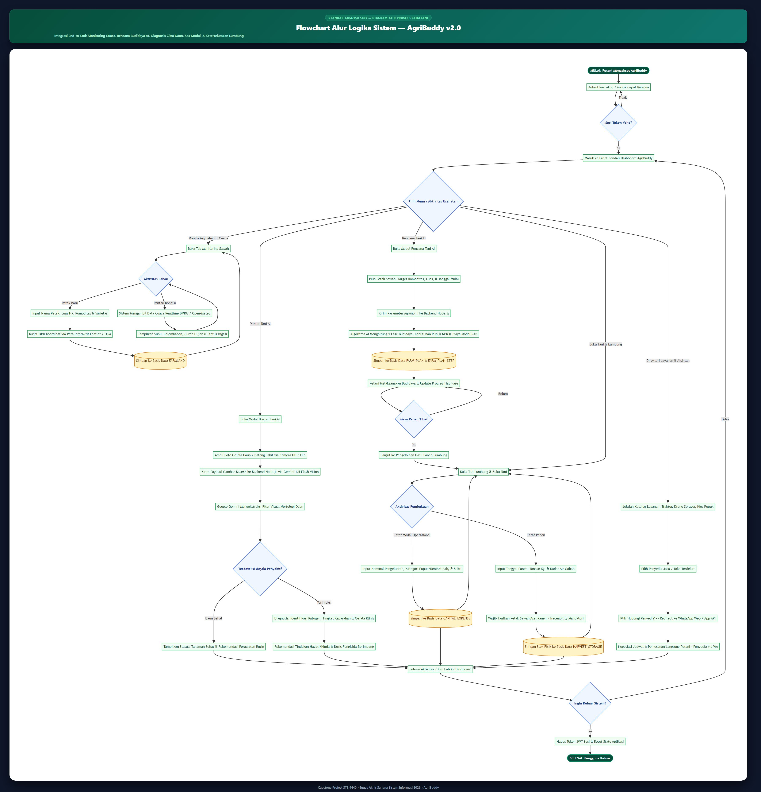
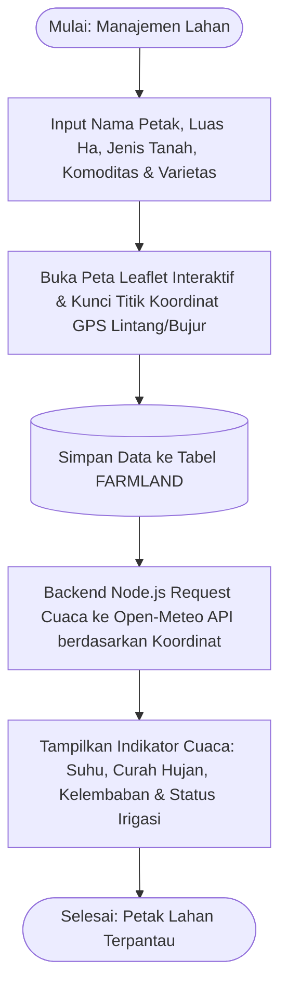
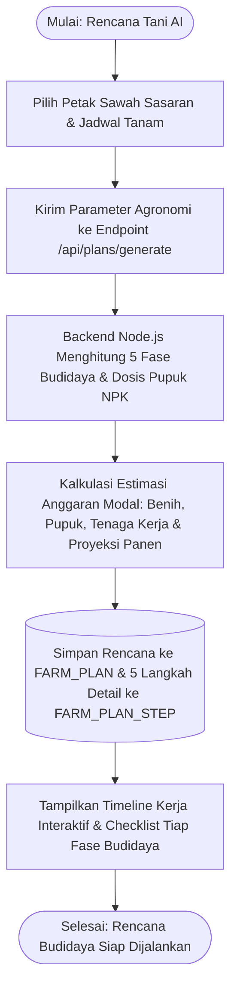
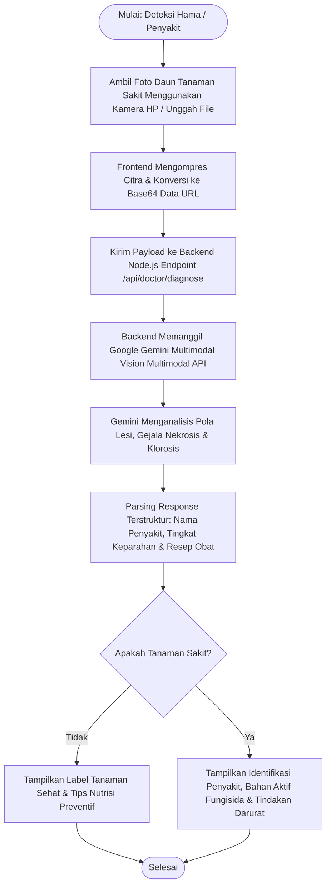
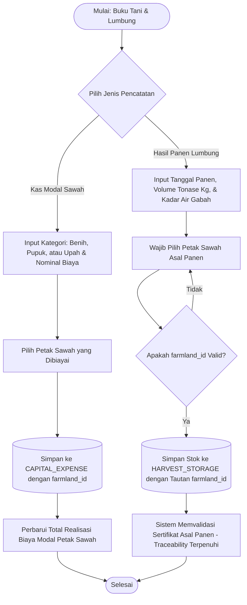
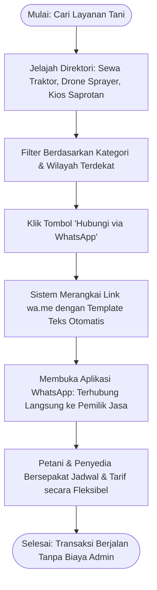

# Flowchart Sistem & Spesifikasi Alur Proses — AgriBuddy v2.0
**Pemodelan Logika Alur Bisnis Usahatani Cerdas: Monitoring Telemetri, Perencanaan AI, Dokter Tani Multimodal Vision, Buku Kas, & Keterlacakan Lumbung**  
*Capstone Project STSI4440 • Tugas Akhir Sarjana Sistem Informasi 2026*

---

## 1. Pendahuluan & Standar Notasi Diagram

Dokumen ini memodelkan seluruh logika alur operasional dan algoritma alur kerja (*business process workflow*) dari sistem **AgriBuddy v2.0**. Pemodelan disusun mengacu pada standar internasional **ANSI/ISO 5807-1985** (*Information processing — Documentation symbols and conventions for data, program and system flowcharts*).

Sistem AgriBuddy v2.0 difokuskan sebagai **Smart Farming Decision Support System (DSS)** berbasis arsitektur modern **Node.js (Express + TypeScript)** dengan integrasi kecerdasan buatan **Google Gemini Multimodal Vision (Auto-Discovery Latest) API** dan layanan telemetri cuaca geospasial terbuka.

### Standar Simbol yang Digunakan
| Simbol Notasi | Bentuk Geometris | Nama Standar | Fungsi & Makna Operasional |
| :---: | :---: | :--- | :--- |
| **Terminator** | Persegi Panjang Sudut Membulat | *Terminal / Terminator* | Menandakan titik awal (*Start / Mulai*) dan titik akhir (*Finish / Selesai*) dari alur sistem. |
| **Proses** | Persegi Panjang Biasa | *Process* | Mewakili aktivitas operasional, eksekusi kode, manipulasi data, atau prosedur komputasi. |
| **Keputusan** | Belah Ketupat (*Diamond*) | *Decision* | Mewakili titik percabangan logika kondisi yang menghasilkan keluaran boolean (*Ya / Tidak*). |
| **Basis Data** | Silinder / Tabung Data | *Direct Data / Database* | Menandakan operasi baca (*read*), tulis (*insert*), atau perbarui (*update*) ke tabel/koleksi database. |
| **Masukan / I/O** | Jajaran Genjang | *Input / Output* | Menandakan interaksi pengguna memasukkan data formulir atau sistem menampilkan hasil. |
| **Garis Alir** | Garis Berpanah | *Flowline* | Menunjukkan arah aliran eksekusi urutan proses dari hulu ke hilir. |

---

## 2. Visual Flowchart Terpadu (Unified End-to-End System)

Berikut adalah diagram alir proses sistem terpadu beresolusi tinggi yang menggambarkan integrasi dari saat petani masuk sistem, mengelola sawah & cuaca, menyusun rencana budidaya AI, mendiagnosis penyakit via foto Gemini Vision, mencatat pembukuan kas modal, hingga menyimpan panen lumbung berketertelusuran:

*(File vektor lossless SVG juga tersedia di: [`FLOWCHART_AgriBuddy.svg`](FLOWCHART_AgriBuddy.svg))*

---

## 3. Pemodelan Mermaid Flowchart Sistem Terpadu

```mermaid
flowchart TD
    %% Titik Awal
    Start([MULAI: Petani Mengakses AgriBuddy]) --> Login[Autentikasi Akun / Masuk Cepat Persona]
    Login --> AuthCheck{Sesi Token Valid?}
    AuthCheck -- Tidak --> Login
    AuthCheck -- Ya --> Dashboard[Masuk ke Pusat Kendali Dashboard AgriBuddy]

    %% Percabangan Menu Utama (5 Modul Inti)
    Dashboard --> MenuChoice{Pilih Menu / Aktivitas Usahatani}

    %% JALUR 1: MONITORING SAWAH & CUACA
    MenuChoice -->|Monitoring Lahan & Cuaca| FarmMenu[Buka Tab Monitoring Sawah]
    FarmMenu --> FarmAction{Aktivitas Lahan}
    
    FarmAction -->|Petak Baru| InputLand[Input Nama Petak, Luas Ha, Komoditas & Varietas]
    InputLand --> PickGPS[Kunci Titik Koordinat via Peta Interaktif Leaflet / OSM]
    PickGPS --> SaveLand[(Simpan ke Basis Data FARMLAND)]
    SaveLand --> FarmMenu

    FarmAction -->|Pantau Kondisi| FetchWeather[Sistem Mengambil Data Cuaca Realtime BMKG / Open-Meteo]
    FetchWeather --> DisplayWeather[Tampilkan Suhu, Kelembaban, Curah Hujan & Status Irigasi]
    DisplayWeather --> FarmAction

    %% JALUR 2: RENCANA TANI AI & RAB MODAL
    MenuChoice -->|Rencana Tani AI| PlanMenu[Buka Modul Rencana Tani AI]
    PlanMenu --> InputPlanParams[Pilih Petak Sawah, Target Komoditas, Luas, & Tanggal Mulai]
    InputPlanParams --> ReqAIPlan[Kirim Parameter Agronomi ke Backend Node.js]
    ReqAIPlan --> CalcAIPlan[Algoritma AI Menghitung 5 Fase Budidaya, Kebutuhan Pupuk NPK & Biaya Modal RAB]
    CalcAIPlan --> SavePlan[(Simpan ke Basis Data FARM_PLAN & FARM_PLAN_STEP)]
    SavePlan --> ExecPhase[Petani Melaksanakan Budidaya & Update Progres Tiap Fase]
    ExecPhase --> CheckHarvest{Masa Panen Tiba?}
    CheckHarvest -- Belum --> ExecPhase
    CheckHarvest -- Ya --> ToHarvest[Lanjut ke Pengelolaan Hasil Panen Lumbung]

    %% JALUR 3: DOKTER TANI AI (GEMINI MULTIMODAL VISION)
    MenuChoice -->|Dokter Tani AI| DocMenu[Buka Modul Dokter Tani AI]
    DocMenu --> CapturePhoto[Ambil Foto Gejala Daun / Batang Sakit via Kamera HP / File]
    CapturePhoto --> SendGemini[Kirim Payload Gambar Base64 ke Backend Node.js via Gemini 1.5 Flash Vision]
    SendGemini --> GeminiInference[Google Gemini Mengekstraksi Fitur Visual Morfologi Daun]
    GeminiInference --> DiseaseCheck{Terdeteksi Gejala Penyakit?}
    DiseaseCheck -- Daun Sehat --> HealthyReport[Tampilkan Status: Tanaman Sehat & Rekomendasi Perawatan Rutin]
    DiseaseCheck -- Terinfeksi --> InfectionReport[Diagnosis: Identifikasi Patogen, Tingkat Keparahan & Gejala Klinis]
    InfectionReport --> ShowDosage[Rekomendasi Tindakan Hayati/Kimia & Dosis Fungisida Berimbang]

    %% JALUR 4: BUKU TANI & LUMBUNG TRACEABILITY
    ToHarvest --> HarvestMenu[Buka Tab Lumbung & Buku Tani]
    MenuChoice -->|Buku Tani & Lumbung| HarvestMenu
    HarvestMenu --> BookAction{Aktivitas Pembukuan}
    
    BookAction -->|Catat Modal Operasional| InputExpense[Input Nominal Pengeluaran, Kategori Pupuk/Benih/Upah, & Bukti]
    InputExpense --> SaveExpense[(Simpan ke Basis Data CAPITAL_EXPENSE)]
    SaveExpense --> HarvestMenu

    BookAction -->|Catat Panen| InputHarvest[Input Tanggal Panen, Tonase Kg, & Kadar Air Gabah]
    InputHarvest --> BindTraceability[Wajib Tautkan Petak Sawah Asal Panen - Traceability Mandatori]
    BindTraceability --> SaveLumbung[(Simpan Stok Fisik ke Basis Data HARVEST_STORAGE)]
    SaveLumbung --> HarvestMenu

    %% JALUR 5: DIREKTORI LAYANAN ALSINTAN & SAPROTAN (WHATSAPP DIRECT)
    MenuChoice -->|Direktori Layanan & Alsintan| ServiceDir[Jelajah Katalog Layanan: Traktor, Drone Sprayer, Kios Pupuk]
    ServiceDir --> SelectVendor[Pilih Penyedia Jasa / Toko Terdekat]
    SelectVendor --> ContactWA[Klik 'Hubungi Penyedia' -> Redirect ke WhatsApp Web / App API]
    ContactWA --> DirectChat[Negosiasi Jadwal & Pemesanan Langsung Petani - Penyedia via WA]

    %% Terminasi Selesai / Logout
    HealthyReport --> LoopBack[Selesai Aktivitas / Kembali ke Dashboard]
    ShowDosage --> LoopBack
    SaveExpense --> LoopBack
    SaveLumbung --> LoopBack
    DirectChat --> LoopBack

    LoopBack --> LogoutChoice{Ingin Keluar Sistem?}
    LogoutChoice -- Tidak --> Dashboard
    LogoutChoice -- Ya --> EndSession[Hapus Token JWT Sesi & Reset State Aplikasi]
    EndSession --> Finish([SELESAI: Pengguna Keluar])

    %% Styling Visual
    classDef startEnd fill:#064e3b,stroke:#059669,stroke-width:2px,color:#ffffff,font-weight:bold;
    classDef process fill:#f0fdf4,stroke:#16a34a,stroke-width:1.5px,color:#14532d;
    classDef decision fill:#eff6ff,stroke:#2563eb,stroke-width:1.5px,color:#1e3a8a,font-weight:600;
    classDef storage fill:#fef3c7,stroke:#d97706,stroke-width:1.5px,color:#78350f;

    class Start,Finish startEnd;
    class Login,Dashboard,FarmMenu,InputLand,PickGPS,FetchWeather,DisplayWeather,PlanMenu,InputPlanParams,ReqAIPlan,CalcAIPlan,ExecPhase,ToHarvest,DocMenu,CapturePhoto,SendGemini,GeminiInference,HealthyReport,InfectionReport,ShowDosage,HarvestMenu,InputExpense,InputHarvest,BindTraceability,ServiceDir,SelectVendor,ContactWA,DirectChat,LoopBack,EndSession process;
    class AuthCheck,MenuChoice,FarmAction,CheckHarvest,DiseaseCheck,BookAction,LogoutChoice decision;
    class SaveLand,SavePlan,SaveExpense,SaveLumbung storage;
```

---

## 4. Flowchart Rinci 5 Alur Proses Utama (Modular Breakdown)

Untuk kemudahan penulisan narasi teknis pada **Bab 3 (Metodologi/Perancangan)** dan **Bab 4 (Implementasi & Pengujian)** skripsi, berikut adalah pemecahan flowchart per modul:

### 4.1. Alur 1: Pendaftaran Lahan Sawah, Geotagging & Telemetri Cuaca

```mermaid
flowchart TD
    S1([Mulai: Manajemen Lahan]) --> In1[Input Nama Petak, Luas Ha, Jenis Tanah, Komoditas & Varietas]
    In1 --> GPS1[Buka Peta Leaflet Interaktif & Kunci Titik Koordinat GPS Lintang/Bujur]
    GPS1 --> D1[(Simpan Data ke Tabel FARMLAND)]
    D1 --> FetchApi[Backend Node.js Request Cuaca ke Open-Meteo API berdasarkan Koordinat]
    FetchApi --> ShowDash[Tampilkan Indikator Cuaca: Suhu, Curah Hujan, Kelembaban & Status Irigasi]
    ShowDash --> End1([Selesai: Petak Lahan Terpantau])
```

### 4.2. Alur 2: Penyusunan Rencana Tani AI & Anggaran Biaya Modal (RAB)

```mermaid
flowchart TD
    S2([Mulai: Rencana Tani AI]) --> PickFarm[Pilih Petak Sawah Sasaran & Jadwal Tanam]
    PickFarm --> SubmitAgronomy[Kirim Parameter Agronomi ke Endpoint /api/plans/generate]
    SubmitAgronomy --> CalcPlan[Backend Node.js Menghitung 5 Fase Budidaya & Dosis Pupuk NPK]
    CalcPlan --> CalcRAB[Kalkulasi Estimasi Anggaran Modal: Benih, Pupuk, Tenaga Kerja & Proyeksi Panen]
    CalcRAB --> D2[(Simpan Rencana ke FARM_PLAN & 5 Langkah Detail ke FARM_PLAN_STEP)]
    D2 --> ViewTimeline[Tampilkan Timeline Kerja Interaktif & Checklist Tiap Fase Budidaya]
    ViewTimeline --> End2([Selesai: Rencana Budidaya Siap Dijalankan])
```

### 4.3. Alur 3: Dokter Tani AI (Diagnosis Penyakit Citra Daun via Google Gemini Multimodal Vision)

```mermaid
flowchart TD
    S3([Mulai: Deteksi Hama / Penyakit]) --> SnapDoc[Ambil Foto Daun Tanaman Sakit Menggunakan Kamera HP / Unggah File]
    SnapDoc --> CompressImg[Frontend Mengompres Citra & Konversi ke Base64 Data URL]
    CompressImg --> PostVision[Kirim Payload ke Backend Node.js Endpoint /api/doctor/diagnose]
    PostVision --> CallGemini[Backend Memanggil Google Gemini Multimodal Vision Multimodal API]
    CallGemini --> GenDiagnosis[Gemini Menganalisis Pola Lesi, Gejala Nekrosis & Klorosis]
    GenDiagnosis --> ParseJSON[Parsing Response Terstruktur: Nama Penyakit, Tingkat Keparahan & Resep Obat]
    ParseJSON --> CheckHealthy{Apakah Tanaman Sakit?}
    CheckHealthy -- Tidak --> DispHealthy[Tampilkan Label Tanaman Sehat & Tips Nutrisi Preventif]
    CheckHealthy -- Ya --> DispDisease[Tampilkan Identifikasi Penyakit, Bahan Aktif Fungisida & Tindakan Darurat]
    DispHealthy --> End3([Selesai])
    DispDisease --> End3
```

### 4.4. Alur 4: Pembukuan Kas Modal & Keterlacakan Lumbung (*Food Traceability*)

```mermaid
flowchart TD
    S4([Mulai: Buku Tani & Lumbung]) --> ChooseAct{Pilih Jenis Pencatatan}
    
    ChooseAct -- Kas Modal Sawah --> InputCost[Input Kategori: Benih, Pupuk, atau Upah & Nominal Biaya]
    InputCost --> PickTargetFarm[Pilih Petak Sawah yang Dibiayai]
    PickTargetFarm --> D4[(Simpan ke CAPITAL_EXPENSE dengan farmland_id)]
    D4 --> UpdateRecap[Perbarui Total Realisasi Biaya Modal Petak Sawah]
    UpdateRecap --> End4([Selesai])

    ChooseAct -- Hasil Panen Lumbung --> InHarvest[Input Tanggal Panen, Volume Tonase Kg, & Kadar Air Gabah]
    InHarvest --> SelectOrigin[Wajib Pilih Petak Sawah Asal Panen]
    SelectOrigin --> ValidateOrigin{Apakah farmland_id Valid?}
    ValidateOrigin -- Tidak --> SelectOrigin
    ValidateOrigin -- Ya --> D5[(Simpan Stok ke HARVEST_STORAGE dengan Tautan farmland_id)]
    D5 --> GenTrace[Sistem Memvalidasi Sertifikat Asal Panen - Traceability Terpenuhi]
    GenTrace --> End4
```

### 4.5. Alur 5: Direktori Layanan Alsintan & Saprotan (Pemesanan Langsung WhatsApp)

```mermaid
flowchart TD
    S5([Mulai: Cari Layanan Tani]) --> BrowseServ[Jelajah Direktori: Sewa Traktor, Drone Sprayer, Kios Saprotan]
    BrowseServ --> FilterServ[Filter Berdasarkan Kategori & Wilayah Terdekat]
    FilterServ --> ClickWA[Klik Tombol 'Hubungi via WhatsApp']
    ClickWA --> GenWALink[Sistem Merangkai Link wa.me dengan Template Teks Otomatis]
    GenWALink --> OpenWA[Membuka Aplikasi WhatsApp: Terhubung Langsung ke Pemilik Jasa]
    OpenWA --> NegotiateDeal[Petani & Penyedia Bersepakat Jadwal & Tarif secara Fleksibel]
    NegotiateDeal --> End5([Selesai: Transaksi Berjalan Tanpa Biaya Admin])
```

---

## 5. Matriks Pengambilan Keputusan (*Decision Points*) & Penanganan Eksepsi

| Titik Keputusan (*Decision Node*) | Kondisi Evaluasi | Alur Jika Kondisi Terpenuhi (*True*) | Alur Jika Kondisi Gagal (*False*) |
| :--- | :--- | :--- | :--- |
| **`AuthCheck`** | Memeriksa token/sesi login di `localStorage`. | Masuk ke dashboard kendali utama. | Kembali ke layar `/login` untuk autentikasi. |
| **`FarmAction`** | Apakah petani mendaftarkan petak sawah baru atau memantau telemetri? | Masuk ke formulir peta Leaflet koordinat GPS. | Menampilkan widget telemetri cuaca Open-Meteo & status irigasi. |
| **`CheckHarvest`** | Apakah budidaya telah mencapai fase akhir (Masa Panen)? | Mengarahkan petani mencatat hasil tonase ke modul Lumbung. | Melanjutkan checklist kegiatan pemeliharaan fase berjalan. |
| **`DiseaseCheck`** | Google Gemini Vision mendeteksi tanda infeksi patogen / lesi daun. | Menampilkan nama penyakit, tingkat keparahan, dan anjuran fungisida. | Menampilkan keterangan tanaman sehat dan rekomendasi sanitasi rutin. |
| **`ValidateOrigin`** | Memeriksa apakah data panen memiliki foreign key `farmland_id` valid. | Menyimpan stok ke lumbung dengan rantai ketertelusuran (*traceability*). | Sistem memblokir penyimpanan sampai petani memilih petak sawah asal. |
| **`LogoutChoice`** | Pengguna menekan tombol keluar sistem. | Menghapus token JWT lokal dan mereset status aplikasi. | Tetap berada di dashboard usahatani. |

---

## 6. Kesimpulan & Relevansi Pengujian Akademis

Pemodelan Flowchart Sistem AgriBuddy v2.0 ini:
1. **Memenuhi Kaidah ANSI/ISO 5807:** Setiap percabangan logika didefinisikan secara deterministik dengan masukan, proses, titik keputusan, dan koneksi basis data yang transparan.
2. **Keterpaduan Alur Cerdas (AI-Driven DSS):** Menggambarkan secara presisi bagaimana data geospasial sawah dan citra daun diproses oleh backend Node.js dan model kecerdasan buatan Google Gemini Vision untuk menghasilkan keputusan agronomis yang akurat.
3. **Kesiapan Naskah Skripsi:** Menyediakan flowchart global untuk pemaparan arsitektur sistem di Bab 3, serta 5 flowchart modular untuk melengkapi analisis perancangan rinci di Bab 4 skripsi.
