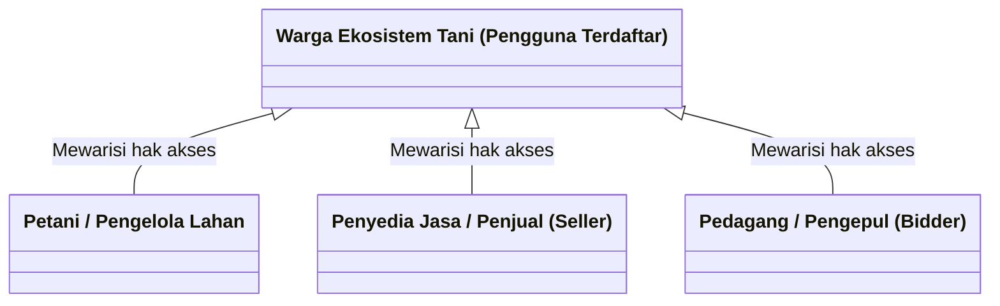
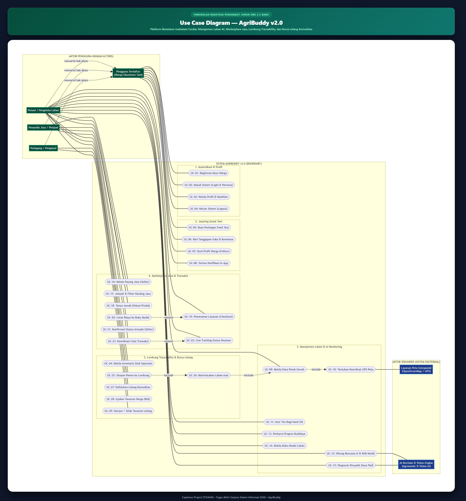
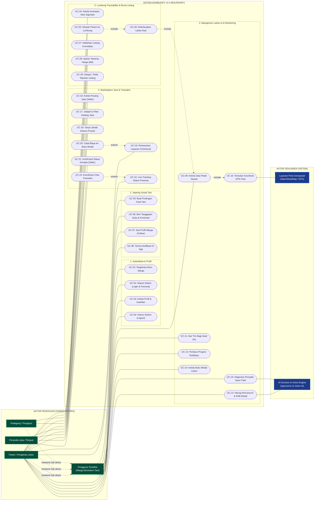
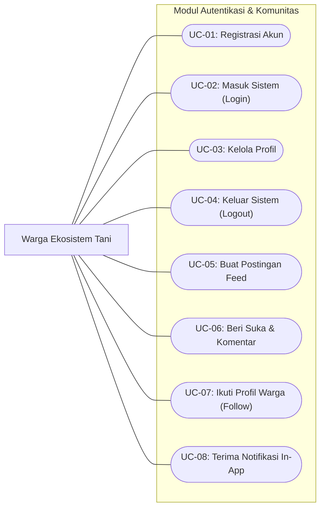
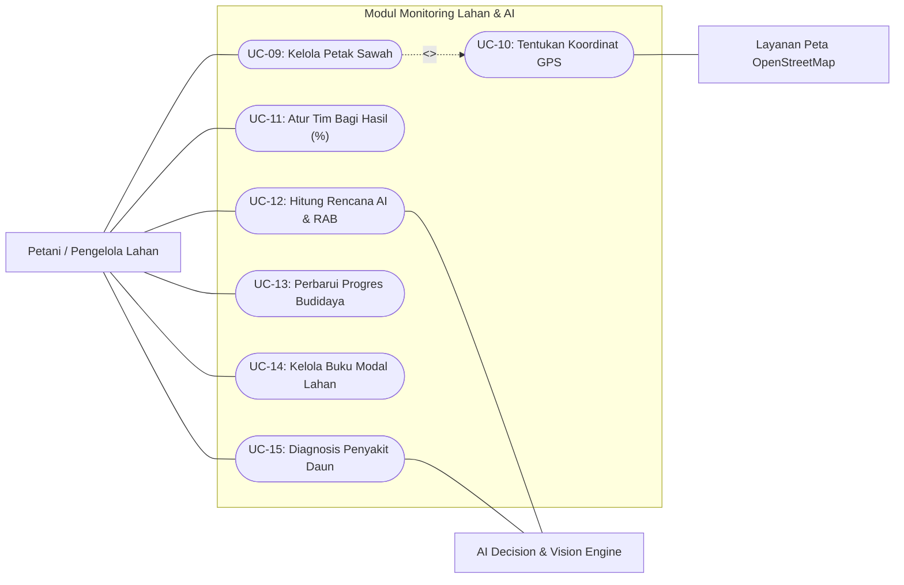
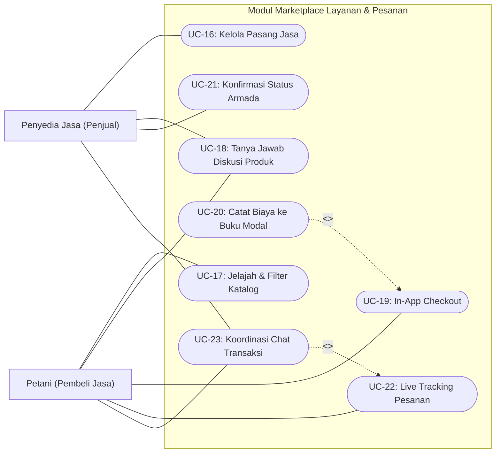
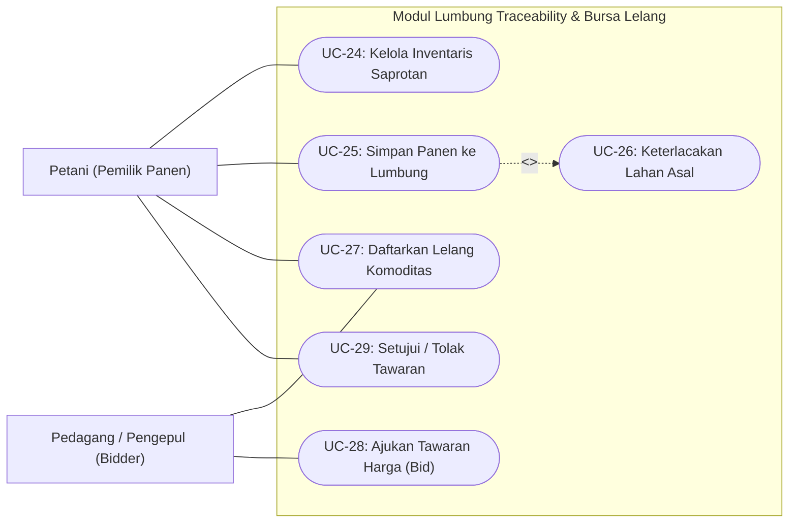

# Use Case Diagram & Spesifikasi Fungsional — AgriBuddy v2.0
**Platform Ekosistem Usahatani Cerdas: Manajemen Lahan AI, Marketplace Jasa, Lumbung Traceability, dan Bursa Lelang Komoditas**  
*Capstone Project STSI4440 • Tugas Akhir Sarjana Sistem Informasi 2026*

---

## 1. Pendahuluan & Lingkup Sistem

Diagram Use Case ini memodelkan seluruh fungsionalitas dan batasan (*system boundary*) dari platform **AgriBuddy v2.0**. Berbeda dengan sistem agritech konvensional yang kaku, AgriBuddy mengusung paradigma **Ecosystem-First**, di mana seluruh pelaku usahatani (pemilik lahan, buruh garap, penyedia alat mesin pertanian / alsintan, kios saprotan, hingga pedagang pengepul) diposisikan sebagai entitas setara yang saling berinteraksi secara kolaboratif (*peer-to-peer collaboration*).

Sistem memfasilitasi interaksi mulai dari perencanaan budidaya cerdas berbasis kecerdasan buatan (*Agronomic AI Decision Engine*), manajemen pembagian hasil panen, pemesanan armada usahatani di katalog jasa terpadu, pencatatan biaya modal otomatis, hingga penyimpanan lumbung berketertelusuran (*food traceability*) dan transaksi bursa lelang komoditas.

---

## 2. Definisi & Karakteristik Aktor (*Actors*)

Sistem AgriBuddy mengidentifikasi **4 Aktor Primer (Pengguna Manusia)** dengan relasi generalisasi (*is-a*), serta **2 Aktor Sekunder (Sistem Eksternal)**:

| No | Nama Aktor | Kategori | Deskripsi & Peran dalam Sistem |
| :---: | :--- | :---: | :--- |
| **1** | **Warga Ekosistem (Pengguna Terdaftar)** | Aktor Primer *(Induk / Basis)* | Pengguna umum yang telah terdaftar dalam sistem. Memiliki akses terhadap autentikasi, manajemen profil, linimasa jejaring sosial tani, dan penerimaan notifikasi in-app. |
| **2** | **Petani / Pengelola Lahan** | Aktor Primer *(Spesialisasi)* | Pengguna yang mengelola petak sawah, menyusun rencana kebutuhan modal AI, mengatur kolaborator bagi hasil panen, memesan layanan/alsintan di katalog, serta menyimpan dan melelang hasil panen. *(Mewarisi hak akses Warga Ekosistem)* |
| **3** | **Penyedia Jasa / Penjual (*Seller*)** | Aktor Primer *(Spesialisasi)* | Pengguna atau mitra usaha yang menawarkan alat/jasa pertanian (sewa traktor roda dua/empat, pompa alkon irigasi, buruh tanam, penggilingan gabah) serta saprotan, mengelola pemesanan masuk, dan berkoordinasi dengan pemesan. *(Mewarisi hak akses Warga Ekosistem)* |
| **4** | **Pedagang / Pengepul (*Bidder*)** | Aktor Primer *(Spesialisasi)* | Mitra penebas, agen penggilingan padi, atau pembeli partai besar yang mencari pasokan komoditas pangan berkualitas di bursa lelang dan mengajukan penawaran harga (*bidding*). *(Mewarisi hak akses Warga Ekosistem)* |
| **5** | **AI Decision & Vision Engine** | Aktor Sekunder *(Sistem AI)* | Layanan kecerdasan buatan backend yang menghitung Rencana Anggaran Biaya (RAB) agronomis, kebutuhan pupuk/benih, estimasi hasil panen, serta model Computer Vision untuk mendiagnosis penyakit daun padi. |
| **6** | **Layanan Peta Geospasial (OpenStreetMap)** | Aktor Sekunder *(External API)* | Layanan pemetaan eksternal yang menyediakan peta interaktif dan reverse-geocoding koordinat GPS petak lahan sawah. |

### Diagram Hirarki Aktor (Generalization Hierarchy)

---

## 3. Visual Use Case Diagram Lengkap

Berikut adalah diagram visual Use Case sistem AgriBuddy v2.0 beresolusi tinggi yang mencakup seluruh 29 Use Case dalam 5 paket sistem fungsional:

*(File vektor SVG juga tersedia di: [`USE_CASE_AgriBuddy.svg`](USE_CASE_AgriBuddy.svg))*

---

## 4. Pemodelan Diagram Use Case Terpadu (Mermaid UML)

---

## 5. Diagram Use Case Modular per Paket Fungsional

Untuk memudahkan penyajian dalam penulisan naskah Bab 4 Tugas Akhir / Skripsi, berikut adalah rincian diagram per modul/paket:

### 5.1. Paket 1 & 2: Autentikasi, Profil, & Jejaring Komunitas

### 5.2. Paket 3: Manajemen Lahan, Monitoring Sawah & AI Engine

### 5.3. Paket 4: Marketplace Jasa, Pemesanan, & Chat Transaksi

### 5.4. Paket 5: Lumbung Traceability & Bursa Lelang Panen

---

## 6. Matriks & Kamus Detail Seluruh Use Case (UC-01 s/d UC-29)

| ID Use Case | Nama Use Case | Aktor Utama | Aktor Pendukung | Tipe Relasi | Prekondisi | Pasca-kondisi |
| :--- | :--- | :--- | :--- | :--- | :--- | :--- |
| **UC-01** | Registrasi Akun Warga Tani | Pengguna Terdaftar | - | - | Pengguna belum memiliki akun. | Akun baru terdaftar di basis data dan profil terbuat. |
| **UC-02** | Masuk Sistem (Login / Switcher) | Pengguna Terdaftar | - | - | Akun terdaftar aktif. | Sesi autentikasi terbentuk, diarahkan ke dashboard. |
| **UC-03** | Mengelola Profil & Keahlian | Pengguna Terdaftar | - | - | Pengguna telah login. | Data profil, kontak WhatsApp, dan keahlian diperbarui. |
| **UC-04** | Keluar Sistem (Logout) | Pengguna Terdaftar | - | - | Pengguna berada di sesi aktif. | Sesi dihapus dan pengguna diarahkan ke layar login. |
| **UC-05** | Membuat Postingan Feed Tani | Pengguna Terdaftar | - | - | Pengguna telah login. | Postingan muncul di linimasa komunitas tani. |
| **UC-06** | Memberikan Suka & Komentar | Pengguna Terdaftar | - | - | Postingan komunitas tersedia. | Jumlah suka bertambah, komentar tampil di utas. |
| **UC-07** | Mengikuti Warga Lain (*Follow*) | Pengguna Terdaftar | - | - | Profil pengguna lain valid. | Hubungan pertemanan/pengikut tersimpan. |
| **UC-08** | Menerima Notifikasi In-App | Pengguna Terdaftar | - | - | Terjadi peristiwa interaksi. | Notifikasi merah muncul di lonceng bilah atas. |
| **UC-09** | Mengelola Data Petak Lahan Sawah | Petani | - | - | Petani telah terautentikasi. | Petak sawah tercatat dengan data luas dan komoditas. |
| **UC-10** | Menentukan Titik Koordinat Peta | Petani | Layanan Peta GPS | Asosiasi (Aktor Sekunder) & `<<include>>` (oleh UC-09) | Fitur geolokasi browser aktif. | Lintang dan bujur lahan sawah tersimpan presisi. |
| **UC-11** | Mengatur Tim Bagi Hasil (%) | Petani | - | - | Petak sawah telah terdaftar. | Daftar anggota kolaborator & porsi bagi hasil tersimpan. |
| **UC-12** | Menghitung Rencana AI & RAB | Petani | AI Decision Engine | Asosiasi (Aktor Sekunder) | Luas lahan dan jenis tanah valid. | RAB biaya modal, kebutuhan benih/pupuk, & jadwal dibuat. |
| **UC-13** | Memperbarui Progres Budidaya | Petani | - | - | Rencana tani aktif tersedia. | Status tahapan (*Selesai*) & realisasi biaya diperbarui. |
| **UC-14** | Mengelola Buku Modal Lahan | Petani | - | - | Petak sawah terdaftar. | Arus kas pengeluaran modal per petak tercatat rapi. |
| **UC-15** | Diagnosis Penyakit Daun Padi | Petani | AI Vision Engine | Asosiasi (Aktor Sekunder) | Foto daun padi diunggah. | Hasil analisis jenis penyakit & rekomendasi obat tampil. |
| **UC-16** | Mengelola Pasang Layanan Jasa | Penyedia Jasa | - | - | Pengguna berperan sebagai mitra. | Jasa tayang di katalog publik (*available*). |
| **UC-17** | Menjelajah & Filter Katalog Jasa | Petani / Pengguna | - | - | Layanan jasa aktif di katalog. | Hasil pencarian tersaring berdasarkan kategori & wilayah. |
| **UC-18** | Tanya-Jawab Diskusi Produk | Petani, Penyedia | - | - | Produk jasa memiliki halaman tanya. | Diskusi publik terjalin dan notifikasi terkirim. |
| **UC-19** | Melakukan In-App Checkout | Petani (Buyer) | Penyedia Jasa | - | Layanan jasa tersedia. | Pesanan terbentuk dengan status `MENUNGGU`. |
| **UC-20** | Catat Biaya ke Buku Modal Lahan | Petani (Buyer) | - | `<<extend>>` (UC-19) | Checkout berhasil dilakukan. | Biaya pesanan langsung masuk ke buku modal sawah. |
| **UC-21** | Konfirmasi Status Armada Pesanan | Penyedia (Seller) | Petani (Buyer) | - | Pesanan berstatus `MENUNGGU`. | Status berubah (`DIPROSES`/`DIKIRIM`/`SELESAI`). |
| **UC-22** | Memantau Pelacakan Status Pesanan | Petani (Buyer) | - | - | Pesanan aktif berjalan. | Indikator progres & catatan armada tampil real-time. |
| **UC-23** | Koordinasi Obrolan Pesanan (*Chat*) | Petani, Penyedia | - | `<<extend>>` (UC-22) | Pesanan aktif ada. | Percakapan koordinasi waktu tiba armada tersimpan. |
| **UC-24** | Mengelola Inventaris Stok Saprotan | Petani | - | - | Petani memiliki pupuk/benih. | Saldo stok fisik tercatat dengan ambang batas minim. |
| **UC-25** | Menyimpan Hasil Panen ke Lumbung | Petani | - | - | Siklus panen telah selesai. | Tonase panen tercatat di lumbung penyimpanan. |
| **UC-26** | Keterlacakan Lahan Asal (*Traceability*) | Petani | - | `<<include>>` (UC-25) | Lahan sawah terdata di sistem. | Panen terhubung secara permanen dengan petak asal. |
| **UC-27** | Mendaftarkan Komoditas ke Lelang | Petani (Seller) | - | - | Panen tersimpan di lumbung. | Lelang komoditas terbuka di bursa pasar lelang. |
| **UC-28** | Mengajukan Tawaran Harga (*Bid*) | Pedagang (Bidder) | Petani (Seller) | - | Lelang komoditas berstatus aktif. | Penawaran harga/kg & tonase tercatat di sistem. |
| **UC-29** | Menyetujui / Menolak Tawaran | Petani (Seller) | Pedagang (Bidder) | - | Penawaran harga lelang masuk. | Transaksi lelang disepakati, stok panen terpotong. |

---

## 7. Skenario Naratif Use Case Inti (*Use Case Specifications*)

### 7.1. Skenario UC-12: Menghitung Rencana Tani AI & Anggaran Biaya (RAB)
* **Aktor Utama:** Petani / Pengelola Lahan
* **Aktor Sekunder:** AI Decision Engine
* **Deskripsi:** Petani meminta sistem kecerdasan buatan untuk menghitungkan kebutuhan modal, pupuk, benih, dan jadwal kerja agronomis berdasarkan luas lahan sawah.
* **Prekondisi:** Petani telah memilih petak sawah yang memiliki data luas lahan dan karakteristik tanah.
* **Alur Utama (*Main Flow*):**
  1. Petani membuka menu **Monitoring** $\rightarrow$ tab **Sawah & AI**.
  2. Petani memilih petak sawah sasaran (misal: *Sawah Blok Krajan 0.8 Ha*).
  3. Petani menekan tombol **"Hitung Ulang Rencana AI"**.
  4. Sistem mengirimkan parameter luas lahan, jenis tanah, komoditas, dan sumber air ke **AI Decision Engine**.
  5. AI Engine memproses kalkulasi agronomis: estimasi tonase panen, proyeksi penerimaan kotor, RAB modal per fase tanam, dan estimasi laba bersih.
  6. Sistem menyimpan rencana ke entitas `FARM_PLAN` dan menghasilkan 5 tahapan kerja interaktif di `FARM_PLAN_STEP`.
  7. Sistem menampilkan dashboard rencana kerja dan grafik kalkulasi modal kepada petani.
* **Alur Alternatif (*Alternative Flow*):**
  * *4a. Parameter lahan belum lengkap:* Sistem menampilkan notifikasi pengisian luas lahan terlebih dahulu.
* **Pasca-kondisi:** Rencana Tani AI tersimpan dan siap dijadikan panduan operasional lapangan.

---

### 7.2. Skenario UC-19 & UC-20: Pemesanan Layanan (Checkout) & Integrasi Buku Modal
* **Aktor Utama:** Petani (Pembeli Jasa)
* **Aktor Pendukung:** Penyedia Jasa (Penjual)
* **Deskripsi:** Petani memesan jasa olah tanah traktor di katalog marketplace dan secara otomatis mencatat biayanya ke dalam buku kas modal sawah yang bersangkutan.
* **Prekondisi:** Layanan traktor berstatus aktif (*is_available = true*) dan petani memiliki minimal satu petak sawah terdaftar.
* **Alur Utama (*Main Flow*):**
  1. Petani membuka menu **Katalog** dan memilih layanan *"Sewa Traktor Quick Kubota"*.
  2. Petani menekan tombol **"Pesan Sekarang"**.
  3. Sistem menampilkan modal checkout dengan rincian luas lahan yang akan dibajak (misal: 0.8 Ha), kalkulasi total tarif (Rp 960.000), dan opsi metode pembayaran (*YARNEN / Bayar Pasca-Panen*).
  4. Petani mengisi instruksi lahan dan menekan tombol **"Konfirmasi Pesanan"**.
  5. Sistem membuat transaksi `SERVICE_ORDER` baru dengan status `MENUNGGU` serta memicu notifikasi `ORDER_RECEIVED` ke akun penyedia traktor.
  6. *(Relasi `<<extend>>` UC-20)*: Sistem memunculkan prompt konfirmasi: *"Apakah ingin mencatat pengeluaran Rp 960.000 ini ke Buku Modal Lahan?"*.
  7. Petani memilih *"Sawah Blok Krajan"* dan menyetujui prompt.
  8. Sistem menambahkan entitas `CAPITAL_EXPENSE` pada lahan tersebut dengan kategori `OLAH_TANAH` dan sumber `MARKETPLACE`.
* **Pasca-kondisi:** Pesanan masuk ke daftar tunggu penyedia jasa dan buku kas pengeluaran sawah bertambah secara akurat.

---

### 7.3. Skenario UC-25, UC-26, & UC-27: Simpan Panen Lumbung & Keterlacakan Lelang
* **Aktor Utama:** Petani / Pengelola Lahan
* **Aktor Pendukung:** Pedagang / Pengepul (*Bidder*)
* **Deskripsi:** Petani mencatat panen gabah ke lumbung dengan mengaitkan petak sawah asalnya, kemudian melelang komoditas tersebut di bursa lelang.
* **Prekondisi:** Petak sawah telah menyelesaikan masa pemeliharaan budidaya.
* **Alur Utama (*Main Flow*):**
  1. Petani membuka menu **Monitoring** $\rightarrow$ tab **Lumbung**.
  2. Petani menekan tombol **"Tambah Stok Panen"**.
  3. Petani mengisi tonase hasil panen (misal: 4.800 Kg Gabah Kering Panen / GKP) dan memilih petak sawah asalnya (*Sawah Blok Krajan*).
  4. *(Relasi `<<include>>` UC-26)*: Sistem menautkan ID lahan ke entitas `HARVEST_STORAGE` (`farmland_id FK`) sehingga seluruh catatan varietas dan riwayat lahan terikat secara permanen.
  5. Petani memilih opsi **"Buka Lelang Bursa"** pada kartu panen tersebut.
  6. Petani menentukan harga awal (misal: Rp 7.200 / Kg) dan volume minimal pembelian (500 Kg).
  7. Sistem menerbitkan listing lelang pada entitas `MARKET_LISTING` dengan status `DIBUKA`.
  8. Pedagang komoditas dapat melihat lelang di bursa dan mengajukan penawaran harga (`MARKET_BID`).
* **Pasca-kondisi:** Komoditas panen tersimpan dengan histori asal lahan yang dapat dilacak (*traceable*) dan siap ditransaksikan di bursa lelang.

---

## 8. Kesimpulan & Relevansi Pengujian Akademis

Rancangan Use Case Diagram AgriBuddy v2.0 ini:
1. **Mematuhi Kaidah Baku UML 2.5 secara Ketat:**
   - **Garis Asosiasi Solid ke Aktor Sekunder**: Hubungan antara Use Case (`UC-10`, `UC-12`, `UC-15`) dengan aktor sistem sekunder eksternal (`Layanan Peta Geospasial` dan `AI Decision & Vision Engine`) dimodelkan menggunakan **garis solid Association biasa**. Sesuai kaidah baku UML 2.5, aktor sistem berada di luar batasan sistem (*system boundary*) sehingga tidak dapat menjadi subjek maupun objek dari relasi ketergantungan `<<include>>` atau `<<extend>>`.
   - **Relasi `<<include>>` dan `<<extend>>` Murni Antar-Use Case**: Relasi dependensi hanya menghubungkan dua Use Case di dalam *system boundary*:
     - `UC-09 (Kelola Lahan)` $\xrightarrow{\ll include\gg}$ `UC-10 (Tentukan Koordinat GPS)`: Syarat mutlak kelengkapan data lahan.
     - `UC-25 (Simpan Panen)` $\xrightarrow{\ll include\gg}$ `UC-26 (Keterlacakan Lahan Asal)` $\xrightarrow{\ll include\gg}$ `UC-09`: Syarat mutlak *food traceability*.
     - `UC-20 (Catat Buku Modal)` $\xrightarrow{\ll extend\gg}$ `UC-19 (Checkout)`: Alur opsional pasca-pemesanan.
     - `UC-23 (Chat Transaksi)` $\xrightarrow{\ll extend\gg}$ `UC-22 (Live Tracking)`: Fitur komunikasi opsional selama pelacakan pesanan.
2. **Menjawab Dinamika Ekosistem Tani:** Menjelaskan secara gamblang bagaimana peran fleksibel (*petani, tukang bajak, penyewa pompa, juragan gabah*) dapat saling bertukar peran secara elegan di satu platform berkat relasi pewarisan (*generalization*) dari entitas `Pengguna Terdaftar`.
3. **Keterpaduan Sistem AI & Geospasial:** Menempatkan modul kecerdasan buatan (*Agronomic Decision Engine* dan *AI Vision Leaf Classifier*) serta pemetaan GPS sebagai aktor layanan eksternal yang diintegrasikan secara fungsional ke dalam alur operasional usahatani cerdas.
