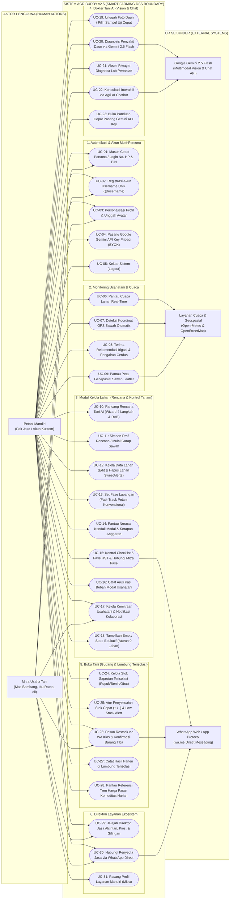

# Use Case Diagram & Spesifikasi Fungsional — AgriBuddy v2.5
**Platform Smart Farming Decision Support System (DSS): Manajemen Kelola Lahan, Rencana Tani AI, Dokter Tani Gemini Vision, Buku Tani Terisolasi, dan Direktori Layanan WhatsApp**  
*Capstone Project STSI4440 • Tugas Akhir Sarjana Sistem Informasi 2026*

---

## 1. Pendahuluan & Lingkup Sistem

Diagram Use Case ini memodelkan seluruh kebutuhan fungsional dan batasan (*system boundary*) dari platform **AgriBuddy v2.5 (Final Capstone Release)**. Sistem difokuskan murni pada **Smart Farming Decision Support System (DSS)** yang dirancang untuk mendampingi petani padi dan para pelaku ekosistem pertanian dalam mengambil keputusan budidaya yang presisi, hemat biaya, dan berbasis data.

Sistem memfasilitasi interaksi hulu-hilir usahatani: pemantauan mikroklimat lahan real-time, perancangan Rencana Anggaran Biaya (RAB) 12 item dan jadwal tanam cerdas (*Smart Farm Planner*), pengelolaan lahan terpadu (*Kelola Lahan: Edit, Hapus, Set Fase Lapangan, & Aturan 0 Lahan*), neraca kendali modal dan checklist 5 fase HST (*Dual Control*), diagnosis fitopatologi daun multimodal (**Google Gemini 2.5 Flash Multimodal Vision**) serta asisten chat interaktif dengan panduan BYOK Gemini API Key, pembukuan inventaris saprotan dan lumbung panen yang **terisolasi ketat per akun usahatani**, hingga direktori jasa mekanisasi dan pemesanan restock terhubung langsung via WhatsApp.

---

## 2. Definisi & Karakteristik Aktor (*Actors*)

Sistem AgriBuddy v2.5 mengidentifikasi **2 Aktor Primer (Pengguna Manusia)** serta **2 Aktor Sekunder (Sistem Eksternal)**:

| No | Nama Aktor | Kategori | Deskripsi & Peran dalam Sistem |
| :---: | :--- | :---: | :--- |
| **1** | **Petani Mandiri** | Aktor Primer *(Pengguna Utama)* | Petani (e.g. Pak Joko / Pengguna Baru) yang mengelola petak sawah, memantau cuaca & irigasi, menyusun rencana modal AI, mengendalikan siklus pengerjaan fase, mendiagnosis daun padi sakit via kamera, mengelola gudang stok pupuk dan lumbung panen terisolasi, serta memesan saprotan via WhatsApp. |
| **2** | **Mitra Usaha Tani** | Aktor Primer *(Penyedia Jasa & Kios)* | Penyedia alsintan (Mas Bambang/Sewa Traktor, Pak Slamet/Pompa Irigasi, Mang Udin/Regu Tanam), Kios KPL Resmi (Ibu Ratna), dan Penggilingan Beras (Bpk. Hendra Jaya) yang mendaftarkan jasanya, berkolaborasi dalam kemitraan lahan, serta menerima order/pesanan via WhatsApp. |
| **3** | **Google Gemini Vision & Chat Engine** | Aktor Sekunder *(Sistem AI Multimodal)* | Layanan kecerdasan buatan Google Gen AI (`gemini-flash-latest`) yang memproses citra daun padi untuk mendiagnosis penyakit kresek, blas, bercak coklat, serta melayani percakapan konsultasi agronomi interaktif. |
| **4** | **Layanan Cuaca & Peta Geospasial** | Aktor Sekunder *(External API)* | Layanan telemetri iklim mikro dan peta interaktif (Leaflet / OpenStreetMap) untuk deteksi koordinat GPS, prakiraan hujan, dan rekomendasi pengairan. |

---

## 3. Visual Use Case Diagram Lengkap

Berikut adalah diagram visual Use Case sistem AgriBuddy v2.5 yang mencakup **30 Use Case** dalam **6 paket fungsional utama**:

*(File vektor SVG tersedia di: [`USE_CASE_AgriBuddy.svg`](USE_CASE_AgriBuddy.svg))*

---

## 4. Pemodelan Diagram Use Case Terpadu (Mermaid UML 2.5)

```mermaid
flowchart LR
    %% Aktor Pengguna di Kiri
    subgraph AktorPengguna["AKTOR PENGGUNA (HUMAN ACTORS)"]
        direction TB
        Petani["Petani Mandiri<br/>(Pak Joko / Akun Kustom)"]
        Mitra["Mitra Usaha Tani<br/>(Mas Bambang, Ibu Ratna, dll)"]
    end

    %% Batasan Sistem Utama
    subgraph AgriBuddy["SISTEM AGRIBUDDY v2.5 (SMART FARMING DSS BOUNDARY)"]
        direction TB
        
        subgraph P1["1. Autentikasi & Akun Multi-Persona"]
            UC01(["UC-01: Masuk Cepat Persona / Login No. HP & PIN"])
            UC02(["UC-02: Registrasi Akun Username Unik (@username)"])
            UC03(["UC-03: Personalisasi Profil & Unggah Avatar"])
            UC04(["UC-04: Pasang Google Gemini API Key Pribadi (BYOK)"])
            UC05(["UC-05: Keluar Sistem (Logout)"])
        end

        subgraph P2["2. Monitoring Usahatani & Cuaca"]
            UC06(["UC-06: Pantau Cuaca Lahan Real-Time"])
            UC07(["UC-07: Deteksi Koordinat GPS Sawah Otomatis"])
            UC08(["UC-08: Terima Rekomendasi Irigasi & Pengairan Cerdas"])
            UC09(["UC-09: Pantau Peta Geospasial Sawah Leaflet"])
        end

        subgraph P3["3. Modul Kelola Lahan (Rencana & Kontrol Tanam)"]
            UC10(["UC-10: Rancang Rencana Tani AI (Wizard 4 Langkah & RAB)"])
            UC11(["UC-11: Simpan Draf Rencana / Mulai Garap Sawah"])
            UC12(["UC-12: Kelola Data Lahan (Edit & Hapus Lahan SweetAlert2)"])
            UC13(["UC-13: Set Fase Lapangan (Fast-Track Petani Konvensional)"])
            UC14(["UC-14: Pantau Neraca Kendali Modal & Serapan Anggaran"])
            UC15(["UC-15: Kontrol Checklist 5 Fase HST & Hubungi Mitra Fase"])
            UC16(["UC-16: Catat Arus Kas Beban Modal Usahatani"])
            UC17(["UC-17: Kelola Kemitraan Usahatani & Notifikasi Kolaborasi"])
            UC18(["UC-18: Tampilkan Empty State Edukatif (Aturan 0 Lahan)"])
        end

        subgraph P4["4. Dokter Tani AI (Vision & Chat)"]
            UC19(["UC-19: Unggah Foto Daun / Pilih Sampel Uji Cepat"])
            UC20(["UC-20: Diagnosis Penyakit Daun via Gemini 2.5 Flash"])
            UC21(["UC-21: Akses Riwayat Diagnosa Lab Pertanian"])
            UC22(["UC-22: Konsultasi Interaktif via Agri AI Chatbot"])
            UC23(["UC-23: Buka Panduan Cepat Pasang Gemini API Key"])
        end

        subgraph P5["5. Buku Tani (Gudang & Lumbung Terisolasi)"]
            UC24(["UC-24: Kelola Stok Saprotan Terisolasi (Pupuk/Benih/Obat)"])
            UC25(["UC-25: Atur Penyesuaian Stok Cepat (+ / -) & Low Stock Alert"])
            UC26(["UC-26: Pesan Restock via WA Kios & Konfirmasi Barang Tiba"])
            UC27(["UC-27: Catat Hasil Panen di Lumbung Terisolasi"])
            UC28(["UC-28: Pantau Referensi Tren Harga Pasar Komoditas Harian"])
        end

        subgraph P6["6. Direktori Layanan Ekosistem"]
            UC29(["UC-29: Jelajah Direktori Jasa Alsintan, Kios, & Gilingan"])
            UC30(["UC-30: Hubungi Penyedia Jasa via WhatsApp Direct"])
            UC31(["UC-31: Pasang Profil Layanan Mandiri (Mitra)"])
        end
    end

    %% Aktor Eksternal di Kanan
    subgraph AktorEksternal["AKTOR SEKUNDER (EXTERNAL SYSTEMS)"]
        direction TB
        GeminiAI["Google Gemini 2.5 Flash<br/>(Multimodal Vision & Chat API)"]
        WeatherGIS["Layanan Cuaca & Geospasial<br/>(Open-Meteo & OpenStreetMap)"]
        WhatsAppAPI["WhatsApp Web / App Protocol<br/>(wa.me Direct Messaging)"]
    end

    %% Hubungan Aktor ke Use Case
    Petani --> UC01
    Petani --> UC02
    Petani --> UC03
    Petani --> UC04
    Petani --> UC05
    Petani --> UC06
    Petani --> UC07
    Petani --> UC08
    Petani --> UC09
    Petani --> UC10
    Petani --> UC11
    Petani --> UC12
    Petani --> UC13
    Petani --> UC14
    Petani --> UC15
    Petani --> UC16
    Petani --> UC17
    Petani --> UC18
    Petani --> UC19
    Petani --> UC20
    Petani --> UC21
    Petani --> UC22
    Petani --> UC23
    Petani --> UC24
    Petani --> UC25
    Petani --> UC26
    Petani --> UC27
    Petani --> UC28
    Petani --> UC29
    Petani --> UC30

    Mitra --> UC01
    Mitra --> UC02
    Mitra --> UC03
    Mitra --> UC17
    Mitra --> UC26
    Mitra --> UC29
    Mitra --> UC30
    Mitra --> UC31

    UC20 --> GeminiAI
    UC22 --> GeminiAI
    UC06 --> WeatherGIS
    UC07 --> WeatherGIS
    UC09 --> WeatherGIS
    UC15 --> WhatsAppAPI
    UC26 --> WhatsAppAPI
    UC30 --> WhatsAppAPI
```

---

## 5. Matriks Deskripsi Rinci Use Case Inti (Sample Detail)

### UC-13: Set Fase Lapangan (Fast-Track Petani Konvensional)
* **Aktor:** Petani Mandiri
* **Tujuan:** Menyesuaikan status siklus budidaya agar langsung berjalan dari fase tertentu bagi petani yang sudah menggarap sawah sebelum mendaftar di sistem.
* **Pre-Kondisi:** Petani memiliki minimal 1 lahan sawah aktif.
* **Alur Utama:**
  1. Petani membuka menu **Kelola Lahan** pada sub-mode **Kontrol Tanam & Modal**.
  2. Petani menekan tombol **"Set Fase"** pada panel Kelola Lahan.
  3. Sistem memunculkan modal interaktif dengan pilihan fase sasaran (Fase 1 s/d 5) dan estimasi tanggal tanam.
  4. Petani memilih fase yang sedang berlangsung di sawahnya (misal Fase 3: Pemupukan Susulan).
  5. Sistem secara otomatis menghitung perkiraan tanggal tanam mundur, menandai Fase 1 dan 2 sebagai `SELESAI`, dan mengaktifkan Fase 3 sebagai `SEDANG_BERJALAN`.
  6. Petani menekan tombol **"Terapkan Fase"**.
  7. Sistem memperbarui basis data dan menampilkan pesan sukses SweetAlert2.

### UC-18: Tampilkan Empty State Edukatif (Aturan 0 Lahan)
* **Aktor:** Petani Mandiri (Akun Baru / Tanpa Lahan)
* **Tujuan:** Memberikan pengalaman pengguna yang jelas dan intuitif ketika akun belum memiliki petak sawah.
* **Pre-Kondisi:** `activeFarmlands.length === 0`.
* **Alur Utama:**
  1. Pengguna membuka menu **Kelola Lahan**.
  2. Sistem memeriksa ketersediaan lahan milik pengguna terautentikasi.
  3. Karena jumlah lahan adalah 0, sistem menampilkan kartu Empty State terpusat bertema alam: *"Kamu belum membuat lahan untuk diolah."*
  4. Pengguna melihat tombol ajakan bertindak (CTA) **"Buat Sekarang"**.
  5. Saat tombol diklik, sistem langsung mengarahkan pengguna ke sub-mode **Rencana Tani AI** (Wizard perencanaan baru).

### UC-24: Kelola Stok Saprotan Terisolasi Per Akun
* **Aktor:** Petani Mandiri
* **Tujuan:** Mengelola inventaris pupuk, benih, dan obat dengan jaminan privasi data antar-akun usahatani.
* **Pre-Kondisi:** Pengguna telah berhasil login.
* **Alur Utama:**
  1. Pengguna membuka modul **Buku Tani** tab **Gudang Saprotan**.
  2. Frontend memanggil `api.getInventory(currentUserId.value)`.
  3. Backend Express memfilter data inventaris dengan mencocokkan `user_id`.
  4. Sistem hanya menampilkan daftar barang milik pengguna tersebut. Akun lain (misal Mas Bambang) tidak dapat melihat stok Pak Joko.
  5. Pengguna dapat menambah item baru, mengubah jumlah stok dengan tombol cepat (+ / -), atau memesan restock via WhatsApp.
