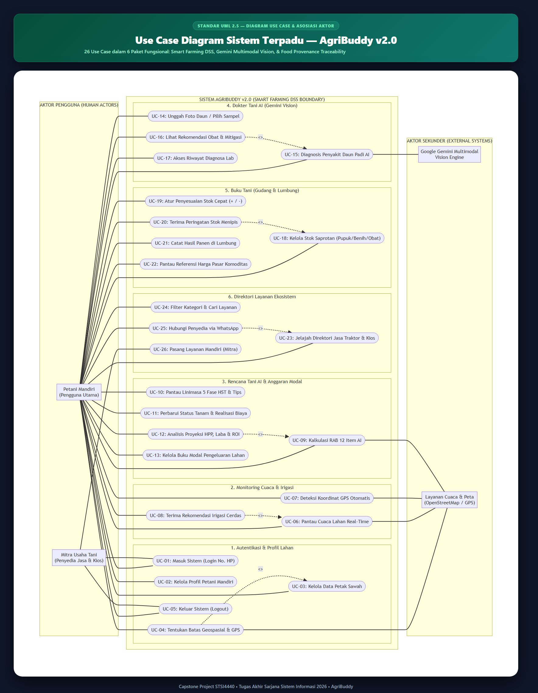
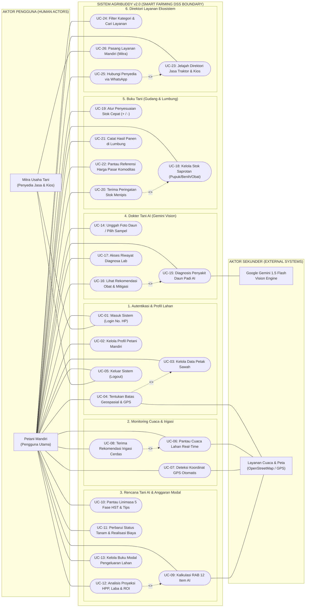

# Use Case Diagram & Spesifikasi Fungsional — AgriBuddy v2.0
**Platform Smart Farming Decision Support System (DSS): Manajemen Lahan Geospasial, Rencana Tani AI, Dokter Tani Gemini Vision, Buku Tani, dan Direktori Layanan WhatsApp**  
*Capstone Project STSI4440 • Tugas Akhir Sarjana Sistem Informasi 2026*

---

## 1. Pendahuluan & Lingkup Sistem

Diagram Use Case ini memodelkan seluruh kebutuhan fungsional dan batasan (*system boundary*) dari platform **AgriBuddy v2.0**. Sesuai penyederhanaan arsitektur sistem terkini, AgriBuddy berfokus murni pada **Smart Farming Decision Support System (DSS)** yang dirancang untuk mendampingi petani padi dalam mengambil keputusan budidaya yang presisi, efisien, dan berbasis data.

Sistem memfasilitasi interaksi mulai dari pemantauan iklim lahan real-time, penyusunan Rencana Anggaran Biaya (RAB) dan jadwal tanam berbasis kecerdasan buatan (*Smart Farm Planner*), diagnosis penyakit daun padi multimodal (**Google Gemini 1.5 Flash Vision**), manajemen persediaan sarana produksi dan lumbung hasil panen berketertelusuran (*Buku Tani*), hingga kemudahan menghubungkan petani dengan penyedia alsintan dan saprotan desa secara langsung via WhatsApp.

---

## 2. Definisi & Karakteristik Aktor (*Actors*)

Sistem AgriBuddy mengidentifikasi **2 Aktor Primer (Pengguna Manusia)** serta **2 Aktor Sekunder (Sistem Eksternal)**:

| No | Nama Aktor | Kategori | Deskripsi & Peran dalam Sistem |
| :---: | :--- | :---: | :--- |
| **1** | **Petani Mandiri** | Aktor Primer *(Pengguna Utama)* | Petani yang mengelola petak sawah, memantau cuaca, menyusun rencana kebutuhan modal tanam AI, mendiagnosis daun sakit lewat kamera, mengelola stok pupuk di gudang & panen di lumbung, serta menghubungi penyedia jasa via WhatsApp. |
| **2** | **Mitra Usaha Tani** | Aktor Primer *(Penyedia Jasa / Kios)* | Pemilik alsintan (sewa traktor, pompa air), buruh cangkul, atau kios pupuk yang mendaftarkan profil jasanya ke dalam direktori usahatani agar dapat dihubungi oleh petani sekitar. |
| **3** | **Google Gemini Vision Engine** | Aktor Sekunder *(Sistem AI Multimodal)* | Layanan kecerdasan buatan visual Google Gen AI (`gemini-1.5-flash`) yang memproses citra daun padi untuk mendiagnosis penyakit hawar daun, blas, bercak coklat, dan merumuskan rekomendasi agronomi nyata. |
| **4** | **Layanan Cuaca & Peta Geospasial** | Aktor Sekunder *(External API)* | Layanan telemetri iklim mikro dan penyedia peta interaktif (Leaflet / OpenStreetMap) untuk deteksi koordinat GPS dan analisis irigasi sawah. |

---

## 3. Visual Use Case Diagram Lengkap

Berikut adalah diagram visual Use Case sistem AgriBuddy v2.0 beresolusi tinggi yang mencakup seluruh 26 Use Case dalam 6 paket fungsional:

*(File vektor SVG tersedia di: [`USE_CASE_AgriBuddy.svg`](USE_CASE_AgriBuddy.svg))*

---

## 4. Pemodelan Diagram Use Case Terpadu (Mermaid UML 2.5)

```mermaid
flowchart LR
    %% Aktor Pengguna di Kiri
    subgraph AktorPengguna["AKTOR PENGGUNA (HUMAN ACTORS)"]
        direction TB
        Petani["Petani Mandiri<br/>(Pengguna Utama)"]
        Mitra["Mitra Usaha Tani<br/>(Penyedia Jasa & Kios)"]
    end

    %% Batasan Sistem Utama
    subgraph AgriBuddy["SISTEM AGRIBUDDY v2.0 (SMART FARMING DSS BOUNDARY)"]
        direction TB
        
        subgraph P1["1. Autentikasi & Profil Lahan"]
            UC01(["UC-01: Masuk Sistem (Login No. HP)"])
            UC02(["UC-02: Kelola Profil Petani Mandiri"])
            UC03(["UC-03: Kelola Data Petak Sawah"])
            UC04(["UC-04: Tentukan Batas Geospasial & GPS"])
            UC05(["UC-05: Keluar Sistem (Logout)"])
        end

        subgraph P2["2. Monitoring Cuaca & Irigasi"]
            UC06(["UC-06: Pantau Cuaca Lahan Real-Time"])
            UC07(["UC-07: Deteksi Koordinat GPS Otomatis"])
            UC08(["UC-08: Terima Rekomendasi Irigasi Cerdas"])
        end

        subgraph P3["3. Rencana Tani AI & Anggaran Modal"]
            UC09(["UC-09: Kalkulasi RAB 12 Item AI"])
            UC10(["UC-10: Pantau Linimasa 5 Fase HST & Tips"])
            UC11(["UC-11: Perbarui Status Tanam & Realisasi Biaya"])
            UC12(["UC-12: Analisis Proyeksi HPP, Laba & ROI"])
            UC13(["UC-13: Kelola Buku Modal Pengeluaran Lahan"])
        end

        subgraph P4["4. Dokter Tani AI (Gemini Vision)"]
            UC14(["UC-14: Unggah Foto Daun / Pilih Sampel"])
            UC15(["UC-15: Diagnosis Penyakit Daun Padi AI"])
            UC16(["UC-16: Lihat Rekomendasi Obat & Mitigasi"])
            UC17(["UC-17: Akses Riwayat Diagnosa Lab"])
        end

        subgraph P5["5. Buku Tani (Gudang & Lumbung)"]
            UC18(["UC-18: Kelola Stok Saprotan (Pupuk/Benih/Obat)"])
            UC19(["UC-19: Atur Penyesuaian Stok Cepat (+ / -)"])
            UC20(["UC-20: Terima Peringatan Stok Menipis"])
            UC21(["UC-21: Catat Hasil Panen di Lumbung"])
            UC22(["UC-22: Pantau Referensi Harga Pasar Komoditas"])
        end

        subgraph P6["6. Direktori Layanan Ekosistem"]
            UC23(["UC-23: Jelajah Direktori Jasa Traktor & Kios"])
            UC24(["UC-24: Filter Kategori & Cari Layanan"])
            UC25(["UC-25: Hubungi Penyedia via WhatsApp"])
            UC26(["UC-26: Pasang Layanan Mandiri (Mitra)"])
        end
    end

    %% Aktor Eksternal di Kanan
    subgraph AktorEksternal["AKTOR SEKUNDER (EXTERNAL SYSTEMS)"]
        direction TB
        GeminiAI["Google Gemini 1.5 Flash<br/>Vision Engine"]
        GeoService["Layanan Cuaca & Peta<br/>(OpenStreetMap / GPS)"]
    end

    %% Relasi Asosiasi Petani ke Use Case
    Petani --- UC01
    Petani --- UC02
    Petani --- UC03
    Petani --- UC04
    Petani --- UC05
    Petani --- UC06
    Petani --- UC07
    Petani --- UC08
    Petani --- UC09
    Petani --- UC10
    Petani --- UC11
    Petani --- UC12
    Petani --- UC13
    Petani --- UC14
    Petani --- UC15
    Petani --- UC16
    Petani --- UC17
    Petani --- UC18
    Petani --- UC19
    Petani --- UC20
    Petani --- UC21
    Petani --- UC22
    Petani --- UC23
    Petani --- UC24
    Petani --- UC25

    %% Relasi Asosiasi Mitra ke Use Case
    Mitra --- UC01
    Mitra --- UC05
    Mitra --- UC26

    %% Relasi <<include>> antar Use Case
    UC04 -. "<<include>>" .-> UC03
    UC08 -. "<<include>>" .-> UC06
    UC12 -. "<<include>>" .-> UC09
    UC16 -. "<<include>>" .-> UC15
    UC20 -. "<<include>>" .-> UC18
    UC25 -. "<<include>>" .-> UC23

    %% Relasi Asosiasi Aktor Sekunder (Strict UML 2.5 - Solid Line)
    UC04 --- GeoService
    UC06 --- GeoService
    UC07 --- GeoService
    UC09 --- GeoService
    UC15 --- GeminiAI
```

---

## 5. Kepatuhan Standar UML 2.5 (OMG Standard)

Model ini menerapkan standar baku **UML 2.5 (Object Management Group)** secara ketat:
1. **Relasi Aktor Sekunder**: Hubungan antara `UC-15` dengan `Google Gemini Vision Engine`, serta `UC-04`, `UC-06`, `UC-07` dengan `Layanan Cuaca & Peta` digambarkan menggunakan **garis solid lurus (Association)**, bukan `<<include>>`, karena aktor eksternal berada di luar batasan sistem (*system boundary*).
2. **Ketergantungan Use Case Internal**: Relasi `<<include>>` hanya digunakan antar-Use Case di dalam boundary sistem yang membutuhkan eksekusi fungsionalitas lain secara wajib (misal: Menghitung Analisis Finansial `UC-12` meng-*include* Kalkulasi RAB `UC-09`).
